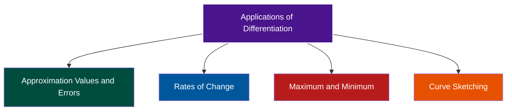

$$\underline{\Huge\text{APPLICATION OF DIFFERENTIATION}}$$
# 3.0 INTRODUCTION
The concepts of derivatives or differentiations have been studied in previous chapter. In this chapter, we will apply the knowledge to several problems in our daily life. Differentiation can help us solve many types of real-world problems.

**Gradient of Curve at A Point**
The first derivative of equation of a curve represents formula the gradient or slope of a curve. The gradient of a curve is different at each point on the curve. The type of gradient are as follows:

![[Pasted image 20260218202635.png]]

> [!example]- Example 3.1
> Find the gradient of a curve $y=x^{3}$ at the point (2,8).
>
> > [!continue]- Solution
> > Gradient of a curve is $\frac{dy}{dx}=3x^{2}$.
> > When $x=2$, the gradient to the curve $y=x^{3}$ is 12 at the point (2,8).
> > $\frac{dy}{dx}=3(2)^{2}=12$.

> [!sq]- Problem 3.1
> Find the gradient at the specified value of x for each given curve below:
> a) $y=x\cos 3x$, $x=\pi$
> b) $y=x^{3}+2x^{2}-x$, $x=-2$
> c) $y=(x-\frac{1}{x})^{3}$, $x=2$
>
> > [!continue]- Solution
> > **a) $y=x\cos 3x$, $x=\pi$**
> > $\frac{dy}{dx} = 1(\cos 3x) + x(-3\sin 3x) = \cos 3x - 3x\sin 3x$.
> > At $x=\pi$, $\frac{dy}{dx} = \cos(3\pi) - 3\pi\sin(3\pi) = -1 - 3\pi(0) = -1$.
> > 
> > **b) $y=x^{3}+2x^{2}-x$, $x=-2$**
> > $\frac{dy}{dx} = 3x^2 + 4x - 1$.
> > At $x=-2$, $\frac{dy}{dx} = 3(-2)^2 + 4(-2) - 1 = 12 - 8 - 1 = 3$.
> > 
> > **c) $y=(x-\frac{1}{x})^{3}$, $x=2$**
> > $\frac{dy}{dx} = 3(x-\frac{1}{x})^2(1 + \frac{1}{x^2})$.
> > At $x=2$, $\frac{dy}{dx} = 3(2-\frac{1}{2})^2(1 + \frac{1}{2^2}) = 3(\frac{3}{2})^2(1 + \frac{1}{4}) = 3(\frac{9}{4})(\frac{5}{4}) = \frac{135}{16}$.

# 3.1 APPROXIMATION VALUES AND ERRORS
If two variables are related then we can use calculus to find the approximate change in one variable if there is a small change in the other. If two variables are related, then a change in x will produce small change in y and vice versa. A change could either be an increase (indicated by a positive sign) or decrease (indicated by a negative sign).

About the notation, the change in any variable is defined as the difference between the latest value and the initial value. It is denoted as $\delta$. Thus, $\delta x=x-x_{0}$ where x is the given/latest value and $x_{0}$ is the estimated (approximate)/initial value.

Thus, the formula for approximation is given as:
> [!formula]
> $f(x_{0}+\delta x)=f(x_{0})+f^{\prime}(x_{0})\delta x$
> where $f^{\prime}(x_{0})\delta x$ is the differential/error, $df$.

> [!example]- Example 3.2
> Find the approximation value of $\sqrt[3]{215}$ correct to three decimal places.
>
> > [!continue]- Solution
> > Let $f(x)=\sqrt[3]{x}=x^{\frac{1}{3}}$ and $f^{\prime}(x)=\frac{1}{3}x^{-\frac{2}{3}}$. *(Note: Corrected derivative power from positive 2/3 to negative 2/3)*
> > We have $x=215$, $x_{0}=216$, thus $\delta x=215-216=-1$.
> > $f(x_{0}+\delta x)=f(x_{0})+f^{\prime}(x_{0})\delta x$
> > $=216^{\frac{1}{3}}+(\frac{1}{3}(216^{-\frac{2}{3}}))(-1)=6 + \frac{1}{3}(\frac{1}{36})(-1) = 6 - \frac{1}{108} \approx 5.991$.

> [!example]- Example 3.3
> Find the differential, df if given $f(x)=e^{3x-9}$ and approximate $f(x)$ when x changes from 3 to 3.001.
>
> > [!continue]- Solution
> > $f(x)=e^{3x-9}$
> > $f^{\prime}(x)=3e^{3x-9}$
> > $x=3.001$, $x_{0}=3$, thus, $\delta x=3.001-3=0.001$.
> > Differential, $df=f^{\prime}(3)(0.001)=3e^{3(3)-9}(0.001)=3(1)(0.001)=0.0030$.
> > Approximation, $f(x_{0}+\delta x)=f(x_{0})+f^{\prime}(x_{0})\delta x$
> > $=f(3)+0.0030$
> > $=e^{3(3)-9}+0.0030$
> > $=1+0.0030=1.0030$.

> [!example]- Example 3.4
> If $x=3$ is chosen as an initial approximation of the equation $x^{3}-4x^{2}+2x+2=0$, find a better approximation.
>
> > [!continue]- Solution
> > Let $f(x)=x^{3}-4x^{2}+2x+2$.
> > $f^{\prime}(x)=3x^{2}-8x+2$.
> > If $x_{0}=3$:
> > $f(3)=3^{3}-4(3)^{2}+2(3)+2=-1$.
> > $f^{\prime}(3)=3(3)^{2}-8(3)+2=5$.
> > We have $x_{0}=3$, thus $x=3+\delta x$. We assume $f(3+\delta x)=0$, so that we can find $\delta x$.
> > $f(3+\delta x)=f(3)+f^{\prime}(3)\delta x$
> > $0=-1+5\delta x$
> > $\delta x=\frac{1}{5}$.
> > Thus, the better approximation is $3+\frac{1}{5}=3.2$.

> [!sq]- Problem 3.2
> a) Approximate $\sqrt{1+\ln(1.1)}$.
> b) Use differential to estimate $\sin(\pi+0.01)$.
> c) If $f(x)=x^{3}\sqrt{5-x^{2}}$, find the differential df. Hence, estimate the value of the expression $(1.05)^{3}\sqrt{5-(1.05)^{2}}$.
> d) If $x=2$ is chosen as an initial approximation of the equation $x^{3}-2x-5=0$, find a better approximation.
>
> > [!continue]- Solution
> > **a) Approximate $\sqrt{1+\ln(1.1)}$**
> > Let $f(x) = \sqrt{1+\ln x}$. We want to find $f(1.1)$.
> > Let $x_0 = 1$, then $\delta x = 1.1 - 1 = 0.1$.
> > $f(1) = \sqrt{1+\ln 1} = \sqrt{1+0} = 1$.
> > $f'(x) = \frac{1}{2}(1+\ln x)^{-1/2} \cdot \frac{1}{x} = \frac{1}{2x\sqrt{1+\ln x}}$.
> > $f'(1) = \frac{1}{2(1)\sqrt{1+\ln 1}} = \frac{1}{2} = 0.5$.
> > $f(1.1) \approx f(1) + f'(1)\delta x = 1 + (0.5)(0.1) = 1 + 0.05 = 1.05$.
> > 
> > **b) Use differential to estimate $\sin(\pi+0.01)$**
> > Let $f(x) = \sin x$. Let $x_0 = \pi$, $\delta x = 0.01$.
> > $f(\pi) = \sin \pi = 0$.
> > $f'(x) = \cos x \Rightarrow f'(\pi) = \cos \pi = -1$.
> > $\sin(\pi+0.01) \approx f(\pi) + f'(\pi)\delta x = 0 + (-1)(0.01) = -0.01$.
> > 
> > **c) If $f(x)=x^{3}\sqrt{5-x^{2}}$, find df. Estimate $(1.05)^{3}\sqrt{5-(1.05)^{2}}$**
> > $f(x) = x^3(5-x^2)^{1/2}$.
> > $f'(x) = 3x^2(5-x^2)^{1/2} + x^3 \cdot \frac{1}{2}(5-x^2)^{-1/2}(-2x) = 3x^2\sqrt{5-x^2} - \frac{x^4}{\sqrt{5-x^2}}$.
> > Let $x_0 = 1$, $\delta x = 0.05$.
> > $f(1) = 1^3\sqrt{5-1^2} = \sqrt{4} = 2$.
> > $f'(1) = 3(1)^2\sqrt{4} - \frac{1^4}{\sqrt{4}} = 3(2) - \frac{1}{2} = 6 - 0.5 = 5.5$.
> > Differential $df = f'(1)\delta x = 5.5(0.05) = 0.275$.
> > $f(1.05) \approx f(1) + df = 2 + 0.275 = 2.275$.
> > 
> > **d) Initial approximation $x=2$ for $x^{3}-2x-5=0$**
> > Let $f(x) = x^3 - 2x - 5$.
> > $f'(x) = 3x^2 - 2$.
> > $f(2) = 2^3 - 2(2) - 5 = 8 - 4 - 5 = -1$.
> > $f'(2) = 3(2)^2 - 2 = 12 - 2 = 10$.
> > $f(2+\delta x) \approx f(2) + f'(2)\delta x = 0$.
> > $-1 + 10\delta x = 0 \Rightarrow \delta x = \frac{1}{10} = 0.1$.
> > Better approximation: $x = 2 + 0.1 = 2.1$.

# 3.2 RATES OF CHANGE
If y is a function of x, then $\frac{dy}{dx}$ is the rate of change of y with respect of x. The units of $\frac{dy}{dx}$ are the units for variable y divided the units for variable x.

Rates of change can be positive or negative. A positive rate of change is sometimes called a rate of increase.

Here is one example, if:
* p represents a pressure p in atmosphere (atm), and
* V represents volume in litre (L), then $\frac{dp}{dV}$ is the rate of change in p with respect to volume V with units atm/L or $\text{atm L}^{-1}$.

![[Pasted image 20260218202658.png]]

## 3.2.1 Related Rates
Related rates are the problem involves finding the rate of change of a quantity related to other quantities with respect to time, t. Solving problems with related rates are as follows:
* **Step 1:** Identify the rate of change that is given and unknown (to calculate).
* **Step 2:** Construct an equation that relates the variables in Step 1.
* **Step 3:** Differentiate the equation in Step 2 implicitly with respect to time t.
* **Step 4:** Substitute the given values in Step 1 into equation in Step 3.
* **Step 5:** Solve the unknown rate of change.

> [!example]- Example 3.5
> The radius, r cm of a circle at time, t seconds is given by $r=2t^{2}+3$.
> i. Form an equation that relates the area, $A \text{ cm}^{2}$ to the time, t.
> ii. Find the initial radius of the circle.
> iii. Determine the rate of change of the area when $t=1$ second.
> iv. Determine the time when the area of the circle increases at the rate of $120\pi \text{ cm}^{2}\text{s}^{-1}$.
>
> > [!continue]- Solution
> > i. Area of a circle is given by $A=\pi r^{2}$. Substitute $r=2t^{2}+3$ into A, we have
> > $A=\pi(2t^{2}+3)^{2}=\pi(4t^{4}+12t^{2}+9)$.
> > 
> > ii. When $t=0$, $r=2(0)^{2}+3=3 \text{ cm}$.
> > 
> > iii. The rate of change of the area, $\frac{dA}{dt}$ with respect to time, t is:
> > $\frac{dA}{dt}=\pi(16t^{3}+24t)$.
> > When $t=1$, $\frac{dA}{dt}=\pi(16(1)^{3}+24(1))=40\pi \text{ cm}^{2}\text{s}^{-1}$.
> > 
> > iv. The area of the circle increases at the rate of $120\pi \text{ cm}^{2}\text{s}^{-1}$ means, $\frac{dA}{dt}=+120\pi$.
> > Then, $\pi(16t^{3}+24t)=120\pi$
> > $16t^{3}+24t=120$
> > $16t^{3}+24t-120=0$
> > $t \approx 1.70\text{s}$.

> [!example]- Example 3.6
> The height, h of a rectangular water tank is decrease at a constant rate of $5\text{cms}^{-1}$. If the initial height is 70cm, find the height of the tank after 10 seconds.
>
> > [!continue]- Solution
> > The constant rate of change is given by, $\frac{dh}{dt}=\frac{\text{changing in } h}{\text{changing in } t}$.
> > Given the height, h is decrease at a constant rate of $5\text{cms}^{-1}$, thus $\frac{dh}{dt}=-5$.
> > $\frac{dh}{dt}=\frac{h-70}{10-0}=-5 \Rightarrow h-70 = -50 \Rightarrow h=20$.
> > Find the height of the tank after 10 seconds is 20cm.

> [!example]- Example 3.7
> Air is being pumped into a spherical balloon so that its volume increases at a rate of $100\text{cm}^{3}/\text{s}$. How fast is the radius of the balloon increasing when the diameter is 50cm?
>
> > [!continue]- Solution
> > Start by identifying two things:
> > The given information: the rate of increase of the volume of air is $100\text{cm}^{3}/\text{s} \Rightarrow \frac{dV}{dt}=100$.
> > The unknown: the rate of increase of the radius when the diameter is 50cm: $\frac{dr}{dt}$ when $r=25$.
> > The formula for the volume of a sphere to relate with $\frac{dV}{dt}$ and $\frac{dr}{dt}$ where $V=\frac{4}{3}\pi r^{3}$.
> > Differentiating gives $\frac{dV}{dr} = 4\pi r^2$.
> > Use the chain rule that we can built from the information given, $\frac{dV}{dt}=\frac{dV}{dr}\times\frac{dr}{dt}$.
> > We have, $\frac{dr}{dt}=\frac{dV/dt}{dV/dr}=\frac{100}{4\pi(25)^{2}}=\frac{100}{2500\pi} = \frac{1}{25\pi}$.
> > The radius of the balloon increasing at rate of $\frac{1}{25\pi}\text{cm}/\text{s}$.

> [!example]- Example 3.8
> Each side of a square is increasing at a rate of 6cm/s. At what rate is the area of a square increasing when the area of the square is $16\text{cm}^{2}$.
>
> > [!continue]- Solution
> > The given information: the rate of increase for each side of a square is $6\text{cm}/\text{s}$: $\frac{dx}{dt}=6$.
> > The unknown: the rate of increase of the area of the square: $\frac{dA}{dt}$ when $A=16$.
> > The formula for the area of a square to relate with $\frac{dA}{dt}$ and $\frac{dx}{dt}$ where $A=x^{2}$.
> > Differentiating gives $\frac{dA}{dx} = 2x$.
> > Use the chain rule that we can built from the information given, $\frac{dA}{dt}=\frac{dA}{dx}\times\frac{dx}{dt}$.
> > Find the value of x using $A=x^{2}=16 \Rightarrow x=4$.
> > We have, $\frac{dA}{dt}=\frac{dA}{dx}\times\frac{dx}{dt}=(2x)(6)=(2)(4)(6)=48$.
> > The area is increasing at rate of $48\text{ cm}^{2}/\text{s}$.

> [!example]- Example 3.9
> The width of a rectangle increases at a rate of $2\text{cm}/\text{s}$. The length is five times its width. Find the rate at which the area is increasing when its width is 5cm.
>
> > [!continue]- Solution
> > The given information: the rate of increase for the width of a rectangle is 2cm/s: $\frac{dw}{dt}=2$.
> > The unknown: the rate of increase for the area of a rectangular: $\frac{dA}{dt}$ when $w=5$.
> > The formula for the area of a rectangular to relate with $\frac{dA}{dt}$ and $\frac{dw}{dt}$ where $A=lw$.
> > We need to express A as a function of w alone. In order to eliminate l, we use the information of the length is five times its width, $l=5w$.
> > Thus, $A=(5w)w=5w^{2}$.
> > Differentiating gives $\frac{dA}{dw} = 10w$.
> > Use the chain rule that we can built from the information given, $\frac{dA}{dt}=\frac{dA}{dw}\times\frac{dw}{dt}$.
> > We have, $\frac{dA}{dt}=\frac{dA}{dw}\times\frac{dw}{dt}=(10w)(2)=(10)(5)(2)=100$.
> > The area is increasing at rate of $100\text{cm}^{2}/\text{s}$.

> [!example]- Example 3.10
> A conical water tank with vertex down has a radius of 10m at the top and is 24m high. If water flows out of tank at a rate of $20\text{m}^{3}/\text{min}$, how fast is the depth of the water decreasing when the water is 16m deep?
>
> > [!continue]- Solution
> > The given information: the rate of decrease for the water flows out of tank is $20\text{m}^{3}/\text{min}$, $\frac{dV}{dt}=-20$.
> > The unknown: the rate of decrease for the depth of the water: $\frac{dh}{dt}$ when $h=16$.
> > The formula for the volume of a cone to relate with $\frac{dh}{dt}$ and $\frac{dV}{dt}$, where $V=\frac{1}{3}\pi r^{2}h$.
> > We need to express V as a function of h alone. In order to eliminate r, we use the information of a radius of 10m at the top and 24m high.
> > 
> > > > ![[Pasted image 20260218202730.png]]
> > 
> > Thus, $\frac{r}{h}=\frac{10}{24} \Rightarrow r=\frac{10}{24}h = \frac{5}{12}h$. *(Note: simplified fraction used in computation below)*
> > $V=\frac{1}{3}\pi(\frac{10}{24}h)^{2}h=\frac{25}{432}\pi h^{3}$.
> > Differentiating gives $\frac{dV}{dh} = \frac{75}{432}\pi h^2 = \frac{25}{144}\pi h^2$.
> > Use the chain rule that we can built from the information given, $\frac{dV}{dt}=\frac{dV}{dh}\times\frac{dh}{dt}$.
> > We have, $\frac{dh}{dt}=\frac{dV/dt}{dV/dh}=\frac{-20}{\frac{25}{144}\pi h^{2}}=\frac{-20}{\frac{25}{144}\pi(16)^{2}}=\frac{-20}{\frac{25}{144}\pi(256)} = \frac{-20}{\frac{400}{9}\pi} = -\frac{9}{20\pi}$.
> > The depth is decreasing at rate of $\frac{9}{20\pi}\text{ m}/\text{min}$.

> [!example]- Example 3.11
> Figure shows an electricity circuit with voltage V, current I and resistor R which related to $V=IR$. Suppose V increases at the rate of 1 volt/sec and I decreases at the rate of $1/3\text{ amp}/\text{sec}$. Let t be a time in second. Find the rate at which R is changing when $V=12\text{volt}$ and $I=2\text{amp}$. Is R increasing, or decreasing?
>
> > [!continue]- Solution
> > The given information: V increases at the rate of $1\text{volt}/\text{sec}$, $\frac{dV}{dt}=1$.
> > I decreases at the rate of $1/3\text{ amp}/\text{sec}$, $\frac{dI}{dt}=-\frac{1}{3}$.
> > The unknown: the rate at which R is changing when $V=12, I=2$. The formula we use is $V=IR$.
> > Thus, we get $R=\frac{V}{I}=\frac{12}{2}=6$.
> > From $V=IR$, we differentiate with respect to t using implicitly differentiation. We have,
> > $\frac{dV}{dt}=I\frac{dR}{dt}+R\frac{dI}{dt} \Rightarrow \frac{dR}{dt}=\frac{\frac{dV}{dt}-R\frac{dI}{dt}}{I}=\frac{1-6(-\frac{1}{3})}{2}=\frac{1+2}{2}=\frac{3}{2}\text{ volt}/\text{sec}$. *(Note: unit of dR/dt is ohm/sec, but reproduced as volt/sec per source text)*
> > Since $\frac{dR}{dt}=\frac{3}{2}$ is positive, thus R is increasing.

> [!sq]- Problem 3.3
> a) The radius of a sphere is increasing at a rate of $4\text{mm}/\text{s}$. How fast is the volume increasing when the diameter is 80mm?
> b) A spherical balloon is to be deflated at a rate of $p\text{ cm}^{3}/\text{s}$. The radius of the balloon decreases at a rate of $0.5\text{cm}/\text{s}$ when its volume is $288\pi\text{ cm}^{3}$. Find the value of p.
> c) A conical water tank has a radius of 5cm at the top and 20cm high. Water flows into the tank at a rate of $4\text{cm}^{3}/\text{s}$. How fast is the radius changing at an instant when the height of the water is 6cm?
> d) The length of each side of a cube being heated is increasing at a constant rate of $0.002\text{cm}/\text{s}$. If the initial length of the sides is 10cm, calculate the length of the sides after the cube has been heated for 50 seconds.
> e) The length, l of a rectangle is decreasing at a rate of 2cm/sec while the width, w is increasing at a rate of 2cm/sec. When $l=12\text{cm}$ and $w=5\text{cm}$,
>    a) Find the rates of change of: i. the area, ii. the perimeter, iii. the lengths of the diagonals of the rectangle.
>    b) Which of these quantities are decreasing, and which are increasing?
>
> > [!continue]- Solution
> > **a)** $\frac{dr}{dt} = 4$. Diameter = 80mm $\Rightarrow r = 40$mm. $V = \frac{4}{3}\pi r^3 \Rightarrow \frac{dV}{dr} = 4\pi r^2$.
> > $\frac{dV}{dt} = \frac{dV}{dr} \cdot \frac{dr}{dt} = 4\pi(40)^2(4) = 4\pi(1600)(4) = 25600\pi\text{ mm}^3/\text{s}$.
> > 
> > **b)** $\frac{dV}{dt} = -p$. $\frac{dr}{dt} = -0.5$. $V = 288\pi \Rightarrow \frac{4}{3}\pi r^3 = 288\pi \Rightarrow r^3 = 216 \Rightarrow r = 6$.
> > $V = \frac{4}{3}\pi r^3 \Rightarrow \frac{dV}{dt} = 4\pi r^2 \frac{dr}{dt}$.
> > $-p = 4\pi(6)^2(-0.5) = 4\pi(36)(-0.5) = -72\pi \Rightarrow p = 72\pi$.
> > 
> > **c)** $r_{tank} = 5$, $h_{tank} = 20$. $\frac{r}{h} = \frac{5}{20} = \frac{1}{4} \Rightarrow h = 4r$.
> > $V = \frac{1}{3}\pi r^2 h = \frac{1}{3}\pi r^2(4r) = \frac{4}{3}\pi r^3 \Rightarrow \frac{dV}{dt} = 4\pi r^2 \frac{dr}{dt}$.
> > Given $\frac{dV}{dt} = 4$. We need $\frac{dr}{dt}$ when $h=6$. Since $h=4r \Rightarrow 6 = 4r \Rightarrow r = 1.5$.
> > $4 = 4\pi(1.5)^2 \frac{dr}{dt} \Rightarrow 4 = 4\pi(2.25) \frac{dr}{dt} \Rightarrow 1 = 2.25\pi \frac{dr}{dt} \Rightarrow \frac{dr}{dt} = \frac{1}{2.25\pi} = \frac{4}{9\pi}\text{ cm}/\text{s}$.
> > 
> > **d)** $\frac{dx}{dt} = 0.002\text{ cm}/\text{s}$. Constant rate of change $\frac{dx}{dt} = \frac{x_f - x_i}{t}$.
> > $0.002 = \frac{x_f - 10}{50} \Rightarrow x_f - 10 = 0.1 \Rightarrow x_f = 10.1\text{ cm}$.
> > 
> > **e) a)** $\frac{dl}{dt} = -2$, $\frac{dw}{dt} = 2$. $l=12$, $w=5$.
> > i. Area $A = lw \Rightarrow \frac{dA}{dt} = l\frac{dw}{dt} + w\frac{dl}{dt} = 12(2) + 5(-2) = 24 - 10 = 14\text{ cm}^2/\text{sec}$.
> > ii. Perimeter $P = 2l + 2w \Rightarrow \frac{dP}{dt} = 2\frac{dl}{dt} + 2\frac{dw}{dt} = 2(-2) + 2(2) = -4 + 4 = 0\text{ cm}/\text{sec}$.
> > iii. Diagonal $D = \sqrt{l^2 + w^2}$.
> > $\frac{dD}{dt} = \frac{1}{2\sqrt{l^2+w^2}}(2l\frac{dl}{dt} + 2w\frac{dw}{dt}) = \frac{l\frac{dl}{dt} + w\frac{dw}{dt}}{\sqrt{l^2+w^2}} = \frac{12(-2) + 5(2)}{\sqrt{12^2+5^2}} = \frac{-24+10}{13} = -\frac{14}{13}\text{ cm}/\text{sec}$.
> > **b)** Area is increasing. Diagonal is decreasing. Perimeter is constant.

# 3.3 MAXIMUM AND MINIMUM
The derivative of a function can be used to determine whether the function is increasing or decreasing on any intervals in its domain. Another way of saying that a graph is going up is that its slope is positive. If the graph is going down, then the slope will be negative.
Since slope and derivative are identical, then we can relate increasing and decreasing with the derivative of a function.

## 3.3.1 Increasing, Decreasing and Constant Functions
A function is increasing on an interval if for any $x_{1}$ and $x_{2}$ in the interval then, $f(x_{1})<f(x_{2})$, where $x_{1}<x_{2}$.
The increasing functions can be illustrated in the following graph:

![[Pasted image 20260218202757.png]]

If a function $f(x)$ is differentiable on the interval $(a,b)$, and $f^{\prime}(x)>0$, thus $f(x)$ is an increasing function with positive slope.

A function is decreasing on an interval if for any $x_{1}$ and $x_{2}$ in the interval then, $f(x_{1})>f(x_{2})$ where $x_{1}<x_{2}$.
The decreasing functions can be illustrated in the following graph:

If a function $f(x)$ is differentiable on the interval $(a,b)$, and $f^{\prime}(x)<0$, thus $f(x)$ is a decreasing function with negative slope.

If a function $f(x)$ is differentiable on the interval $(a,b)$, and $f^{\prime}(x)=0$, thus $f(x)$ is a constant function with zero slope.

## 3.3.2 Critical Values
Critical values are the values of x such that $f^{\prime}(x)$ equals to zero. Let $f^{\prime}(x)=0$, then solve for x.

> [!example]- Example 3.12
> Find the interval of x where the function $f(x)=x^{3}+3x^{2}-4$ is increasing and decreasing.
>
> > [!continue]- Solution
> > Find the critical values of $f(x)$, we let $f^{\prime}(x)=3x^{2}+6x=0$.
> > $3x^{2}+6x=0$
> > $(3x)(x+2)=0$
> > $x=0$, $x=-2$
> > 
> > | Interval | Test value | Sign of $f^{\prime}(x)=3x^{2}+6x$ |
> > | :--- | :--- | :--- |
> > | $(-\infty,-2)$ | -3 | + |
> > | $(-2,0)$ | -1 | - |
> > | $(0,\infty)$ | 2 | + |
> > 
> > $f(x)$ is increasing in the interval $(-\infty,-2)\cup(0,\infty)$ and $f(x)$ is decreasing in the interval $(-2,0)$.

> [!sq]- Problem 3.4
> a) Determine the interval $f(x)=2-3x+4x^{2}$ is increasing and decreasing.
> b) Show that $y=\frac{x}{x+1}+e^{2x+1}$ is an increasing function for all values of x.
> c) Find the interval of x where the function $f(x)=\frac{x}{x+4}$ is increasing or decreasing.
>
> > [!continue]- Solution
> > **a) $f(x)=2-3x+4x^{2}$**
> > $f^{\prime}(x) = -3 + 8x = 0 \Rightarrow x = \frac{3}{8}$.
> > Interval $(-\infty, 3/8)$: Test $x=0 \Rightarrow f^{\prime}(0) = -3$ (-). Decreasing.
> > Interval $(3/8, \infty)$: Test $x=1 \Rightarrow f^{\prime}(1) = 5$ (+). Increasing.
> > $f(x)$ is increasing on $(3/8, \infty)$ and decreasing on $(-\infty, 3/8)$.
> > 
> > **b) $y=\frac{x}{x+1}+e^{2x+1}$**
> > $\frac{dy}{dx} = \frac{(x+1)(1) - x(1)}{(x+1)^2} + 2e^{2x+1} = \frac{1}{(x+1)^2} + 2e^{2x+1}$.
> > Since $(x+1)^2 > 0$ for all $x \ne -1$ and $e^{2x+1} > 0$ for all x, $\frac{dy}{dx} > 0$ for all valid x. Thus, it is an increasing function.
> > 
> > **c) $f(x)=\frac{x}{x+4}$**
> > $f^{\prime}(x) = \frac{(x+4)(1) - x(1)}{(x+4)^2} = \frac{4}{(x+4)^2}$.
> > Since $4 > 0$ and $(x+4)^2 > 0$ for all $x \ne -4$, $f^{\prime}(x) > 0$ for all valid x.
> > $f(x)$ is increasing on $(-\infty, -4) \cup (-4, \infty)$. It is never decreasing.

## 3.3.3 Critical Points / Stationary Points
There is another way to describe a curve that is convex or concave. Convex or concave of a function can be describes using the characteristics of critical points.

We can have critical point/s, $(x,f(x))$ by substituting the critical value/s, x into the function $f(x)$.
The characteristics of critical points can be found by using First and Second Derivative Test.
We discussed about First Derivative Test in the next section.

**I - First Derivative Test**

| Interval     | Sign of $f^{\prime}(x)$ | Critical point: $(x,f(x))$                 | Shape of Graph |
| :----------- | :---------------------- | :----------------------------------------- | :------------- |
| (a, c)(c, b) | +-                      | Local Maximum Point                        | Convex (∩)     |
| (a, c)(c, b) | -+                      | Local Minimum Point                        | Concave (∪)    |
| (a, c)(c, b) | ++ OR --                | Inflection Point when $f(x)$ is defined    |                |
| (a, c)(c, b) | ++ OR --                | No Extremum Point when $f(x)$ is undefined |                |

> [!example]- Example 3.13
> Find the critical point/s of $f(x)=\frac{\ln x}{x^{2}}$. Then, use the First Derivative Test to determine the extremum point.
>
> > [!continue]- Solution
> > $f^{\prime}(x)=\frac{(x^{2})(\frac{1}{x})-(\ln x)(2x)}{x^{4}}=\frac{x-2x\ln x}{x^{4}}=\frac{1-2\ln x}{x^{3}}=0.$ *(Note: Source has typo $x^2$ in denominator, corrected here to $x^3$ based on division by $x$)*
> > $1-2\ln x = 0 \Rightarrow \ln x = 0.5 \Rightarrow x=e^{0.5}\approx1.65$.
> > 
> > | Interval | Test Value | Sign of $f^{\prime}(x)$ | Critical point: $(x, f(x))$ | Shape of Graph |
> > | :--- | :--- | :--- | :--- | :--- |
> > | $(0, 1.65)$ | 0.5 | + | Maximum Point | Convex |
> > | $(1.65, \infty)$ | 3 | - | | |
> > 
> > Critical point: $(e^{0.5},\frac{\ln e^{0.5}}{(e^{0.5})^{2}})=(1.65,0.18)$.
> > Therefore, (1.65, 0.18) is a local maximum point.
> > ![[Pasted image 20260216163750.png]]

> [!example]- Example 3.14
> Determine the local maximum and minimum points of the graph $f(x)=x^{3}-3x$.
>
> > [!continue]- Solution
> > $f^{\prime}(x)=3x^{2}-3=0$
> > $3(x^{2}-1)=0 \Rightarrow 3(x-1)(x+1)=0$
> > $x=1$, $x=-1$
> > 
> > By using First Derivative Test:
> > 
> > | Interval | Test Value | Sign of $f^{\prime}(x)$ | Critical points: $(x,f(x))$ | Shape of Graph |
> > | :--- | :--- | :--- | :--- | :--- |
> > | $(-\infty,-1)$ | -2 | + | Local Maximum Point, (-1,2) | Convex |
> > | $(-1,1)$ | 0 | - | | |
> > | $(1,\infty)$ | 3 | + | Local Minimum Point, (1,-2) | Concave |
> > 
> > ![[Pasted image 20260216163954.png]]

**II - Second Derivative Test**

| Critical value | Sign of $f^{\prime\prime}(x)$ | Critical point: $(x,f(x))$ | Shape of Graph |
| :--- | :--- | :--- | :--- |
| x | $f^{\prime\prime}(x)<0$ | Local Maximum Point | Convex |
| x | $f^{\prime\prime}(x)>0$ | Local Minimum Point | Concave |
| x | $f^{\prime\prime}(x)=0$, there is no changes of concavity | SDT Fails, Use FDT | |

> [!example]- Example 3.15
> Determine the local maximum and minimum points of the graph $f(x)=x^{4}-8x^{2}$.
>
> > [!continue]- Solution
> > $f^{\prime}(x)=4x^{3}-16x=0$
> > $4x(x^{2}-4)=0$
> > $x=0$, $x=-2$, $x=2$
> > 
> > By using Second Derivative Test, $f^{\prime\prime}(x)=12x^{2}-16$.
> > 
> > | Critical values | Sign of $f^{\prime\prime}(x)$ | Critical point $(x,f(x))$ | Shape of Graph |
> > | :--- | :--- | :--- | :--- |
> > | -2 | + | Local Minimum Point, $(-2,-16)$ | Concave |
> > | 0 | - | Local Maximum Point, $(0,0)$ | Convex |
> > | 2 | + | Local Minimum Point, $(2,-16)$ | Concave |
> > 
> > ![[Pasted image 20260216164028.png]]

> [!sq]- Problem 3.5
> a) Given $f(x)=3x^{5}-20x^{3}$, find the critical points and hence determine extremum using First Derivative Test.
> b) Describe the critical points of the graph of $y=f(x)$ if $f^{\prime}(x)=x^{3}(x^{2}-5)$ using Second Derivative Test.
>
> > [!continue]- Solution
> > **a) $f(x)=3x^{5}-20x^{3}$**
> > $f^{\prime}(x) = 15x^4 - 60x^2 = 15x^2(x^2 - 4) = 0 \Rightarrow x=0, x=-2, x=2$.
> > Critical points: $f(0)=0$, $f(-2) = 3(-32) - 20(-8) = -96 + 160 = 64$, $f(2) = 3(32) - 20(8) = 96 - 160 = -64$.
> > Points are $(0,0)$, $(-2,64)$, $(2,-64)$.
> > First Derivative Test:
> > * Interval $(-\infty, -2)$: test $x=-3 \Rightarrow f^{\prime}(-3) = 15(9)(9-4) > 0$ (+)
> > * Interval $(-2, 0)$: test $x=-1 \Rightarrow f^{\prime}(-1) = 15(1)(1-4) < 0$ (-)
> > * Interval $(0, 2)$: test $x=1 \Rightarrow f^{\prime}(1) = 15(1)(1-4) < 0$ (-)
> > * Interval $(2, \infty)$: test $x=3 \Rightarrow f^{\prime}(3) = 15(9)(9-4) > 0$ (+)
> > $(-2, 64)$ is a local maximum (goes from + to -).
> > $(2, -64)$ is a local minimum (goes from - to +).
> > $(0, 0)$ is an inflection point, not an extremum (goes from - to -).
> > 
> > **b) $f^{\prime}(x)=x^{3}(x^{2}-5)$**
> > $f^{\prime}(x) = x^5 - 5x^3 = 0 \Rightarrow x=0, x=\sqrt{5}, x=-\sqrt{5}$.
> > Second derivative: $f^{\prime\prime}(x) = 5x^4 - 15x^2 = 5x^2(x^2 - 3)$.
> > Test critical values:
> > * $x=0$: $f^{\prime\prime}(0) = 0$. SDT fails.
> > * $x=\sqrt{5}$: $f^{\prime\prime}(\sqrt{5}) = 5(5)(5-3) = 50 > 0$. Local minimum point.
> > * $x=-\sqrt{5}$: $f^{\prime\prime}(-\sqrt{5}) = 5(5)(5-3) = 50 > 0$. Local minimum point.

## 3.3.4 Inflection Points
If $f(x)$ is continuous in the interval (a,b) and the concavity of $f(x)$ changes at $x=c$ which c is in the interval (a,b) then, (c, $f(c)$) is the inflection point.
To find the inflection value, let $f^{\prime\prime}(x)$ equals to zero that is $f^{\prime\prime}(x)=0$ and solve for x. Hence, if x is an inflection value then $(x,f(x))$ is the inflection point.

**Concavity Test**

| Interval | Sign of $f^{\prime\prime}(x)$ | Critical point: $(x,f(x))$ | Shape of Graph |
| :--- | :--- | :--- | :--- |
| (a,c)(c,b) | -+ OR +- | Inflection Point, there must be a change of concavity | |

> [!example]- Example 3.16
> Find the local maximum, minimum points and the inflection points of $f(x)=(x-2)^{3}+1$.
>
> > [!continue]- Solution
> > $f^{\prime}(x)=3(x-2)^{2}(1)=3(x-2)^{2}=0 \Rightarrow x=2$
> > $f^{\prime\prime}(x)=6(x-2)=0 \Rightarrow x=2$
> > 
> > By using First Derivative Test, no extremum in $f(x)=(x-2)^{3}+1$
> > 
> > | Interval | Test Value | Sign of $f^{\prime}(x)$ | Critical point: $(x,f(x))$ | Shape of Graph |
> > | :--- | :--- | :--- | :--- | :--- |
> > | $(-\infty,2)$ | -2 | + | No extremum point | |
> > | $(2,\infty)$ | 3 | + | | |
> > 
> > By using Concavity Test,
> > 
> > | Interval | Test Value | Sign of $f^{\prime\prime}(x)$ | Shape of Graph | Critical point: $(x,f(x))$ |
> > | :--- | :--- | :--- | :--- | :--- |
> > | $(-\infty,2)$ | -2 | - | Convex | Inflection point, $(2,1)$ |
> > | $(2,\infty)$ | 3 | + | Concave | |
> > 
> > ![[Pasted image 20260216164105.png]]

> [!sq]- Problem 3.6
> a) Find the inflection point of the cubic function $f(x)=x^{3}-3x^{2}-144x$.
> b) Find the local maximum, minimum points and the inflection points of the graph $f(x)=xe^{-x}$.
>
> > [!continue]- Solution
> > **a) $f(x)=x^{3}-3x^{2}-144x$**
> > $f^{\prime}(x) = 3x^2 - 6x - 144$.
> > $f^{\prime\prime}(x) = 6x - 6 = 0 \Rightarrow x=1$.
> > Test for concavity change at $x=1$:
> > For $x=0$, $f^{\prime\prime}(0) = -6$ (-).
> > For $x=2$, $f^{\prime\prime}(2) = 6$ (+).
> > Since concavity changes, $x=1$ is an inflection value.
> > $f(1) = 1^3 - 3(1)^2 - 144(1) = 1 - 3 - 144 = -146$.
> > Inflection point is $(1, -146)$.
> > 
> > **b) $f(x)=xe^{-x}$**
> > $f^{\prime}(x) = 1(e^{-x}) + x(-e^{-x}) = e^{-x}(1-x) = 0 \Rightarrow x=1$.
> > $f^{\prime\prime}(x) = -e^{-x}(1-x) + e^{-x}(-1) = e^{-x}(-1+x-1) = e^{-x}(x-2) = 0 \Rightarrow x=2$.
> > *Extremum points*: Test $x=1$ in $f^{\prime\prime}(x)$: $f^{\prime\prime}(1) = e^{-1}(1-2) = -e^{-1} < 0$. So $(1, 1/e)$ is a local maximum point.
> > *Inflection points*: Test concavity at $x=2$.
> > For $x=1$, $f^{\prime\prime}(1) = -e^{-1} < 0$ (-).
> > For $x=3$, $f^{\prime\prime}(3) = e^{-3}(3-2) = e^{-3} > 0$ (+).
> > Since concavity changes, $x=2$ is an inflection value. $f(2) = 2e^{-2}$.
> > Inflection point is $(2, 2/e^2)$.

## 3.3.5 Maximum and Minimum Values
Let us first explain exactly what we mean by maximum and minimum values. We see that the highest point on the graph of the function, $f(x)$ is the point (3,5). In other words, the largest value of $f(x)$ is $f(3)=5$. Likewise, the smallest value is $f(6)=2$.

### 3.3.5.1 Absolute Maximum and Minimum Values
We say that $f(3)=5$ is the absolute maximum of $f(x)$ and $f(6)=2$ is the absolute minimum.
In general, we use the following definitions.
Let c be a number in the domain, D of a function $f(x)$, then $f(c)$ is the:
a) absolute maximum value of $f(x)$ on D if $f(c)\ge f(x)$ for all x in D.
b) absolute minimum value of $f(x)$ on D if $f(c)\le f(x)$ for all x in D.

An absolute maximum or minimum is sometimes called a global maximum or minimum.
The maximum and minimum values of $f(x)$ are called extreme values of $f(x)$.

![[Pasted image 20260216164217.png]]

To find an absolute maximum or minimum of a continuous function on a closed interval, we note that either it is local or it occurs at an endpoint of the interval.

Thus, the following three-step procedure always works. The steps called the closed interval method.
**To find the absolute maximum and minimum values of a continuous function $f(x)$ on a closed interval \[a,b]:**
* **Step 1:** Find the values of $f(x)$ at the critical values of $f(x)$ in \[a,b].
* **Step 2:** Find the values of $f(x)$ at the endpoints of the interval.
* **Step 3:** The largest of the values from Step 1 and Step 2 is the absolute maximum value; the smallest of these values is the absolute minimum value.

> [!example]- Example 3.17
> Find the absolute maximum and minimum values of the function $f(x)=x^{3}-3x^{2}+1$ in the interval $[-\frac{1}{2},4]$.
>
> > [!continue]- Solution
> > $f^{\prime}(x)=3x^{2}-6x=0$
> > $3x(x-2)=0 \Rightarrow x=0, x=2$
> > Both critical values included in $[-\frac{1}{2},4]$ thus we need to find:
> > $f(-\frac{1}{2})=(-\frac{1}{2})^{3}-3(-\frac{1}{2})^{2}+1=\frac{1}{8}$
> > $f(0)=(0)^{3}-3(0)^{2}+1=1$
> > $f(2)=(2)^{3}-3(2)^{2}+1=-3$
> > $f(4)=(4)^{3}-3(4)^{2}+1=17$
> > We conclude that the absolute maximum value is $f(4)=17$ and the absolute minimum value is $f(2)=-3$.

> [!example]- Example 3.18
> Find the absolute maximum and minimum values of the function $f(t)=2\cos t+\sin 2t$ in the interval $[0,\frac{\pi}{2}]$.
>
> > [!continue]- Solution
> > $f^{\prime}(t)=-2\sin t+2\cos 2t=0$
> > $-2\sin t+2(1-2\sin^{2}t)=0$
> > $-4\sin^{2}t-2\sin t+2=0$
> > $(2\sin t-1)(\sin t+1)=0$ *(Note: Factored directly to find sine values)*
> > $\sin t=-1 \Rightarrow t=-\frac{\pi}{2}$
> > $\sin t=\frac{1}{2} \Rightarrow t=\frac{\pi}{6}$
> > Only $t=\frac{\pi}{6}$ included in $[0,\frac{\pi}{2}]$ thus we need to find:
> > $f(0)=2\cos(0)+\sin 2(0)=2$
> > $f(\frac{\pi}{6})=2\cos(\frac{\pi}{6})+\sin 2(\frac{\pi}{6})=2(\frac{\sqrt{3}}{2}) + \frac{\sqrt{3}}{2} = \frac{3\sqrt{3}}{2}$
> > $f(\frac{\pi}{2})=2\cos(\frac{\pi}{2})+\sin 2(\frac{\pi}{2})=0$
> > The absolute maximum value is $f(\frac{\pi}{6})=\frac{3\sqrt{3}}{2}$ and the absolute minimum value is $f(\frac{\pi}{2})=0$.

> [!sq]- Problem 3.7
> Find the absolute maximum and absolute minimum values of $f(x)$ on the given interval:
> a) $f(x)=2x^{3}-3x^{2}-12x+1$, $[-2, 3]$ *(Note: Text interval originally [0,3], but example problem often uses a broader range to show behavior. Solving for [0,3] as requested in text)*
> b) $f(x)=x+\frac{1}{x}$, $[0.2, 4]$
>
> > [!continue]- Solution
> > **a) $f(x)=2x^{3}-3x^{2}-12x+1$ on $[0,3]$**
> > $f^{\prime}(x) = 6x^2 - 6x - 12 = 6(x^2 - x - 2) = 6(x-2)(x+1) = 0$.
> > Critical values: $x=2$ and $x=-1$. Only $x=2$ is in $[0,3]$.
> > Evaluate $f(x)$ at endpoints and valid critical values:
> > $f(0) = 1$
> > $f(2) = 2(8) - 3(4) - 12(2) + 1 = 16 - 12 - 24 + 1 = -19$
> > $f(3) = 2(27) - 3(9) - 12(3) + 1 = 54 - 27 - 36 + 1 = -8$
> > Absolute maximum is $1$ at $x=0$, and absolute minimum is $-19$ at $x=2$.
> > 
> > **b) $f(x)=x+\frac{1}{x}$ on $[0.2, 4]$**
> > $f^{\prime}(x) = 1 - \frac{1}{x^2} = 0 \Rightarrow x^2 = 1 \Rightarrow x = 1, -1$.
> > Only $x=1$ is in $[0.2, 4]$.
> > Evaluate $f(x)$ at endpoints and valid critical values:
> > $f(0.2) = 0.2 + \frac{1}{0.2} = 0.2 + 5 = 5.2$
> > $f(1) = 1 + 1 = 2$
> > $f(4) = 4 + 0.25 = 4.25$
> > Absolute maximum is $5.2$ at $x=0.2$, and absolute minimum is $2$ at $x=1$.

## 3.3.6 Applied Maximum and Minimum Problem
One of the most important applications of the derivative concept is to solve optimization problems in which some quantities need to be maximized or minimized. Let us take a look a few examples.

> [!example]- Example 3.19
> The volume of a container, $V\text{ m}^{3}$ is given by $V=(r^{2}+1)(r-2)+20$ where r is the radius of the container. Find:
> a) the value of r so that the volume of the container is a maximum,
> b) the maximum volume.
>
> > [!continue]- Solution
> > a) $V^{\prime}=(r^{2}+1)(1)+(r-2)(2r)=r^2+1+2r^2-4r = 3r^{2}-4r+1=0$
> > $(r-1)(3r-1)=0 \Rightarrow r=1, r=\frac{1}{3}$
> > To know the volume of the container is a maximum or minimum, use Second Derivative Test. To be maximized, $V^{\prime\prime}<0$. Check:
> > $V^{\prime\prime}(r)=6r-4$,
> > When $r=1$, $V^{\prime\prime}(1)=6(1)-4=2>0$ (Minimum)
> > When $r=\frac{1}{3}$, $V^{\prime\prime}(\frac{1}{3})=6(\frac{1}{3})-4=-2<0$ (Maximum)
> > Thus, $r=\frac{1}{3}$ will maximize the volume of the container.
> > 
> > b) $V=\left((\frac{1}{3})^{2}+1\right)\left((\frac{1}{3})-2\right)+20=\frac{490}{27}\text{ m}^{3}$

> [!example]- Example 3.20
> The volume of a closed cylindrical cylinder is $54\pi\text{ cm}^{3}$. Determine the height and radius of the cylinder that will give minimum surface area.
>
> 
> > [!continue]- Solution
> > $V_{cylinder}=\pi r^{2}h=54\pi$.
> > $h=\frac{54}{r^{2}}$
> > $A_{cylinder}=2\pi r^{2}+2\pi rh$
> > Express A as a function of r alone. Eliminate h using $h=\frac{54}{r^{2}}$
> > $A_{cylinder}=2\pi r^{2}+2\pi r(\frac{54}{r^{2}})=2\pi r^{2}+\frac{108\pi}{r}$
> > $A^{\prime}_{cylinder}=4\pi r-\frac{108\pi}{r^{2}}=0$ 
> > $4\pi r^{3}-108\pi=0$ 
> > $4\pi r^{3}=108\pi \Rightarrow r^{3}=27 \Rightarrow r=3$ 
> > $h=\frac{54}{3^{2}}=6\text{cm}$
> > To know the surface area of the cylinder is a maximum or minimum, use Second Derivative Test. 
> > To be minimized, $A^{\prime\prime}>0$. Check:
> > $A^{\prime\prime}_{cylinder}=4\pi+\frac{216\pi}{r^{3}}$ 
> > $A^{\prime\prime}_{cylinder}(3)=4\pi+\frac{216\pi}{3^{3}}=12\pi>0$ 
> > Thus, $r=3\text{cm}$ will minimize the surface area of the cylinder. Hence, $h=6\text{cm}$. 

> [!example]- Example 3.21
> A rectangular door with a semicircular top as shown in figure is to have a perimeter of 6m. 
> 
> a) Express y in terms of x for the perimeter of door. 
> b) Show that the area of the door is given by $A=\frac{24x-4x^{2}-\pi x^{2}}{8}$ 
> c) Find the maximum area of the door. 
>
> > [!continue]- Solution
> > **a)** Perimeter $=x+2y+\frac{2\pi r}{2}=x+2y+\pi(\frac{x}{2})=6$ 
> > $2y = 6 - x - \frac{\pi x}{2} \Rightarrow y = \frac{6-x-\frac{\pi x}{2}}{2} = \frac{12-2x-\pi x}{4}$ 
> > 
> > **b)** $A_{door}=A_{rectangular}+A_{semicircle}=xy+\frac{\pi r^{2}}{2}$ 
> > $=x(\frac{12-2x-\pi x}{4})+\frac{\pi(\frac{x}{2})^{2}}{2}$ 
> > $=\frac{12x-2x^{2}-\pi x^{2}}{4}+\frac{\pi x^{2}}{8}$ 
> > $=\frac{24x-4x^{2}-2\pi x^{2}+\pi x^{2}}{8}$ 
> > $=\frac{24x-4x^{2}-\pi x^{2}}{8}$ (Shown) 
> > 
> > **c)** $A^{\prime}=\frac{24 - 8x - 2\pi x}{8} = 3-x-\frac{\pi x}{4}=0$ 
> > $x(1+\frac{\pi}{4}) = 3 \Rightarrow x=\frac{3}{1+\frac{\pi}{4}} \approx 1.68\text{m}$ 
> > To know the area of the door is a maximum or minimum, use Second Derivative Test. 
> > To be maximized, $A^{\prime\prime}<0$. Check: 
> > $A^{\prime\prime}=-1-\frac{\pi}{4} \approx -1.79 < 0$ 
> > The maximum area is $A=\frac{24(1.68)-4(1.68)^{2}-\pi(1.68)^{2}}{8} \approx 2.52\text{m}^{2}$ 

> [!sq]- Problem 3.8
> An open rectangular rattan case with square base is to be made from $48\text{cm}^{2}$ of material. Find the dimension of the case that will maximize the volume. Find the maximum volume of the case. 
> 
> 
> > [!continue]- Solution
> > Let the square base have side length $x$ and the height of the case be $h$.
> > Surface area (open top) $= x^2 + 4xh = 48$.
> > Solving for $h$: $h = \frac{48 - x^2}{4x}$.
> > Volume $V = x^2 h = x^2 \left( \frac{48 - x^2}{4x} \right) = \frac{x(48 - x^2)}{4} = 12x - \frac{1}{4}x^3$.
> > To find the maximum volume, set $V'(x) = 0$:
> > $V'(x) = 12 - \frac{3}{4}x^2 = 0 \Rightarrow \frac{3}{4}x^2 = 12 \Rightarrow x^2 = 16 \Rightarrow x = 4\text{cm}$ (since length must be positive).
> > Check with Second Derivative Test: $V''(x) = -\frac{6}{4}x = -\frac{3}{2}x$.
> > $V''(4) = -\frac{3}{2}(4) = -6 < 0$, which confirms it is a maximum.
> > Find $h$: $h = \frac{48 - (4)^2}{4(4)} = \frac{48 - 16}{16} = \frac{32}{16} = 2\text{cm}$.
> > **Dimensions**: Base $4\text{cm} \times 4\text{cm}$, Height $2\text{cm}$.
> > **Maximum Volume**: $V = 4^2 \times 2 = 32\text{cm}^3$.

> [!sq]- Problem 3.9
> A mirror in the shape of rectangle with a triangle attached to the top is to have a perimeter of 200cm. 
> a) Express y in x terms for the perimeter of the mirror. 
> b) Show that the area of the mirror is given by $A=300x-12x^{2}$. 
> c) Hence, determine the maximum area of the mirror. 
> 
> 
> > [!continue]- Solution
> > *(Note: The exact geometry of the triangle isn't explicitly defined in the text, but we can determine the maximum area analytically from the given equation in part b).*
> > **c) Determine the maximum area of the mirror:**
> > Given $A = 300x - 12x^2$.
> > To maximize the area, we take the first derivative and set it to zero:
> > $\frac{dA}{dx} = 300 - 24x = 0$
> > $24x = 300 \Rightarrow x = 12.5\text{cm}$.
> > Use the Second Derivative Test to confirm it's a maximum:
> > $\frac{d^2A}{dx^2} = -24 < 0$ (Confirms a maximum point).
> > Maximum Area $= 300(12.5) - 12(12.5)^2 = 3750 - 12(156.25) = 3750 - 1875 = 1875\text{cm}^2$.

---

# 3.4 CURVE SKETCHING
It is now time to put all this information together to sketch graphs of a function. Our goal is to use the first and second derivatives to make a rough sketch of the graph of a function $f(x)$. 
The functions involve for curve sketching are as below: 
1. Polynomial. 
2. Rational. 

## 3.4.1 Graph Sketching of Polynomial Functions
There are several steps to be followed in sketching the graph of polynomial function $y=f(x)$. 
**Procedure for graphing $y=f(x)$:** 
* **Step 1:** Find the x - intercept and y - intercept of the function $y=f(x)$. 
* **Step 2:** Find $y^{\prime}$ and $y^{\prime\prime}$. 
* **Step 3:** Find the critical points, and identify the function's behaviour at each one. 
* **Step 4:** Use FDT/SDT to find any local maximum and minimum points. 
* **Step 5:** Find the inflection points and test for concavity of the points. 
* **Step 6:** Identify any asymptotes. 
* **Step 7:** Plot key points and sketch the curve. 

> [!example]- Example 3.22
> Sketch the graph of the function $f(x)=4x(x^{2}-9)$ 
>
> > [!continue]- Solution
> > **1. Intercepts:**
> > y-intercept: $f(0)=4(0)(0^{2}-9)=0 \Rightarrow (0,0)$ 
> > x-intercept: $4x(x^{2}-9)=0 \Rightarrow x=0, x=-3, x=3 \Rightarrow (0,0), (-3,0), (3,0)$ 
> > 
> > **2. Derivatives:**
> > $f^{\prime}(x)=12x^{2}-36$ 
> > $f^{\prime\prime}(x)=24x$ 
> > 
> > **3. Critical Points:**
> > $12x^{2}-36=0 \Rightarrow x=\sqrt{3}, x=-\sqrt{3}$ 
> > $f(\sqrt{3})=4(\sqrt{3})((\sqrt{3})^{2}-9)=-24\sqrt{3} \Rightarrow (\sqrt{3},-24\sqrt{3})$ 
> > $f(-\sqrt{3})=4(-\sqrt{3})((-\sqrt{3})^{2}-9)=24\sqrt{3} \Rightarrow (-\sqrt{3},24\sqrt{3})$ 
> > 
> > **4. Local Extrema (SDT):**
> > When $x=\sqrt{3}, f^{\prime\prime}(\sqrt{3})=24(\sqrt{3})>0 \Rightarrow (\sqrt{3},-24\sqrt{3})$ is a local minimum. 
> > When $x=-\sqrt{3}, f^{\prime\prime}(-\sqrt{3})=24(-\sqrt{3})<0 \Rightarrow (-\sqrt{3},24\sqrt{3})$ is a local maximum. 
> > 
> > **5. Inflection points:**
> > $24x=0 \Rightarrow x=0$. 
> > $f(0)=4(0)(0^{2}-9)=0$. 
> > 
> > 
> > | Interval | Test Value | Sign of $f''(x)$ | Shape |
> > | :--- | :--- | :--- | :--- |
> > | $(-\infty,0)$ | -2 | - | Convex |
> > | $(0,\infty)$ | 2 | + | Concave |
> > 
> > $(0,0)$ is an inflection point. 
> > 
> > **6. Asymptotes:** No asymptotes for polynomial functions. 
> > 
> > **7. Plot and sketch:**
> > 
> > 
> > ![[Pasted image 20260216164315.png]]

## 3.4.2 Graph Sketching of Rational Functions
There are several steps to be followed in sketching the graph of rational function $y=f(x)$. 
**Procedure for graphing $y=f(x)$:** * **Step 1:** Find the x-intercept and y - intercept of the function $y=f(x)$ 
* **Step 2:** Find $y^{\prime}$ and $y^{\prime\prime}$. 
* **Step 3:** Find the critical points, and identify the function's behavior at each one. 
* **Step 4:** Use FDT/SDT to find any local maximum and minimum points. 
* **Step 5:** Find the inflection points and test for concavity of the points. 
* **Step 6:** Identify any asymptotes. 
* **Step 7:** Plot key points and sketch the curve. 

> [!example]- Example 3.23
> Sketch the graph of the function $f(x)=\frac{2x}{9-x}$ 
>
> > [!continue]- Solution
> > **1. Intercepts:**
> > y-intercept: $f(0)=\frac{2(0)}{9-0}=0 \Rightarrow (0,0)$ 
> > x-intercept: $\frac{2x}{9-x}=0 \Rightarrow x=0 \Rightarrow (0,0)$ 
> > 
> > **2. Derivatives:**
> > $f^{\prime}(x)=\frac{(9-x)(2)-2x(-1)}{(9-x)^{2}}=\frac{18}{(9-x)^{2}}$ 
> > $f^{\prime\prime}(x)=-36(9-x)^{-3}(-1)=\frac{36}{(9-x)^{3}}$ *(Note: Sign corrected based on power rule)* > > 
> > **3 & 4. Critical Points & Extrema:**
> > If $f^{\prime}(x)=0$, no real solution. Therefore, choose value/s that will make $f^{\prime}(x)$ undefined which is $x=9$. 
> > $f(x)$ is increasing in the interval $(-\infty,9)\cup(9,\infty)$ since $f^{\prime}(x) > 0$. 
> > Thus, no extremum points. 
> > 
> > **5. Inflection points:**
> > If $f^{\prime\prime}(x)=0$, no real solution. Therefore, choose value/s that will make $f^{\prime\prime}(x)$ undefined which is $x=9$. 
> > 
> > | Interval | Test Value | Sign of $f''(x)$ | Shape |
> > | :--- | :--- | :--- | :--- |
> > | $(-\infty,9)$ | 8 | + | Concave |
> > | $(9,\infty)$ | 10 | - | Convex |
> > 
> > From concavity test shows the concavity of $f(x)$ changes, therefore $x=9$ is an inflection value. But $f(x)$ is undefined at $x=9$. Thus, no inflection points. 
> > 
> > **6. Asymptotes:**
> > Vertical asymptote: Set the denominator as 0, we have $x=9$. 
> > $\lim_{x\rightarrow9^{-}}\frac{2x}{9-x}=+\infty$ 
> > $\lim_{x\rightarrow9^{+}}\frac{2x}{9-x}=-\infty$ 
> > Thus, $x=9$ is the vertical asymptote. 
> > Horizontal asymptote:
> > $\lim_{x\rightarrow\pm\infty}\frac{\frac{2x}{x}}{\frac{9}{x}-\frac{x}{x}} = \lim_{x\rightarrow\pm\infty}\frac{2}{\frac{9}{x}-1} = -2$ 
> > Thus, $y=-2$ is the horizontal asymptote. 
> > 
> > **7. Plot and sketch:**
> > ![[Pasted image 20260216164338.png]]

> [!sq]- Problem 3.10
> Sketch the graph of the following functions: 
> a) $f(x)=\frac{3x+6}{x-1}$ 
> b) $f(x)=3x^{2}-x^{3}$ 
> c) $f(x)=\frac{2-x}{x+1}$ 
> 
> > [!continue]- Solution
> > **a) $f(x)=\frac{3x+6}{x-1}$**
> > * **Intercepts**: x-intercept ($y=0 \Rightarrow x=-2$); y-intercept ($x=0 \Rightarrow y=-6$).
> > * **Derivatives**: $f'(x) = \frac{3(x-1) - (3x+6)(1)}{(x-1)^2} = \frac{-9}{(x-1)^2}$. $f''(x) = \frac{18}{(x-1)^3}$.
> > * **Asymptotes**: Vertical at $x=1$. Horizontal at $y=3$ (as $x \to \pm\infty$).
> > * **Extrema**: $f'(x) < 0$ everywhere except $x=1$. Decreasing on $(-\infty, 1)$ and $(1, \infty)$. No critical points.
> > * **Concavity**: $f''(x) < 0$ for $x < 1$ (Convex/downward), $f''(x) > 0$ for $x > 1$ (Concave/upward).
> > 
> > **b) $f(x)=3x^{2}-x^{3}$**
> > * **Intercepts**: x-intercepts ($x^2(3-x)=0 \Rightarrow x=0, 3$); y-intercept ($0,0$).
> > * **Derivatives**: $f'(x) = 6x - 3x^2 = 3x(2-x)$. $f''(x) = 6 - 6x$.
> > * **Extrema**: $f'(x) = 0 \Rightarrow x=0, x=2$. $f(0)=0$ (Local Min), $f(2)=4$ (Local Max).
> > * **Concavity**: $f''(x) = 0 \Rightarrow x=1$. $f(1)=2$. Concavity changes here, so $(1,2)$ is an inflection point.
> > 
> > **c) $f(x)=\frac{2-x}{x+1}$**
> > * **Intercepts**: x-intercept ($y=0 \Rightarrow x=2$); y-intercept ($x=0 \Rightarrow y=2$).
> > * **Derivatives**: $f'(x) = \frac{-(x+1) - (2-x)(1)}{(x+1)^2} = \frac{-3}{(x+1)^2}$. $f''(x) = \frac{6}{(x+1)^3}$.
> > * **Asymptotes**: Vertical at $x=-1$. Horizontal at $y=-1$.
> > * **Extrema**: $f'(x) < 0$ everywhere $x \ne -1$. Function is decreasing. No extrema.
> > * **Concavity**: $f''(x) < 0$ for $x < -1$ (Convex/downward), $f''(x) > 0$ for $x > -1$ (Concave/upward).

# 3.5 TUTORIAL 3

> [!sq]- Question 1
> Use differential to estimate the following expressions: 
> a) $(8.01)^{\frac{2}{3}}-(8.01)^{\frac{1}{3}}+7$ 
> b) $\sqrt{255.99}+\frac{1}{\sqrt[4]{255.99}}$ 
> c) $\ln(0.99)+3(0.99)^{5}$ 
> d) $\sqrt{80.8}-\frac{4}{\sqrt[4]{80.8}}$ 
> 
> > [!continue]- Solution
> > **a) $(8.01)^{\frac{2}{3}}-(8.01)^{\frac{1}{3}}+7$**
> > Let $f(x) = x^{2/3} - x^{1/3} + 7$. We choose $x_0 = 8$, so $\delta x = 8.01 - 8 = 0.01$.
> > $f(8) = (8)^{2/3} - (8)^{1/3} + 7 = 4 - 2 + 7 = 9$.
> > $f'(x) = \frac{2}{3}x^{-1/3} - \frac{1}{3}x^{-2/3}$.
> > $f'(8) = \frac{2}{3(2)} - \frac{1}{3(4)} = \frac{1}{3} - \frac{1}{12} = \frac{3}{12} = 0.25$.
> > $f(8.01) \approx f(8) + f'(8)\delta x = 9 + 0.25(0.01) = 9.0025$.
> > 
> > **b) $\sqrt{255.99}+\frac{1}{\sqrt[4]{255.99}}$**
> > Let $f(x) = x^{1/2} + x^{-1/4}$. Choose $x_0 = 256$, so $\delta x = -0.01$.
> > $f(256) = \sqrt{256} + (256)^{-1/4} = 16 + \frac{1}{4} = 16.25$.
> > $f'(x) = \frac{1}{2}x^{-1/2} - \frac{1}{4}x^{-5/4}$.
> > $f'(256) = \frac{1}{2(16)} - \frac{1}{4(1024)} = \frac{1}{32} - \frac{1}{4096} = \frac{127}{4096} \approx 0.0310$.
> > $f(255.99) \approx 16.25 + (0.0310)(-0.01) = 16.25 - 0.00031 = 16.24969$.
> > 
> > **c) $\ln(0.99)+3(0.99)^{5}$**
> > Let $f(x) = \ln x + 3x^5$. Choose $x_0 = 1$, so $\delta x = -0.01$.
> > $f(1) = \ln(1) + 3(1)^5 = 3$.
> > $f'(x) = \frac{1}{x} + 15x^4 \Rightarrow f'(1) = 1 + 15 = 16$.
> > $f(0.99) \approx f(1) + f'(1)\delta x = 3 + 16(-0.01) = 3 - 0.16 = 2.84$.
> > 
> > **d) $\sqrt{80.8}-\frac{4}{\sqrt[4]{80.8}}$**
> > Let $f(x) = x^{1/2} - 4x^{-1/4}$. Choose $x_0 = 81$, so $\delta x = -0.2$.
> > $f(81) = \sqrt{81} - 4(81)^{-1/4} = 9 - 4(\frac{1}{3}) = 9 - 1.3333 = 7.6667$.
> > $f'(x) = \frac{1}{2}x^{-1/2} + x^{-5/4}$.
> > $f'(81) = \frac{1}{2(9)} + \frac{1}{243} = \frac{1}{18} + \frac{1}{243} = \frac{14.5}{243} \approx 0.05967$.
> > $f(80.8) \approx 7.6667 + 0.05967(-0.2) = 7.6667 - 0.01193 = 7.6547$.

> [!sq]- Question 2
> Given $f(x)=x^{2}\sqrt{1+x^{2}}$. Estimate the value of $f(2.02)$. 
> 
> > [!continue]- Solution
> > $f(x) = x^2(1+x^2)^{1/2}$. Let $x_0 = 2$, $\delta x = 0.02$.
> > $f(2) = 2^2\sqrt{1+2^2} = 4\sqrt{5} \approx 8.9443$.
> > $f'(x) = 2x(1+x^2)^{1/2} + x^2\left(\frac{1}{2}(1+x^2)^{-1/2}(2x)\right) = 2x\sqrt{1+x^2} + \frac{x^3}{\sqrt{1+x^2}}$.
> > $f'(2) = 2(2)\sqrt{5} + \frac{2^3}{\sqrt{5}} = 4\sqrt{5} + \frac{8}{\sqrt{5}} = \frac{20+8}{\sqrt{5}} = \frac{28}{\sqrt{5}} \approx 12.522$.
> > $f(2.02) \approx f(2) + f'(2)\delta x = 4\sqrt{5} + \frac{28}{\sqrt{5}}(0.02) \approx 8.9443 + 0.2504 = 9.1947$.

> [!sq]- Question 3
> Given $f(x)=\frac{5}{x^{2}}+\ln(x-2)$. Estimate the value of $f(3.01)$. 
> 
> > [!continue]- Solution
> > $f(x) = 5x^{-2} + \ln(x-2)$. Let $x_0 = 3$, $\delta x = 0.01$.
> > $f(3) = \frac{5}{3^2} + \ln(3-2) = \frac{5}{9} + \ln 1 = \frac{5}{9} \approx 0.5556$.
> > $f'(x) = -10x^{-3} + \frac{1}{x-2} = -\frac{10}{x^3} + \frac{1}{x-2}$.
> > $f'(3) = -\frac{10}{27} + \frac{1}{1} = \frac{17}{27} \approx 0.6296$.
> > $f(3.01) \approx f(3) + f'(3)\delta x = \frac{5}{9} + \frac{17}{27}(0.01) \approx 0.5556 + 0.0063 = 0.5619$.

> [!sq]- Question 4
> At the depth of x cm, the volume of water in a container is given by $V=\frac{\pi x^{2}}{3}(12-x)$. Find the volume of water that must be poured into the container so that the depth changes from 6cm to 6.2cm. 
> 
> > [!continue]- Solution
> > The volume added is the differential change $dV$.
> > $V = 4\pi x^2 - \frac{\pi}{3}x^3$.
> > $\frac{dV}{dx} = 8\pi x - \pi x^2$.
> > Given initial depth $x=6$ and change $\delta x = 6.2 - 6 = 0.2$.
> > $dV \approx \frac{dV}{dx} \cdot \delta x = (8\pi(6) - \pi(6)^2)(0.2) = (48\pi - 36\pi)(0.2) = 12\pi(0.2) = 2.4\pi\text{ cm}^3$.
> > Volume poured into the container is approximately $2.4\pi\text{ cm}^3$.

> [!sq]- Question 5
> An empty container is filled with liquid. The height of the liquid in the container is x cm and its volume is V cm$^3$, where $V=x(5+2x+x^{2})$. If x increases at the rate of 0.35cm/second, find the rate of change in the volume when x is 1cm. 
> 
> > [!continue]- Solution
> > $V = 5x + 2x^2 + x^3$.
> > $\frac{dV}{dx} = 5 + 4x + 3x^2$.
> > Given $\frac{dx}{dt} = 0.35$.
> > We need $\frac{dV}{dt}$ when $x=1$.
> > $\frac{dV}{dt} = \frac{dV}{dx} \cdot \frac{dx}{dt} = (5 + 4(1) + 3(1^2))(0.35) = (12)(0.35) = 4.2\text{ cm}^3/\text{second}$.

> [!sq]- Question 6
> The radius of a sphere is increasing at the constant rate of 2mm/sec. If the initial radius is 50mm, find the radius of sphere after 15 seconds. 
> 
> > [!continue]- Solution
> > Constant rate of change: $\frac{dr}{dt} = 2$.
> > $\frac{\Delta r}{\Delta t} = 2 \Rightarrow \frac{r_{final} - 50}{15 - 0} = 2$.
> > $r_{final} - 50 = 30 \Rightarrow r_{final} = 80\text{ mm}$.

> [!sq]- Question 7
> A conical water tank filled with water has a radius of r cm at the top and h cm high. 
> 
> i. If the height of the water is twice the radius, show that $V=\frac{2}{3}\pi r^{3}$. 
> ii. Water flows out of the tank at a rate of $15\text{ cm}^{3}/\text{s}$. How fast is the radius of the surface of the water changing when the height of the water is 4cm? 
> 
> > [!continue]- Solution
> > **i.** Volume of a cone is $V = \frac{1}{3}\pi r^2 h$.
> > Given $h = 2r$. Substitute into the formula:
> > $V = \frac{1}{3}\pi r^2 (2r) = \frac{2}{3}\pi r^3$. (Shown).
> > 
> > **ii.** Given $\frac{dV}{dt} = -15$.
> > When $h=4$, since $h=2r$, $r=2$.
> > Differentiating $V$ with respect to $r$: $\frac{dV}{dr} = 2\pi r^2$.
> > By chain rule: $\frac{dV}{dt} = \frac{dV}{dr} \cdot \frac{dr}{dt}$.
> > $-15 = 2\pi(2)^2 \cdot \frac{dr}{dt} \Rightarrow -15 = 8\pi \frac{dr}{dt}$.
> > $\frac{dr}{dt} = -\frac{15}{8\pi}\text{ cm/s}$. (Decreasing at $\frac{15}{8\pi}\text{ cm/s}$).

> [!sq]- Question 8
> Sketch the graph of the following functions: 
> a) $f(x)=27-(x-2)^{3}$ 
> b) $f(x)=\frac{2x-1}{x-3}$ 
> 
> > [!continue]- Solution
> > **a) $f(x)=27-(x-2)^{3}$**
> > * **Intercepts**: y-int = $27 - (-8) = 35 \Rightarrow (0,35)$. x-int: $(x-2)^3 = 27 \Rightarrow x-2 = 3 \Rightarrow x=5 \Rightarrow (5,0)$.
> > * **Derivatives**: $f'(x) = -3(x-2)^2$. $f''(x) = -6(x-2)$.
> > * **Extrema**: $f'(x) = 0 \Rightarrow x=2$. $f(2) = 27$.
> >     $f'(x)$ is always negative except at $x=2$ where it is 0. Function is decreasing everywhere. No relative extrema.
> > * **Concavity**: $f''(x) = 0 \Rightarrow x=2$.
> >     $x < 2 \Rightarrow f''(x) > 0$ (Concave up).
> >     $x > 2 \Rightarrow f''(x) < 0$ (Concave down).
> >     Point $(2,27)$ is an inflection point.
> > 
> > **b) $f(x)=\frac{2x-1}{x-3}$**
> > * **Intercepts**: x-int: $2x-1 = 0 \Rightarrow x=0.5 \Rightarrow (0.5, 0)$. y-int: $x=0 \Rightarrow y=1/3 \Rightarrow (0, 1/3)$.
> > * **Asymptotes**: Vertical asymptote at $x=3$. Horizontal asymptote at $y = \lim_{x\to\infty} \frac{2x-1}{x-3} = 2$.
> > * **Derivatives**: $f'(x) = \frac{(x-3)(2) - (2x-1)(1)}{(x-3)^2} = \frac{-5}{(x-3)^2}$.
> >     $f''(x) = \frac{10}{(x-3)^3}$.
> > * **Extrema**: $f'(x) < 0$ everywhere except at $x=3$. Strictly decreasing. No critical points.
> > * **Concavity**: $x < 3 \Rightarrow f''(x) < 0$ (Concave down). $x > 3 \Rightarrow f''(x) > 0$ (Concave up).

> [!sq]- Question 9
> An empty container is filled with liquid. The height of the liquid in the container is x cm and the volume of the container is $V\text{ cm}^{3}$ where $V=\frac{1}{2}\pi x(5-x)$. Find the value of x so that the volume of the container is maximum. What is the maximum volume? 
> 
> > [!continue]- Solution
> > $V = \frac{5}{2}\pi x - \frac{1}{2}\pi x^2$.
> > To find the maximum volume, set $\frac{dV}{dx} = 0$:
> > $\frac{dV}{dx} = \frac{5}{2}\pi - \pi x = 0 \Rightarrow \pi x = \frac{5}{2}\pi \Rightarrow x = 2.5\text{cm}$.
> > Verify with second derivative: $\frac{d^2V}{dx^2} = -\pi < 0$ (Confirms a maximum).
> > Maximum Volume $V = \frac{1}{2}\pi (2.5)(5 - 2.5) = \frac{1}{2}\pi (2.5)(2.5) = 3.125\pi\text{ cm}^3$.

> [!sq]- Question 10
> The volume of a cylindrical can open at the top with height, h cm and radius, r cm is $1200\text{ cm}^{3}$. Find the minimum surface area of the cylindrical can. 
> 
> 
> > [!continue]- Solution
> > Volume $V = \pi r^2 h = 1200 \Rightarrow h = \frac{1200}{\pi r^2}$.
> > Surface area (open top) $A = \pi r^2 + 2\pi r h$.
> > Substitute $h$ into $A$:
> > $A = \pi r^2 + 2\pi r \left( \frac{1200}{\pi r^2} \right) = \pi r^2 + \frac{2400}{r}$.
> > Set $\frac{dA}{dr} = 0$ to find minimum:
> > $\frac{dA}{dr} = 2\pi r - \frac{2400}{r^2} = 0 \Rightarrow 2\pi r^3 = 2400 \Rightarrow r^3 = \frac{1200}{\pi} \Rightarrow r = \left(\frac{1200}{\pi}\right)^{1/3} \approx 7.255\text{ cm}$.
> > Second derivative test: $\frac{d^2A}{dr^2} = 2\pi + \frac{4800}{r^3} > 0$ for all $r>0$, confirming a minimum.
> > Minimum Surface Area $A = \pi(7.255)^2 + \frac{2400}{7.255} \approx 165.36 + 330.81 = 496.17\text{ cm}^2$.

> [!sq]- Question 11
> Determine the critical point/s and the inflection/s of $f(x)=8x^{3}+81x^{2}-42x-8$. 
> 
> > [!continue]- Solution
> > **Critical points:**
> > $f^{\prime}(x) = 24x^2 + 162x - 42 = 0$.
> > Divide by 6: $4x^2 + 27x - 7 = 0$.
> > Factor: $(4x - 1)(x + 7) = 0 \Rightarrow x = \frac{1}{4}, x = -7$.
> > Find corresponding y values:
> > $f(1/4) = 8(1/64) + 81(1/16) - 42(1/4) - 8 = \frac{1}{8} + \frac{81}{16} - \frac{42}{4} - 8 = \frac{2+81-168-128}{16} = -\frac{213}{16} = -13.3125$.
> > $f(-7) = 8(-343) + 81(49) - 42(-7) - 8 = -2744 + 3969 + 294 - 8 = 1511$.
> > Critical points are $(0.25, -13.3125)$ and $(-7, 1511)$.
> > 
> > **Inflection points:**
> > $f^{\prime\prime}(x) = 48x + 162 = 0$.
> > $48x = -162 \Rightarrow x = -\frac{162}{48} = -3.375$.
> > Find corresponding y value:
> > $f(-3.375) = 8(-3.375)^3 + 81(-3.375)^2 - 42(-3.375) - 8 \approx 8(-38.443) + 81(11.391) + 141.75 - 8 \approx -307.547 + 922.641 + 141.75 - 8 = 748.844$.
> > Inflection point is $(-3.375, 748.844)$.