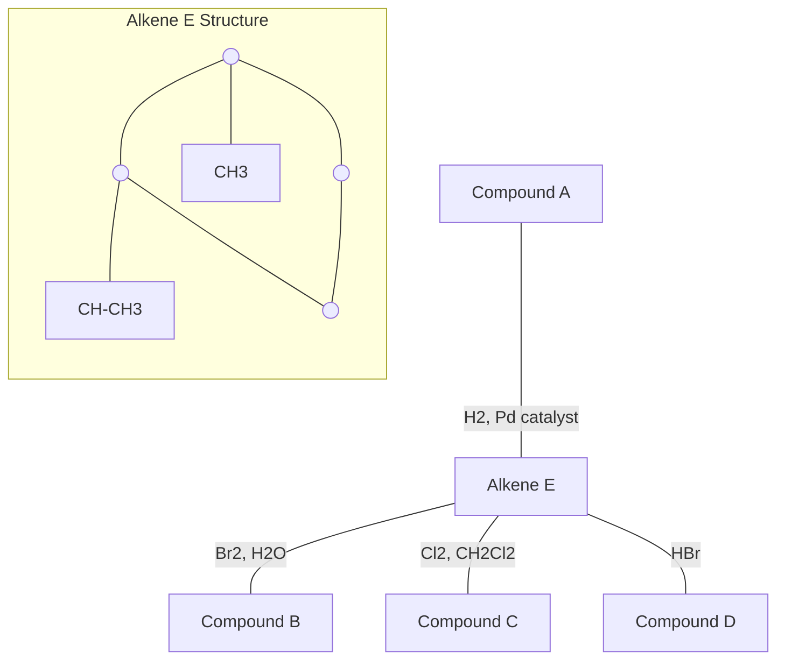
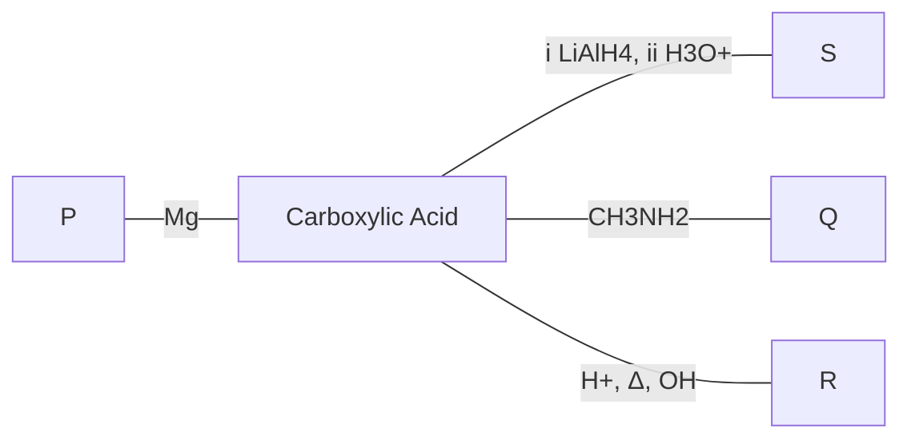

UTM School of Professional and Continuing Education (SPACE) logo

# PAST
# EXAMINATION
# PAPERS

## FOUNDATION PROGRAMME

**SESSION 2018-2022**

**FINAL EXAMINATION**
**SEMESTER I, SESSION 2019/2020**

**COURSE CODE**: FSPK 0012
**COURSE**: COMPUTER LITERACY
**PROGRAMME**: FOUNDATION UTM
**DURATION**: 2 HOURS 30 MINUTES
**DATE**: JUNE 2020

---

**FINAL EXAMINATION**
**SEMESTER I, SESSION 2019/2020**

**COURSE CODE**: ASPE 0032
**COURSE**: ACADEMIC READING
**PROGRAMME**: FOUNDATION UTM
**DURATION**: 8.30 - 11.30 AM

---

**FINAL EXAMINATION**
**SEMESTER II, SESSION 2019/2020**

**COURSE CODE**: FSPM 0034
**COURSE**: STATISTICS AND PROBABILITY
**PROGRAMME**: FOUNDATION UTM
**DURATION**: 3 HOURS
**DATE**: 6 April 2020

---

**FINAL EXAMINATION**
**SEMESTER III, SESSION 2019/2020**

**COURSE CODE**: FSPM 0024
**COURSE**: CALCULUS
**PROGRAMME**: FOUNDATION UTM
**DURATION**: 3 HOURS
**DATE**: APRIL 2020

**INSTRUCTIONS TO CANDIDATE:**
1. This paper consists of 7 questions. Answer all questions.
2. Use a new page for each question.
3. The full marks for each question or section are shown in brackets [ ] at the end of each question.
4. All steps must be shown clearly.
5. Answers may be given in the form of $\pi$, $e$, surd or in significant figures, where appropriate, unless stated otherwise.
6. You are not permitted to share the exam paper with anyone.
7. If you used the methods that never been taught, it will not be counted.

(2019)

UTM Universiti Teknologi Malaysia School of Professional and Continuing Education (SPACE) logo

# PAST YEAR QUESTIONS

---

## FOUNDATION PROGRAMME

### FSPC0034
### CHEMISTRY II SESSION
### 2018-2022

PAST EXAM PAPERS | i

# TABLE OF CONTENTS

**<u>NO</u>**	**<u>ITEM</u>**	**<u>PAGE</u>**

<table>
  <tbody>
    <tr>
        <td>1.</td>
        <td><strong>FSPC0034 Chemistry II</strong></td>
        <td colspan="2"></td>
    </tr>
    <tr>
        <td></td>
        <td>1.1.</td>
        <td>Semester III, Session 2018/2019</td>
        <td>1</td>
    </tr>
    <tr>
        <td></td>
        <td>1.2.</td>
        <td>Semester I, Session 2019/2020</td>
        <td>12</td>
    </tr>
    <tr>
        <td></td>
        <td>1.3.</td>
        <td>Semester III, Session 2019/2020</td>
        <td>23</td>
    </tr>
    <tr>
        <td></td>
        <td>1.4.</td>
        <td>Semester II, Session 2020/2021</td>
        <td>34</td>
    </tr>
    <tr>
        <td></td>
        <td>1.5.</td>
        <td>Semester III, Session 2020/2021</td>
        <td>45</td>
    </tr>
    <tr>
        <td></td>
        <td>1.6.</td>
        <td>Semester III, Session 2021/2022</td>
        <td>58</td>
    </tr>
    <tr>
        <td></td>
        <td>1.7.</td>
        <td>Semester July, Session 2022/2023</td>
        <td>71</td>
    </tr>
    <tr>
        <td></td>
        <td>1.8.</td>
        <td>Semester December, Session 2022/2023</td>
        <td>83</td>
    </tr>
  </tbody>
</table>

PAST EXAM PAPERS | ii

# FSPC0034
# CHEMISTRY II

Semester III, Session 2018/2019

PAST EXAM PAPERS | 1

UTM Universiti Teknologi Malaysia logo

# FINAL EXAMINATION
# SEMESTER III, SESSION 2018/2019

**COURSE CODE** : **FSPC 0034**
**COURSE** : **CHEMISTRY II**
**PROGRAMME** : **FOUNDATION UTM**
**DURATION** : **3 HOURS**
**DATE** : **16 APRIL 2019**

### INSTRUCTION TO CANDIDATES:

1. DO NOT OPEN THIS QUESTION PAPER UNTIL YOU ARE TOLD TO DO SO.
2. ANSWER ALL QUESTIONS.

### WARNING!

*Students caught copying/cheating during the examination will be liable for disciplinary actions and UTMSPACE may recommend the student to be expelled from the study.*

This examination question consists of (10) printed pages including this page.

PAST EXAM PAPERS | 2

# QUESTION 1 (15 MARKS)

(a) When power was turned off to a 30.0 gal. water heater, the temperature of the water dropped from 75.0°C to 22.5°C.
(Given, 1 gal = 3.785 L, density of water 1.00 g/mL).

(i) Determine the amount of heat lost to the surroundings.
(ii) Draw and label the correct energy profile diagram for the given situation.
(4 + 4 marks)

(b) Calculate the $\Delta H^\circ$ for decomposing 10.0 g of limestone,

$$CaCO_3(s) \rightarrow CaO(s) + O_2(g)$$

Given,
Enthalpy of formation, CaO = $-634.9$ kJ
Enthalpy of formation, $CaCO_3$ = $-1207.6$ kJ
(3 marks)

(c) Based on the following reactions,

$2NO(g) + O_2(g) \rightarrow 2 NO_2(g)$ $\Delta H^\circ = -116$ kJ
$2N_2(g) + 5 O_2(g) + 2 H_2O(l) \rightarrow 4 HNO_3(aq)$ $\Delta H^\circ = -256$ kJ
$N_2(g) + O_2(g) \rightarrow 2 NO(g)$ $\Delta H^\circ = +183$ kJ

calculate $\Delta H^\circ$ for the reaction:

$3NO_2(g) + H_2O(l) \rightarrow 2 HNO_3(aq) + NO(g)$
(4 marks)

2
PAST EXAM PAPERS | 3

# QUESTION 2 (15 MARKS)

(a) The data listed in in **TABLE 1** were obtained for the decomposition reaction A $\rightarrow$ Products.

TABLE 1

<table>
  <thead>
    <tr>
        <th>Time, min</th>
        <th>[A], M</th>
        <th>ln [A]</th>
        <th>1/[A]</th>
    </tr>
  </thead>
  <tbody>
    <tr>
        <td>0</td>
        <td>0.53</td>
        <td>-0.63</td>
        <td>1.89</td>
    </tr>
    <tr>
        <td>5</td>
        <td>0.26</td>
        <td>-1.35</td>
        <td>3.85</td>
    </tr>
    <tr>
        <td>10</td>
        <td>0.17</td>
        <td>-1.77</td>
        <td>5.89</td>
    </tr>
    <tr>
        <td>15</td>
        <td>0.12</td>
        <td>-2.12</td>
        <td>8.34</td>
    </tr>
    <tr>
        <td>20</td>
        <td>0.10</td>
        <td>-2.30</td>
        <td>10.00</td>
    </tr>
  </tbody>
</table>

(i) Based on graphical method, establish the order of the reaction. (Hint: Use trial and error methods)

(ii) Determine the rate constant, $k$ and half-life, $t_{1/2}$, when $[A]_0 = 1.00\text{ M}$. (5 + 5 marks)

(b) Methyl bromide reacts with hydroxide ion in solution to produce methyl alcohol and bromide ion.

$$ \text{CH}_3\text{Br} + \text{OH}^- \rightarrow \text{CH}_3\text{OH} + \text{Br}^- $$

TABLE 2

<table>
  <thead>
    <tr>
        <th>Expt. No.</th>
        <th>Initial [CH$_3$Br] (M)</th>
        <th>Initial [OH$^-$] (M)</th>
        <th>Initial Rate (M/s)</th>
    </tr>
  </thead>
  <tbody>
    <tr>
        <td>1.</td>
        <td>0.050</td>
        <td>0.010</td>
        <td>2.4 $\times$ 10$^{-3}$</td>
    </tr>
    <tr>
        <td>2.</td>
        <td>0.080</td>
        <td>0.020</td>
        <td>7.7 $\times$ 10$^{-3}$</td>
    </tr>
    <tr>
        <td>3.</td>
        <td>0.080</td>
        <td>0.010</td>
        <td>3.8 $\times$ 10$^{-3}$</td>
    </tr>
  </tbody>
</table>

From the experimental data in **TABLE 2**, determine the rate law, total order of the reaction and the rate constant. (5 marks)

3
PAST EXAM PAPERS | 4

# QUESTION 3 (15 MARKS)

(a) The research and development unit of a chemical company is studying the reaction of two components of natural gas, CH4 and H2S.

$$ \text{CH}_4(g) + 2\text{H}_2\text{S}(g) \rightleftharpoons \text{CS}_2(g) + 4\text{H}_2(g) $$

In one experiment, 1.00 mol of CH4, 1.00 mol of CS2, 2.00 mol of H2S and 2.00 mol of H2 are mixed in a 250-mL vessel at 960°C. At this temperature, $K_c = 0.036$.

(i) In which direction will the reaction proceed to reach equilibrium?

(ii) If methane concentration is 5.56 M at equilibrium, calculate the equilibrium concentrations of the other substances.

(4 + 6 marks)

(b) Sulphur trioxide, SO3 decomposes to sulphur dioxide, SO2 and oxygen gas. At 350 K, an amount of 3 mol of SO3 is introduced into a 0.50 L vessel, producing 0.08 mol SO2 gas at equilibrium. Determine the equilibrium concentration of all the reacting species at 350 K.

(5 marks)

4

PAST EXAM PAPERS | 5

# QUESTION 4 (20 MARKS)

Ethanoic acid or acetic acid, CH3COOH is a weak acid and a main component of household vinegar, apart from water.

(a) Describe the properties of ethanoic acid as a Bronsted-Lowry acid.
(2 marks)

(b) **TABLE 3** shows the acid dissociation constant, $K_a$ and $pK_a$ of some weak acids.

TABLE 3

<table>
  <thead>
    <tr>
        <th>Acid</th>
        <th>K_a / mol dm⁻³</th>
        <th>pK_a</th>
    </tr>
  </thead>
  <tbody>
    <tr>
        <td>Methanoic acid, HCOOH</td>
        <td>20.9 × 10⁻⁵</td>
        <td>3.68</td>
    </tr>
    <tr>
        <td>Ethanoic acid, CH₃COOH</td>
        <td>1.80 × 10⁻⁵</td>
        <td>4.74</td>
    </tr>
    <tr>
        <td>Phenol, C₆H₅OH</td>
        <td>1.20 × 10⁻¹⁰</td>
        <td>9.92</td>
    </tr>
    <tr>
        <td>Carbonic acid, H₂CO₃</td>
        <td>4.47 × 10⁻⁷</td>
        <td>6.35</td>
    </tr>
  </tbody>
</table>

Arrange the acids in order of increasing acid strength. Explain your answer.
(3 marks)

(c) Sketch the curve expected when ethanoic acid is titrated with sodium hydroxide.
(2 marks)

(d) A buffer solution is formed from ethanoic acid and sodium ethanoate. Using suitable equations, demonstrate why the pH of this buffer solution remains almost constant after addition of small amount of acid or base.
(4 marks)

(e) The dissociation constant, $K_a$ of CH3COOH is $1.8 \times 10^{-5}$.

(i) Calculate the pH of 1.0 mol dm⁻³ of a buffer solution prepared by dissolving 1.0 mol of ethanoic acid and 1.0 mol of sodium ethanoate in sufficient amount of water.

(ii) Calculate the pH of the buffer solution in (i) when 0.1 mol of calcium hydroxide, Ca(OH)₂ is added to it.

(iii) Determine the change in pH in (i).
(3 + 5 + 1 marks)

5

PAST EXAM PAPERS | 6

# QUESTION 5 (20 MARKS)

(a) The diagram below shows a galvanic cell operating under standard conditions. The cell reaction taking place when the cell is functioning is,

$$6\text{Cl}^-(\text{aq}) + 2\text{Au}^{3+}(\text{aq}) \rightarrow 3\text{Cl}_2(\text{g}) + 2\text{Au}(\text{s})$$

with switch S OPEN, the initial reading on the voltmeter is 0.14 V.

Diagram of a galvanic cell with a platinum electrode in a chloride solution and a gold electrode in a gold(III) solution, connected by a salt bridge and an external circuit with a voltmeter and switch.

(i) State the name and chemical formula of the oxidizing agent.
(ii) Write down the half-reaction which takes place at the anode.
(iii) Give the cell notation for this cell.
(iv) Calculate the standard reduction potential of Au.
(v) Will the reading on the voltmeter be compared to the INITIAL reading of 0.14 V? (LARGER THAN, SMALLER THAN or EQUAL TO). Why?

($1 + 2 + 2 + 3 + 2$ marks)

(b) The reaction of a constructed voltaic cell is

$$2\text{Cr}(\text{s}) + 3\text{Sn}^{4+}(\text{aq}) \rightarrow 2\text{Cr}^{3+}(\text{aq}) + 3\text{Sn}^{2+}(\text{aq})$$

(i) Calculate $\text{E}_{\text{cell}}$ at 25 °C if $[\text{Cr}^{3+}] = 1.00\text{ M}$, $[\text{Sn}^{4+}] = 0.500\text{ M}$ and the $[\text{Sn}^{2+}] = 0.025\text{ M}$.
(ii) Calculate $[\text{Cr}^{3+}]$ for the reaction if $[\text{Sn}^{2+}] = 1.00\text{ M}$ and $[\text{Sn}^{4+}] = 1.00\text{ M}$ and the measured cell potential is +0.994 V.

($6 + 2$ marks)

(c) A $\text{Cr}^{3+}(\text{aq})$ solution is electrolyzed using a current of 13.5 A. Calculate the mass of Cr(s) plated out after 3 days.
Given MW of Cr = 51.996 g mol$^{-1}$

(2 marks)

PAST EXAM PAPERS | 7

# QUESTION 6 (30 MARKS)

## (a) Write the structural formula for

(i) 2-bromo-3-nitrobutane
(ii) hexylcyclohexane
(iii) 3,3,6,6-tetraethyl-4-octyne
(iv) 2,4-dinitrotoluene
(v) 2-butanone

(5 marks)

## (b) Give the IUPAC name for the following compounds:

Chemical structures for (i) and (ii)
Chemical structures for (iii) and (iv)

(4 marks)

## (c) Circle and name the functional group(s) in the following molecule:

Chemical structures for (i) and (ii)

(4 marks)

## (d) Draw and name the geometric isomers for the following compound.

Chemical structure for (d)

(4 marks)

7

PAST EXAM PAPERS | 8

(e) (i) Name the reaction processes that lead to the two types of synthetic polymers.
(ii) Draw the structure of the polymers obtain from the polymerization of the following monomers. Use brackets around the repeating unit.

1) Chemical structure of styrene

2) Chemical structures of terephthalic acid and ethylene glycol

(4 marks)

(f) Show the mechanism of electrophilic addition for hydrohalogenation reaction of 2-methylpropene with HBr. State the IUPAC name for the final major product.
(5 marks)

(g) Describe the experimental procedure to differentiate between saturated and unsaturated hydrocarbon using Baeyer test. Show a chemical equation of this reaction to support your answer.
(4 marks)

8

PAST EXAM PAPERS | 9

# LIST OF SELECTED CONSTANT VALUES

Speed of light in a vacuum $c = 3.0 \times 10^8 \text{ m s}^{-1}$
Avogadro's number $N_A = 6.02 \times 10^{23} \text{ mol}^{-1}$
Faraday constant $F = 9.65 \times 10^4 \text{ C mol}^{-1}$
Planck constant $h = 6.6256 \times 10^{-34} \text{ J s}$
Reduced Planck constant $\hbar = 1.054 \times 10^{-34} \text{ J s}$
Rydberg constant $R_H = 1.097 \times 10^7 \text{ m}^{-1}$
$= 2.18 \times 10^{-14} \text{ J}$
Molar of gases constant $R = 8.314 \text{ J K}^{-1} \text{ mol}^{-1}$
$= 0.08206 \text{ L atm mol}^{-1} \text{ K}^{-1}$
Boltzmann constant $k = 1.3807 \times 10^{-27} \text{ J K}^{-1}$
Mass of proton $M_p = 1.672 \times 10^{-27} \text{ kg}$
Electronic Bohr magneton $\mu_B = 9.2741 \times 10^{-24} \text{ J T}^{-1}$
Nuclear Bohr magneton $\beta_N = 5.05 \times 10^{-27} \text{ J T}^{-1}$
Vapour pressure of water $P_{\text{water}} = 23.8 \text{ torr}$
Electron charge $e^- = 1.602 \times 10^{-19} \text{ C}$

# UNIT AND CONVERSION FACTOR

**Energy**
1 J $= 1 \text{ kg m}^2 \text{ s}^{-2} = 1 \text{ N m} = 10^7 \text{ erg}$
1 calorie $= 4.184 \text{ Joule}$
1 eV $= 1.602 \times 10^{-19} \text{ J}$
1 amu $= 1.66 \times 10^{-27} \text{ kg}$

**Pressure**
1 atm $= 760 \text{ mm Hg} = 760 \text{ torr} = 101.325 \text{ kPa} = 101325 \text{ N m}^{-2}$

# FORMULAE

$$ \frac{1}{\lambda_{\text{vac}}} = R \left( \frac{1}{n_1^2} - \frac{1}{n_2^2} \right) $$

$$ 4r = a\sqrt{2} $$

$$ \text{rate} = \sqrt{\frac{1}{\text{density}}} $$

$$ E_{\text{cell}} = E^\circ_{\text{cell}} - \frac{0.0592}{n} \log Q $$

9
PAST EXAM PAPERS | 10

# STANDARD REDUCTION POTENTIAL ELECTROCHEMICAL SERIES

<table>
  <thead>
    <tr>
        <th>Half-Reaction</th>
        <th>E (Volts)</th>
    </tr>
  </thead>
  <tbody>
    <tr>
        <td>K⁺ + e⁻ ⇌ K</td>
        <td>-2.924</td>
    </tr>
    <tr>
        <td>Ba²⁺ + 2e⁻ ⇌ Ba</td>
        <td>-2.900</td>
    </tr>
    <tr>
        <td>Ca²⁺ + 2e⁻ ⇌ Ca</td>
        <td>-2.760</td>
    </tr>
    <tr>
        <td>Na⁺ + e⁻ ⇌ Na</td>
        <td>-2.712</td>
    </tr>
    <tr>
        <td>Mg²⁺ + 2e⁻ ⇌ Mg</td>
        <td>-2.375</td>
    </tr>
    <tr>
        <td>H₂ + 2e⁻ ⇌ 2 H⁻</td>
        <td>-2.230</td>
    </tr>
    <tr>
        <td>Al³⁺ + 3e⁻ ⇌ Al</td>
        <td>-1.706</td>
    </tr>
    <tr>
        <td>Mn²⁺ + 2e⁻ ⇌ Mn</td>
        <td>-1.040</td>
    </tr>
    <tr>
        <td>Zn²⁺ + 2e⁻ ⇌ Zn</td>
        <td>-0.763</td>
    </tr>
    <tr>
        <td>Cr³⁺ + 3e⁻ ⇌ Cr</td>
        <td>-0.740</td>
    </tr>
    <tr>
        <td>S + 2e⁻ ⇌ S²⁻</td>
        <td>-0.508</td>
    </tr>
    <tr>
        <td>2CO₂ + 2H⁺ + 2e⁻ ⇌ H₂C₂O₄</td>
        <td>-0.490</td>
    </tr>
    <tr>
        <td>Cr³⁺ + e⁻ ⇌ Cr²⁺</td>
        <td>-0.410</td>
    </tr>
    <tr>
        <td>Fe²⁺ + 2e⁻ ⇌ Fe</td>
        <td>-0.409</td>
    </tr>
    <tr>
        <td>Co²⁺ + 2e⁻ ⇌ Co</td>
        <td>-0.280</td>
    </tr>
    <tr>
        <td>Ni²⁺ + 2e⁻ ⇌ Ni</td>
        <td>-0.230</td>
    </tr>
    <tr>
        <td>Sn²⁺ + 2e⁻ ⇌ Sn</td>
        <td>-0.136</td>
    </tr>
    <tr>
        <td>Pb²⁺ + 2e⁻ ⇌ Pb</td>
        <td>-0.126</td>
    </tr>
    <tr>
        <td>Fe³⁺ + 3e⁻ ⇌ Fe</td>
        <td>-0.036</td>
    </tr>
    <tr>
        <td>2H⁺ + 2e⁻ ⇌ H₂</td>
        <td>0.000</td>
    </tr>
    <tr>
        <td>S₄O₆²⁻ + 2e⁻ ⇌ 2 S₂O₃²⁻</td>
        <td>0.089</td>
    </tr>
    <tr>
        <td>Sn⁴⁺ + 2e⁻ ⇌ Sn²⁺</td>
        <td>0.150</td>
    </tr>
    <tr>
        <td>Cu²⁺ + e⁻ ⇌ Cu⁺</td>
        <td>0.158</td>
    </tr>
    <tr>
        <td>Cu²⁺ + 2e⁻ ⇌ Cu</td>
        <td>0.340</td>
    </tr>
    <tr>
        <td>O₂ + 2H₂O + 4e⁻ ⇌ 4OH⁻</td>
        <td>0.401</td>
    </tr>
    <tr>
        <td>Cu⁺ + e⁻ ⇌ Cu</td>
        <td>0.522</td>
    </tr>
    <tr>
        <td>I₃⁻ + 2e⁻ ⇌ 3 I⁻</td>
        <td>0.534</td>
    </tr>
    <tr>
        <td>MnO₄⁻ + 2H₂O + 3e⁻ ⇌ MnO₂ + 4OH⁻</td>
        <td>0.588</td>
    </tr>
    <tr>
        <td>O₂ + 2H⁺ + 2e⁻ ⇌ H₂O₂</td>
        <td>0.682</td>
    </tr>
    <tr>
        <td>Fe³⁺ + e⁻ ⇌ Fe²⁺</td>
        <td>0.770</td>
    </tr>
    <tr>
        <td>Hg₂²⁺ + 2e⁻ ⇌ Hg</td>
        <td>0.796</td>
    </tr>
    <tr>
        <td>Cl₂ + 2e⁻ ⇌ 2Cl⁻</td>
        <td>1.360</td>
    </tr>
  </tbody>
</table>

10
PAST EXAM PAPERS | 11

# FSPC0034
# CHEMISTRY II

decorative divider

Semester I, Session 2019/2020

PAST EXAM PAPERS | 12

UTM Universiti Teknologi Malaysia logo

# FINAL EXAMINATION
# SEMESTER I, SESSION 2019/2020

**COURSE CODE** : FSPC 0034

**COURSE** : CHEMISTRY II

**PROGRAMME** : FOUNDATION

**DURATION** : 3 HOURS

**DATE** : JUNE 2019

**INSTRUCTION TO CANDIDATES:**

1. DO NOT OPEN THIS QUESTION PAPER UNTIL YOU ARE TOLD TO DO SO.

2. ANSWER ALL QUESTIONS.

***WARNING!***

*Students caught copying/cheating during the examination will be liable for disciplinary actions and SPACE may recommend the student to be expelled from the study.*

This examination question consists of (10) printed pages only including this page.

PAST EXAM PAPERS | 13

FSPC 0034 CHEMISTRY II

# QUESTION 1 (20 MARKS)

a) The thermite reaction involves aluminum and iron(III) oxide is given as the following:

$$2Al(s) + Fe_{2}O_{3}(s) \rightarrow Al_{2}O_{3}(s) + 2Fe(l)$$

This reaction is highly exothermic and the liquid iron formed is used to weld metals.
Given:

$\Delta H_{f}^{o} [Al_{2}O_{3}(s)] = -1669.8 \text{ kJ mol}^{-1}$
$\Delta H_{f}^{o} [Fe(l)] = 12.40 \text{ kJ mol}^{-1}$
$\Delta H_{f}^{o} [Al(s)] = 0 \text{ kJ mol}^{-1}$
$\Delta H_{f}^{o} [Fe_{2}O_{3}(s)] = -822.2 \text{ kJ mol}^{-1}$
Molar Mass of Aluminium is 26.98 g/mol.

Calculate the heat released in kilojoules per gram of Al reacted with $Fe_{2}O_{3}$
(6 marks)

b) A sample of magnesium metal weighing 0.14 g is combusted in a bomb calorimeter containing $3.0 \times 10^{2}$ g water at an initial temperature of 25.0 °C. The maximum temperature recorded was 26.0 °C. If the heat capacity of the calorimeter is 1769 J °C⁻¹, the specific heat of water is 4.184 Jg⁻¹ °C⁻¹ and molar mass of magnesium 24.31 g/mol,

i. calculate the enthalpy of combustion for magnesium.
ii. write the thermochemical equation for the combustion of magnesium.
(5+2 marks)

c) Consider the dimerization of $NO_{2}$,

$$2NO_{2}(g) \rightarrow N_{2}O_{4}(g) - \text{equation (3)}$$

i. Write two (2) equations which correspond to the following $\Delta H_{f}^{o}$ values.

$\Delta H_{f}^{o} [NO_{2}(g)] = 33.84 \text{ kJ/mol}$
$\Delta H_{f}^{o} [N_{2}O_{4}(g)] = 9.66 \text{ kJ/mol}$

Combine these equations to give product as per above reaction (equation 3).

ii. Calculate the value of $\Delta H$ for the reaction above, and state whether the reaction is endothermic or exothermic.
(4+3 marks)

2

PAST EXAM PAPERS | 14

FSPC 0034 CHEMISTRY II

# QUESTION 2 (20 MARKS)

a) The reaction of peroxydisulfate ion ($S_2O_8^{2-}$) with iodide ion ($I^-$) is given as the following:

$$S_2O_8^{2-}(aq) + 3I^-(aq) \rightarrow 2SO_4^{2-}(aq) + I_3^-(aq)$$

<table>
  <thead>
    <tr>
        <th>Experiment</th>
        <th>S_2O_8^{2-}</th>
        <th>[I^-] (M)</th>
        <th>Initial Rate (M/s)</th>
    </tr>
  </thead>
  <tbody>
    <tr>
        <td>1</td>
        <td>0.080</td>
        <td>0.034</td>
        <td>2.2 x 10⁻⁴</td>
    </tr>
    <tr>
        <td>2</td>
        <td>0.080</td>
        <td>0.017</td>
        <td>1.1 x 10⁻⁴</td>
    </tr>
    <tr>
        <td>3</td>
        <td>0.16</td>
        <td>0.017</td>
        <td>2.2 x 10⁻⁴</td>
    </tr>
  </tbody>
</table>

Based on the data collected, determine

i. the rate law
ii. the overall order reaction
iii. the rate constant

(7+1+2 marks)

b) The rate of decomposition of azomethane ($C_2H_6N_2$) is studied by monitoring the partial pressure of the reactant as a function of time.

$$CH_3N=NCH_3(g) \rightarrow N_2(g) + C_2H_6(g)$$

The data obtained at 300°C are shown in the following table:

<table>
  <thead>
    <tr>
        <th>Time (s)</th>
        <th>Partial Pressure of Azomethane (mmHg)</th>
    </tr>
  </thead>
  <tbody>
    <tr>
        <td>0</td>
        <td>284</td>
    </tr>
    <tr>
        <td>100</td>
        <td>220</td>
    </tr>
    <tr>
        <td>150</td>
        <td>193</td>
    </tr>
    <tr>
        <td>200</td>
        <td>170</td>
    </tr>
    <tr>
        <td>250</td>
        <td>150</td>
    </tr>
    <tr>
        <td>300</td>
        <td>132</td>
    </tr>
  </tbody>
</table>

Are these values consistent with first order kinetics? If so, based on graphical method, determine the rate constant.

(10 marks)

3

PAST EXAM PAPERS | 15

FSPC 0034 CHEMISTRY II

# QUESTION 3 (15 MARKS)

a) The equilibrium constant $K_p$ for the decomposition of phosphorus pentachloride to phosphorus trichloride and molecular chlorine is found to be 1.05 at 250°C.

$$ \text{PCl}_5(g) \rightleftharpoons \text{PCl}_3(g) + \text{Cl}_2(g) $$

With the given equation, if the equilibrium partial pressures of $\text{PCl}_5$ and $\text{PCl}_3$ are 0.875 atm and 0.463 atm, respectively, determine the equilibrium partial pressure of $\text{Cl}_2$ at 250°C.

(5 marks)

b) Methanol ($\text{CH}_3\text{OH}$) is manufactured industrially by the reaction given below

$$ \text{CO}(g) + 2\text{H}_2(g) \rightleftharpoons \text{CH}_3\text{OH}(g) $$

The equilibrium constant $K_c$ for the reaction is 10.5 at 220°C. Determine the value of $K_p$ at this temperature.

(5 marks)

c) Write down the expression for the solubility product, $K_{sp}$ for the following salts.

i. NiS
ii. $\text{Pb(OH)}_2$
iii. $\text{Ca}_3(\text{PO}_4)_2$
iv. $\text{Ag}_2\text{CrO}_4$
v. $\text{Al(OH)}_3$

(5 marks)

4

PAST EXAM PAPERS | 16

FSPC 0034 CHEMISTRY II

# QUESTION 4 (25 MARKS)

a) The concentration of H+ ions in a bottle of table wine was 3.2 x 10-4 M right after the cork was removed. Only half of the wine was consumed. The other half, after it had been standing open to the air for a month, was found to have a hydrogen ion concentration equal to 1.0 x 10-3 M. Calculate the pH of the wine for these two separate occasions.

(5 marks)

b) Predict whether the following solutions will be acidic, basic or nearly neutral. State your reason.

i. NH4I
ii. NaNO2
iii. FeCl3
iv. KC2H3O2
v. Li2SO3

(10 marks)

c) The concentration of sodium acetate solution, CH3COONa is 0.15 M. Given Kb= 5.6 X 10-10. Calculate,

i. the pH of the solution.
ii. the percentage of hydrolysis.

(8+2 marks)

5
PAST EXAM PAPERS | 17

FSPC 0034 CHEMISTRY II

**QUESTION 5 (20 MARKS)**

a) An electrochemical cell was set up using the silver half-cell as anode.

Diagram of an electrochemical cell with silver and platinum electrodes connected by a salt bridge and a voltmeter. The platinum electrode is in a solution with hydrogen gas.

i. Write a balanced equation to represent the reaction in each half cell.
ii. Calculate the cell standard electromotive force
iii. The concentration of Ag+ is increased to 10.00 mol dm-3 whereas the concentration of H+ is decreased to 0.10 mol dm-3. If hydrogen gas at 1.0 atm is used, determine the new cell potential.

(2+2+2 marks)

b) Calculate the quantity of electricity in Coloumbs necessary to deposit 100.0 g of copper from CuSO4 solution. Given MW of Cu=63.6g/mol and 1 mol of copper = 193000 C
(4 marks)

c) Balance the following equation for the reaction in basic medium by the ion-electron method.

$$ \text{SO}_3^{2-}(\text{aq}) + \text{MnO}_4^-(\text{aq}) \rightarrow \text{SO}_4^{2-}(\text{aq}) + \text{Mn}^{2+}(\text{aq}) $$

(10 marks)

6
PAST EXAM PAPERS | 18

FSPC 0034 CHEMISTRY II

# QUESTION 6 (30 MARKS)

a. Name the following saturated hydrocarbon according to IUPAC nomenclature.

i. skeletal structure of 3,5-dimethylheptane

ii. skeletal structure of 2,2,5-trimethyloctane

iii. skeletal structure of ethylcyclobutane

iv. skeletal structure of 4-ethyl-1,2-dimethylcyclohexane

(4 marks)

b. Draw the structural formulae for the following molecules.

i. 4-ethyl-1,2-dimethylcyclohexane
ii. 2,2,5-trimethylheptane
iii. 3-cyclobutylpentane

(3 marks)

c. Draw all possible structural isomers for an alkane with the molecular formula of C5H12

(3 marks)

d. Draw the structure of 3-ethyl-2,2-dimethylhexane and determine the primary, secondary, tertiary and quaternary carbon atoms are there.

(5 marks)

7

PAST EXAM PAPERS | 19

FSPC 0034 CHEMISTRY II

e. According to the diagram below,

i. draw the structures of compound A,B,C and D

ii. draw the structure of the product when alkene E react with hot acidified KMnO4

iii. Reaction of alkene E with cold dilute alkaline KMnO4 solution can be used as a test for an alkene. Name this test, state the observation and provide the equation involved for the reaction. (4+2+4 marks)

f. Draw the structure of compound P,Q, R and S and name the carboxylic acid according to IUPAC nomenclature.

(5 marks)

# THE END

8

PAST EXAM PAPERS | 20

FSPC 0034 CHEMISTRY II

# LIST OF SELECTED CONSTANT VALUES

<table>
  <thead>
    <tr>
        <th>Constant</th>
        <th>Symbol</th>
        <th colspan="2">Value</th>
    </tr>
  </thead>
  <tbody>
    <tr>
        <td>Speed of light in a vacuum</td>
        <td>c</td>
        <td>=</td>
        <td>3.0 X 10⁸ ms⁻¹</td>
    </tr>
    <tr>
        <td>Avogadro's number</td>
        <td>NA</td>
        <td>=</td>
        <td>6.02 X 10²³ mol⁻¹</td>
    </tr>
    <tr>
        <td>Faraday Constant</td>
        <td>F</td>
        <td>=</td>
        <td>9.65 X 10⁴ Cmol⁻¹</td>
    </tr>
    <tr>
        <td>Planck constant</td>
        <td>h</td>
        <td>=</td>
        <td>6.6256 X 10⁻³⁴ Js</td>
    </tr>
    <tr>
        <td>Reduced Planck Constant</td>
        <td>ℏ</td>
        <td>=</td>
        <td>1.054 X 10⁻³⁴ Js</td>
    </tr>
    <tr>
        <td>Rydberg Constant</td>
        <td>RH</td>
        <td>=</td>
        <td>1.097 X 10⁷ m⁻¹</td>
    </tr>
    <tr>
        <td> </td>
        <td> </td>
        <td>=</td>
        <td>2.18 X 10⁻¹⁸ J</td>
    </tr>
    <tr>
        <td>Molar of Gases Constant</td>
        <td>R</td>
        <td>=</td>
        <td>8.314 JK⁻¹ mol⁻¹</td>
    </tr>
    <tr>
        <td> </td>
        <td> </td>
        <td>=</td>
        <td>0.08206 L atm mol⁻¹K⁻¹</td>
    </tr>
    <tr>
        <td>Boltzmann Constant</td>
        <td>k</td>
        <td>=</td>
        <td>1.3807 X 10⁻²³ JK⁻¹</td>
    </tr>
    <tr>
        <td>Mass of Proton</td>
        <td>Mp</td>
        <td>=</td>
        <td>1.672 X 10⁻²⁷ kg</td>
    </tr>
    <tr>
        <td>Electronic Bohr Magneton</td>
        <td>μB</td>
        <td>=</td>
        <td>9.2741 X 10⁻²⁴</td>
    </tr>
    <tr>
        <td>Nuclear Bohr Magneton</td>
        <td>βN</td>
        <td>=</td>
        <td>5.05 X 10⁻²⁷ JT⁻¹</td>
    </tr>
    <tr>
        <td>Vapor Pressure of Water</td>
        <td>Pwater</td>
        <td>=</td>
        <td>23.8 torr</td>
    </tr>
    <tr>
        <td>Electron Charge</td>
        <td>e⁻</td>
        <td>=</td>
        <td>1.602 X 10⁻¹⁹ C</td>
    </tr>
  </tbody>
</table>

# UNIT AND CONVERSION FACTOR

<table>
  <thead>
    <tr>
        <th>Category</th>
        <th>Unit</th>
        <th>Conversion</th>
    </tr>
  </thead>
  <tbody>
    <tr>
        <td>Energy</td>
        <td>1J</td>
        <td>= 1kg m²s⁻² = 1Nm = 10⁷ erg</td>
    </tr>
    <tr>
        <td> </td>
        <td>1 calorie</td>
        <td>= 4.184 Joule</td>
    </tr>
    <tr>
        <td> </td>
        <td>1 eV</td>
        <td>= 1.602 X 10⁻¹⁹ J</td>
    </tr>
    <tr>
        <td> </td>
        <td>1 amu</td>
        <td>= 1.66 X 10⁻²⁷ kg</td>
    </tr>
    <tr>
        <td>Pressure</td>
        <td>1 atm</td>
        <td>= 760 mm Hg = 760 torr = 101.325 kPa</td>
    </tr>
    <tr>
        <td> </td>
        <td> </td>
        <td>= 101325 Nm⁻²</td>
    </tr>
  </tbody>
</table>

# FORMULAE

$$ \frac{1}{\lambda_{vac}} = R(\frac{1}{n_1^2} - \frac{1}{n_2^2}) $$

$$ 4r = a\sqrt{2} $$

$$ \text{Rate} = \sqrt{\frac{1}{\text{density}}} $$

$$ E_{cell} = E^\circ_{cell} - \frac{0.0592}{n} \log Q $$

9

PAST EXAM PAPERS | 21

FSPC 0034 CHEMISTRY II

# STANDARD REDUCTION POTENTIAL ELECTROCHEMICAL SERIES

<table>
  <thead>
    <tr>
        <th>Half-Reaction</th>
        <th>E (Volts)</th>
    </tr>
  </thead>
  <tbody>
    <tr>
        <td>K+ + e- ⇌ K</td>
        <td>-2.924</td>
    </tr>
    <tr>
        <td>Ba2+ + 2e- ⇌ Ba</td>
        <td>-2.900</td>
    </tr>
    <tr>
        <td>Ca2+ + 2e- ⇌ Ca</td>
        <td>-2.760</td>
    </tr>
    <tr>
        <td>Na+ + e- ⇌ Na</td>
        <td>-2.712</td>
    </tr>
    <tr>
        <td>Mg2+ + 2e- ⇌ Mg</td>
        <td>-2.375</td>
    </tr>
    <tr>
        <td>H2 + 2e- ⇌ 2 H-</td>
        <td>-2.230</td>
    </tr>
    <tr>
        <td>Al3+ + 3e- ⇌ Al</td>
        <td>-1.706</td>
    </tr>
    <tr>
        <td>Mn2+ + 2e- ⇌ Mn</td>
        <td>-1.040</td>
    </tr>
    <tr>
        <td>Zn2+ + 2e- ⇌ Zn</td>
        <td>-0.763</td>
    </tr>
    <tr>
        <td>Cr3+ + 3e- ⇌ Cr</td>
        <td>-0.740</td>
    </tr>
    <tr>
        <td>S + 2e- ⇌ S2-</td>
        <td>-0.508</td>
    </tr>
    <tr>
        <td>2CO2 + 2H+ + 2e- ⇌ H2C2O4</td>
        <td>-0.490</td>
    </tr>
    <tr>
        <td>Cr3+ + e- ⇌ Cr2+</td>
        <td>-0.410</td>
    </tr>
    <tr>
        <td>Fe2+ + 2e- ⇌ Fe</td>
        <td>-0.409</td>
    </tr>
    <tr>
        <td>Co2+ + 2e- ⇌ Co</td>
        <td>-0.280</td>
    </tr>
    <tr>
        <td>Ni2+ + 2e- ⇌ Ni</td>
        <td>-0.230</td>
    </tr>
    <tr>
        <td>Sn2+ + 2e- ⇌ Sn</td>
        <td>-0.136</td>
    </tr>
    <tr>
        <td>Pb2+ + 2e- ⇌ Pb</td>
        <td>-0.126</td>
    </tr>
    <tr>
        <td>Fe3+ + 3e- ⇌ Fe</td>
        <td>-0.036</td>
    </tr>
    <tr>
        <td>2H+ + 2e- ⇌ H2</td>
        <td>0.000</td>
    </tr>
    <tr>
        <td>S4O62- + 2e- ⇌ 2 S2O32-</td>
        <td>0.089</td>
    </tr>
    <tr>
        <td>Sn4+ + 2e- ⇌ Sn2+</td>
        <td>0.150</td>
    </tr>
    <tr>
        <td>Cu2+ + e- ⇌ Cu+</td>
        <td>0.158</td>
    </tr>
    <tr>
        <td>Cu2+ + 2e- ⇌ Cu</td>
        <td>0.340</td>
    </tr>
    <tr>
        <td>O2 + 2H2O + 4e- ⇌ 4OH-</td>
        <td>0.401</td>
    </tr>
    <tr>
        <td>Cu+ + e- ⇌ Cu</td>
        <td>0.522</td>
    </tr>
    <tr>
        <td>I3- + 2e- ⇌ 3 I-</td>
        <td>0.534</td>
    </tr>
    <tr>
        <td>MnO4- + 2H2O + 3e- ⇌ MnO2 + 4OH-</td>
        <td>0.588</td>
    </tr>
    <tr>
        <td>O2 + 2H+ + 2e- ⇌ H2O2</td>
        <td>0.682</td>
    </tr>
    <tr>
        <td>Fe3+ + e- ⇌ Fe2+</td>
        <td>0.770</td>
    </tr>
    <tr>
        <td>Hg22+ + 2e- ⇌ Hg</td>
        <td>0.796</td>
    </tr>
  </tbody>
</table>

10
PAST EXAM PAPERS | 22

# FSPC0034
# CHEMISTRY II

***

## Semester III, Session 2019/2020

PAST EXAM PAPERS | 23

UTM Universiti Teknologi Malaysia logo

# FINAL EXAMINATION
# SEMESTER III, SESSION 2019/2020

* **COURSE CODE**: FSPC 0034
* **COURSE**: CHEMISTRY II
* **PROGRAMME**: FOUNDATION
* **DURATION**: 3 HOURS
* **DATE**: APRIL 2020

**INSTRUCTION TO CANDIDATES:**

1. DO NOT OPEN THIS QUESTION PAPER UNTIL YOU ARE TOLD TO DO SO.
2. ANSWER ALL QUESTIONS.

**WARNING!**
*Students caught copying/cheating during the examination will be liable for disciplinary actions and SPACE may recommend the student to be expelled from the study.*

This examination question consists of (10) printed pages only including this page.

PAST EXAM PAPERS | 24

# QUESTION 1 (15 MARKS)

(a) Based on the following enthalpy values with their respective reactions:

<table>
  <thead>
    <tr>
        <th>Equation</th>
        <th>Enthalpy change, ΔH (kJ/mol)</th>
    </tr>
  </thead>
  <tbody>
    <tr>
        <td>2 Al (s) + 3/2 O2 (g) → Al2O3 (s)</td>
        <td>-1675.7</td>
    </tr>
    <tr>
        <td>Al (s) → Al (g)</td>
        <td>+326</td>
    </tr>
    <tr>
        <td>½ O2 (g) → O (g)</td>
        <td>+498</td>
    </tr>
    <tr>
        <td>Al (g) → Al3+ (g) + 3 e-</td>
        <td>+5139</td>
    </tr>
    <tr>
        <td>O (g) + 2 e- → O2- (g)</td>
        <td>+844</td>
    </tr>
  </tbody>
</table>

(i) Calculate the lattice energy of aluminium oxide, Al2O3 (s). Given the reaction equation for standard lattice enthalpy:

$$ 2 Al^{3+} (g) + 3/2 O^{2-} (g) \rightarrow Al_2O_3 (s) $$

(8 marks)

(ii) Based on the calculated values, state whether the crystal structure of Al2O3 formed is stable or not. Explain your choice very briefly.

(2 marks)

(b) When 9.55 g sample of solid ammonium nitrate, NH4NO3, dissolves in 60 g of water in a coffee cup calorimeter, the temperature drops from 23.0°C to 18.4°C. Calculate the heat, q, for the dissolution process. Given the specific heat capacity of the solution is 4.186 J°C-1g-1 and heat capacity of the cup calorimeter is 22.95 J°C-1. Based on the value obtained, is the process exothermic or endothermic?

(5 marks)

2

PAST EXAM PAPERS | 25

# QUESTION 2 (15 MARKS)

(a) Propanone iodises in the presence of dilute acid through the following equation:

$$I_2 + CH_3COOCH_3 \rightarrow ICH_2COOCH_3 + HI$$

In a study, the following results were obtained:

<table>
  <tbody>
    <tr>
        <td>Time / min</td>
        <td>0</td>
        <td>5</td>
        <td>9</td>
        <td>12</td>
        <td>14</td>
        <td>15</td>
    </tr>
    <tr>
        <td>[I₂] x 10⁻³ / mol dm⁻³</td>
        <td>2.5</td>
        <td>1.65</td>
        <td>0.97</td>
        <td>0.46</td>
        <td>0.12</td>
        <td>0</td>
    </tr>
  </tbody>
</table>

(i) Sketch a graph of concentration of iodine against time.
(4 marks)

(ii) Based on the graph, deduce the order of reaction with respect to iodine. Justify your answer.
(2 marks)

(b) Nitrosyl chloride, ClNO, a gas, can be prepared through the reaction between nitrogen monoxide gas, NO, and chlorine gas, Cl₂.

(i) Write a balanced chemical equation to demonstrate this reaction.
(2 marks)

(ii) The rate expression for this reaction is as follows:

Rate = k[NO][Cl₂]

The reaction mechanism involves two steps. The first step involves production of ClNO and chlorine free radical. The second step involves the reaction between chlorine free radical and nitrogen monoxide gas.

Write the chemical equation for both the steps in the reaction mechanism.
(4 marks)

(iii) Which of the two steps is the rate-determining step? Explain your answer.
(3 marks)

3
PAST EXAM PAPERS | 26

# QUESTION 3 (15 MARKS)

(a) When steam is allowed to react with red hot iron filings, the following reversible reaction takes place.

$$3 \text{ Fe (s)} + 4 \text{ H}_2\text{O (g)} \rightleftharpoons \text{Fe}_3\text{O}_4 \text{ (s)} + 4 \text{ H}_2 \text{ (g)}$$

At a certain temperature, the partial pressures of steam and hydrogen in the <u>equilibrium mixture</u> are 15.2 atm and 319 atm respectively. Calculate :

(i) The equilibrium constant, Kp
(ii) The pressure of hydrogen and steam, when the total pressure is 100 atm at this temperature and equilibrium.
(2+5 marks)

(b) The synthesis of hydrogen iodide from hydrogen and iodine is an <u>endothermic process.</u> It is widely use in the preparation of organic and inorganic iodides and also as a reducing agent as HI is considered as a strong acid.

$$\text{H}_2 \text{ (g)} + \text{ I}_2 \text{ (g)} \rightleftharpoons 2 \text{ HI (g)}$$

Predict the effect of **increasing the temperature** on the above system in equilibrium for: (please justify your answer)

(i) The concentration of product, [HI]
(ii) The equilibrium position/direction
(iii)The equilibrium constant, Kp
(6 marks)

(c) For an equilibrium reaction : 2 SO2 (g) + O2 (g) $\rightleftharpoons$ 2 SO3 (g), the Kp of this reaction is 1.3x104. The partial pressures of a mixture of gases measured at equilibrium are in the table below :

<table>
  <thead>
    <tr>
        <th>Gas</th>
        <th>SO2</th>
        <th>O2</th>
        <th>SO3</th>
    </tr>
  </thead>
  <tbody>
    <tr>
        <td>P (atm)</td>
        <td>0.05</td>
        <td>0.03</td>
        <td>1.00</td>
    </tr>
  </tbody>
</table>

What is the value of K'p for the new reaction given?
$$\text{SO}_2 \text{ (g)} + \text{ ½ O}_2 \text{ (g)} \rightleftharpoons \text{ SO}_3 \text{ (g)}$$
(2 marks)

4
PAST EXAM PAPERS | 27

# QUESTION 4 (20 MARKS)

(a) Formic acid, HCOOH, is an important intermediate in chemical synthesis and occurs naturally, most notably in some ants that causes irritation to the body.

(i) Find the concentration of hydronium ion and the pH in a 0.534 M solution of formic acid.

HCOOH (aq) + H2O (l) $\rightleftharpoons$ H3O+ (aq) + HCOO− (aq), Ka=1.8×10−4
(5 marks)

(ii) What is the percent ionization of formic acid?
(2 marks)

(b) Acetic acid, systematically named ethanoic acid, is a colourless liquid organic compound with the chemical formula CH3COOH. Ethanoic acid has many uses in industrial, medical and household settings. An experiment using this organic compound was held in the lab where a mixture is produced by mixing 800 mL of 0.10 mol L-1 ethanoic acid with 200 mL of 0.10 mol L-1 sodium hydroxide solution. The *pKa* of ethanoic acid is 4.74.

(i) Calculate the concentration (in mol L-1) of ethanoic acid left and sodium ethanoate in this solution.
(6 marks)

(ii) Calculate the pH of the mixture
(3 marks)

(iii) Determine the mass of ethanoic acid, CH3COOH in gram added to sodium hydroxide solution in the above experiment.
(2 marks)

(iv) Equivalence point is the point at which the amount of acid added is equivalent to the amount of base added. Write the equation involving the ethanoate ion to show why the pH of the solution is greater than 7 at equivalence point.
(2 marks)

5

PAST EXAM PAPERS | 28

# QUESTION 5 (20 MARKS)

(a) Balance this reaction in both acidic and basic aqueous solutions:

$$ \text{Cr}_2\text{O}_7^{2-} + \text{Fe}^{2+} \rightarrow \text{Cr}^{3+} + \text{Fe}^{3+} $$
(10 marks)

(b) An aqueous Na2SO4 solution is electrolyzed, using the apparatus shown below.

Electrolysis of aqueous sodium sulfate solution showing gas collection in two test tubes

If the products formed at the anode and cathode is oxygen gas and hydrogen gas, respectively, describe the electrolysis in terms of the reactions at the electrodes.

(10 marks)

6
PAST EXAM PAPERS | 29

# QUESTION 6 (30 MARKS)

(a) Draw the structural formula and give the general formula for the following molecules:

(i) 1,2-dimethyl cyclobutane
(ii) Ortho-hydroxybenzoic acid
(iii) 2,2-dimethylpropane
(iv) 1,4-hexadiene
(v) toluene

(10 marks)

(b) Give the IUPAC name and state the functional groups for the given structures below:

(i) chemical structure of 2-methylhexan-2-ol

(ii) chemical structure of cyclopentene

(iii) chemical structure of 3-chloro-4-methylhex-3-ene

(6 marks)

(c) Draw the optical isomers for 2-hydroxypropanoic acid and show the position of chiral carbon in the structure.

(3 marks)

(d) Given structure below:

-(NH-CHR-CO)n-

(i) identify if whether the polymer is homopolymer or copolymer
(ii) explain your answer

(4 marks)

(e) Differentiate between the three classifications of polymers on the basis of structures.

(3 marks)

(f) Describe one (1) experimental procedures involved in testing aldehydes.

(4 marks)

PAST EXAM PAPERS | 30

Periodic Table of the Elements

PAST EXAM PAPERS | 31

8

# LIST OF SELECTED CONSTANT VALUES

<table>
  <tbody>
    <tr>
        <td>Speed of light in a vacuum</td>
        <td>c</td>
        <td>=</td>
        <td>3.0 × 10⁸ m s⁻¹</td>
    </tr>
    <tr>
        <td>Avogadro's number</td>
        <td>N_A</td>
        <td>=</td>
        <td>6.02 × 10²³ mol⁻¹</td>
    </tr>
    <tr>
        <td>Faraday constant</td>
        <td>F</td>
        <td>=</td>
        <td>9.65 × 10⁴ C mol⁻¹</td>
    </tr>
    <tr>
        <td>Planck constant</td>
        <td>h</td>
        <td>=</td>
        <td>6.6256 × 10⁻³⁴ J s</td>
    </tr>
    <tr>
        <td>Reduced Planck constant</td>
        <td>ℏ</td>
        <td>=</td>
        <td>1.054 × 10⁻³⁴ J s</td>
    </tr>
    <tr>
        <td>Rydberg constant</td>
        <td>R_H</td>
        <td>=</td>
        <td>1.097 × 10⁷ m⁻¹</td>
    </tr>
    <tr>
        <td> </td>
        <td> </td>
        <td>=</td>
        <td>2.18 × 10⁻¹⁸ J</td>
    </tr>
    <tr>
        <td>Molar of gases constant</td>
        <td>R</td>
        <td>=</td>
        <td>8.314 J K⁻¹ mol⁻¹</td>
    </tr>
    <tr>
        <td> </td>
        <td> </td>
        <td>=</td>
        <td>0.08206 L atm mol⁻¹ K⁻¹</td>
    </tr>
    <tr>
        <td>Boltzmann constant</td>
        <td>k</td>
        <td>=</td>
        <td>1.3807 × 10⁻²³ J K⁻¹</td>
    </tr>
    <tr>
        <td>Mass of proton</td>
        <td>M_p</td>
        <td>=</td>
        <td>1.672 × 10⁻²⁷ kg</td>
    </tr>
    <tr>
        <td>Electronic Bohr magneton</td>
        <td>μ_B</td>
        <td>=</td>
        <td>9.2741 × 10⁻²⁴ J T⁻¹</td>
    </tr>
    <tr>
        <td>Nuclear Bohr magneton</td>
        <td>β_N</td>
        <td>=</td>
        <td>5.05 × 10⁻²⁷ J T⁻¹</td>
    </tr>
    <tr>
        <td>Vapour pressure of water</td>
        <td>P_water</td>
        <td>=</td>
        <td>23.8 torr</td>
    </tr>
    <tr>
        <td>Electron charge</td>
        <td>e⁻</td>
        <td>=</td>
        <td>1.602 × 10⁻¹⁹ C</td>
    </tr>
  </tbody>
</table>

# UNIT AND CONVERSION FACTOR

<table>
  <tbody>
    <tr>
        <td>Energy</td>
        <td>1 J = 1 kg m² s⁻² = 1 N m = 10⁷ erg 1 calorie = 4.184 Joule 1 eV = 1.602 × 10⁻¹⁹ J 1 amu = 1.66 × 10⁻²⁷ kg</td>
    </tr>
    <tr>
        <td>Pressure</td>
        <td>1 atm = 760 mm Hg = 760 torr = 101.325 kPa = 101325 N m⁻²</td>
    </tr>
  </tbody>
</table>

9
PAST EXAM PAPERS | 32

# FORMULAE

$$ \frac{1}{\lambda_{\text{vac}}} = R \left( \frac{1}{n_1^2} - \frac{1}{n_2^2} \right) $$

$$ 4r = a\sqrt{2} $$

$$ rate = \sqrt{\frac{1}{density}} $$

$$ E_{\text{cell}} = E^{\circ}_{\text{cell}} - \frac{0.0592}{n} \text{log}Q $$

# STANDARD REDUCTION POTENTIAL ELECTROCHEMICAL SERIES

<table>
  <thead>
    <tr>
        <th>Half-Reaction</th>
        <th>E (Volts)</th>
    </tr>
  </thead>
  <tbody>
    <tr>
        <td>K⁺ + e⁻ ⇌ K</td>
        <td>-2.924</td>
    </tr>
    <tr>
        <td>Ba²⁺ + 2e⁻ ⇌ Ba</td>
        <td>-2.900</td>
    </tr>
    <tr>
        <td>Ca²⁺ + 2e⁻ ⇌ Ca</td>
        <td>-2.760</td>
    </tr>
    <tr>
        <td>Na⁺ + e⁻ ⇌ Na</td>
        <td>-2.712</td>
    </tr>
    <tr>
        <td>Mg²⁺ + 2e⁻ ⇌ Mg</td>
        <td>-2.375</td>
    </tr>
    <tr>
        <td>H₂ + 2e⁻ ⇌ 2 H⁻</td>
        <td>-2.230</td>
    </tr>
    <tr>
        <td>Al³⁺ + 3e⁻ ⇌ Al</td>
        <td>-1.706</td>
    </tr>
    <tr>
        <td>Mn²⁺ + 2e⁻ ⇌ Mn</td>
        <td>-1.040</td>
    </tr>
    <tr>
        <td>Zn²⁺ + 2e⁻ ⇌ Zn</td>
        <td>-0.763</td>
    </tr>
    <tr>
        <td>Cr³⁺ + 3e⁻ ⇌ Cr</td>
        <td>-0.740</td>
    </tr>
    <tr>
        <td>S + 2e⁻ ⇌ S²⁻</td>
        <td>-0.508</td>
    </tr>
    <tr>
        <td>2CO₂ + 2H⁺ + 2e⁻ ⇌ H₂C₂O₄</td>
        <td>-0.490</td>
    </tr>
    <tr>
        <td>Cr³⁺ + e⁻ ⇌ Cr²⁺</td>
        <td>-0.410</td>
    </tr>
    <tr>
        <td>Fe²⁺ + 2e⁻ ⇌ Fe</td>
        <td>-0.409</td>
    </tr>
    <tr>
        <td>Co²⁺ + 2e⁻ ⇌ Co</td>
        <td>-0.280</td>
    </tr>
    <tr>
        <td>Ni²⁺ + 2e⁻ ⇌ Ni</td>
        <td>-0.230</td>
    </tr>
    <tr>
        <td>Sn²⁺ + 2e⁻ ⇌ Sn</td>
        <td>-0.136</td>
    </tr>
    <tr>
        <td>Pb²⁺ + 2e⁻ ⇌ Pb</td>
        <td>-0.126</td>
    </tr>
    <tr>
        <td>Fe³⁺ + 3e⁻ ⇌ Fe</td>
        <td>-0.036</td>
    </tr>
    <tr>
        <td>2H⁺ + 2e⁻ ⇌ H₂</td>
        <td>0.000</td>
    </tr>
    <tr>
        <td>S₄O₆²⁻ + 2e⁻ ⇌ 2 S₂O₃²⁻</td>
        <td>0.089</td>
    </tr>
    <tr>
        <td>Sn⁴⁺ + 2e⁻ ⇌ Sn²⁺</td>
        <td>0.150</td>
    </tr>
    <tr>
        <td>Cu²⁺ + e⁻ ⇌ Cu⁺</td>
        <td>0.158</td>
    </tr>
    <tr>
        <td>Cu²⁺ + 2e⁻ ⇌ Cu</td>
        <td>0.340</td>
    </tr>
    <tr>
        <td>O₂ + 2H₂O + 4e⁻ ⇌ 4OH⁻</td>
        <td>0.401</td>
    </tr>
    <tr>
        <td>Cu⁺ + e⁻ ⇌ Cu</td>
        <td>0.522</td>
    </tr>
    <tr>
        <td>I₃⁻ + 2e⁻ ⇌ 3 I⁻</td>
        <td>0.534</td>
    </tr>
    <tr>
        <td>MnO₄⁻ + 2H₂O + 3e⁻ ⇌ MnO₂ + 4OH⁻</td>
        <td>0.588</td>
    </tr>
    <tr>
        <td>O₂ + 2H⁺ + 2e⁻ ⇌ H₂O₂</td>
        <td>0.682</td>
    </tr>
    <tr>
        <td>Fe³⁺ + e⁻ ⇌ Fe²⁺</td>
        <td>0.770</td>
    </tr>
    <tr>
        <td>Hg₂²⁺ + 2e⁻ ⇌ Hg</td>
        <td>0.796</td>
    </tr>
    <tr>
        <td>Cl₂ + 2e⁻ ⇌ 2Cl⁻</td>
        <td>1.360</td>
    </tr>
  </tbody>
</table>

10

PAST EXAM PAPERS | 33

# FSPC0034
# CHEMISTRY II

---

Semester II, Session 2020/2021

PAST EXAM PAPERS | 34

UTM Universiti Teknologi Malaysia logo

# FINAL EXAMINATION
# SEMESTER II, SESSION 2020/2021

**COURSE CODE** : FSPC 0034

**COURSE** : CHEMISTRY II

**PROGRAMME** : FOUNDATION UTM

**DURATION** : 3 HOURS

**DATE** : 18 NOVEMBER 2020

**INSTRUCTION TO CANDIDATES:**

1. Answer all **SIX** questions.

***WARNING!***

*Students caught copying/cheating during the examination will be liable for disciplinary actions and SPACE may recommend the student to be expelled from the study.*

This examination question consists of (10) printed pages only including this page

PAST EXAM PAPERS | 35

**QUESTION 1 (20 MARKS)**

a. When 1.815 g of naphtalene (C10H8) is burnt in a bomb calorimeter, the temperature of the water in the calorimeter increases from 20.35 °C to 27.9 °C. If the heat capacity of the calorimeter is 9.73 kJ °C−1,

i. Determine the standard enthalpy of combustion for naphtalene.

ii. Is the reaction exothermic or endothermic?

iii. Write the thermochemical equation of the reaction

iv. Draw the energy profile diagram for the combustion reaction.

(10 marks)

b. Ethene (C2H4) and ethyne (C2H2) are two important fuels. Given:

$$ 2\text{H}_2 \text{ (g)} + \text{O}_2 \text{ (g)} \rightarrow 2\text{H}_2\text{O (l)}, \quad \Delta\text{H} = -571 \text{ kJ} $$
$$ \text{C (s)} + \text{O}_2 \text{ (g)} \rightarrow \text{CO}_2 \text{ (g)}, \quad \Delta\text{H} = -396 \text{ kJ} $$
$$ \text{C}_2\text{H}_4 \text{ (g)} + 3\text{O}_2 \text{ (g)} \rightarrow 2\text{CO}_2 \text{ (g)} + 2\text{H}_2\text{O (l)}, \quad \Delta\text{H} = -1\text{ }428 \text{ kJ} $$
$$ 2\text{C}_2\text{H}_2 \text{ (g)} + 5\text{O}_2 \text{ (g)} \rightarrow 4\text{CO}_2 \text{ (g)} + 2\text{H}_2\text{O (l)}, \quad \Delta\text{H} = -2\text{ }600 \text{ kJ} $$

i. Calculate the standard enthalpy of formation for ethene and ethyne.

ii. Compare the efficiency of ethene and ethyne as fuel by calculating the enthalpy of combustion for 1kg of each of the compounds.

(10 marks)

2
PAST EXAM PAPERS | 36

# QUESTION 2 (15 MARKS)

a. The reaction of nitric oxide with hydrogen at 1100°C is

$$ 2\text{NO(g)} + 2\text{H}_2\text{(g)} \rightarrow \text{N}_2\text{(g)} + 2\text{H}_2\text{O(g)} $$

From the following data collected at a certain temperature, determine the rate law, order of reaction and calculate the rate constant.

<table>
  <thead>
    <tr>
        <th>Experiment</th>
        <th>[NO] (mol dm⁻³)</th>
        <th>[H₂] (mol dm⁻³)</th>
        <th>Rate (mol dm⁻³ s⁻¹)</th>
    </tr>
  </thead>
  <tbody>
    <tr>
        <td>1</td>
        <td>1.4 × 10⁻²</td>
        <td>2.3 × 10⁻²</td>
        <td>7.40 × 10⁻⁹</td>
    </tr>
    <tr>
        <td>2</td>
        <td>2.8 × 10⁻²</td>
        <td>4.6 × 10⁻²</td>
        <td>5.92 × 10⁻⁸</td>
    </tr>
    <tr>
        <td>3</td>
        <td>2.8 × 10⁻¹</td>
        <td>4.6 × 10⁻²</td>
        <td>5.92 × 10⁻⁶</td>
    </tr>
  </tbody>
</table>

(10 marks)

b. The reaction 2A $\rightarrow$ B is second order with a rate constant of 51 M⁻¹ min⁻¹ at 24°C.

i. Starting with [A]₀ = 0.0092 M, how long will it take for [A]ₜ = 3.7 X 10⁻³ M?

ii. Calculate the half-life of the reaction.

(5 marks)

3
PAST EXAM PAPERS | 37

# QUESTION 3 (15 MARKS)

a. A reaction vessel contains NH3, N2 and H2 at equilibrium at a certain temperature. The equilibrium concentrations are [NH3] = 0.25M, [N2] = 0.11M, and [H2] = 1.91M.

i. Calculate the equilibrium constant $K_c$ for the synthesis of ammonia represented by the equation

$$3H_2(g) + N_2(g) \rightleftharpoons 2NH_3(g)$$

ii. What is the value of the equilibrium constant $K_c$ for $2NH_3(g) \rightleftharpoons 3H_2(g) + N_2(g)$
(4 marks)

b. Equilibrium constant, $K_c$ for the reaction $N_2(g) + 3H_2(g) \rightleftharpoons 2NH_3(g)$ at 500 K is 0.061. At a particular time, the analysis shows that composition of the reaction mixture is 3.0 mol L−1 N2, 2.0 mol L−1 H2 and 0.5 mol L−1 NH3. Is the reaction at equilibrium? If not in which direction does the reaction tend to proceed to reach equilibrium?
(3 marks)

c. Chlorine and carbon monoxide react to form phosphene, COCl2 according to the equation Cl2(g) + CO(g) $\rightleftharpoons$ COCl2(g). Chlorine gas was placed in a reaction vessel connected to a manometer and its pressure was found to be 0.74 atm. Carbon monoxide, with an initial pressure of 0.56 atm, was then allowed to react with chlorine in the reaction vessel. At equilibrium, the total pressure was found to be 0.85 atm. Calculate $K_p$ for the reaction
(5 marks)

d. Calculate the molar solubility of Ni(OH)2 in 0.10 M NaOH. The ionic product of Ni(OH)2 is 2.0×10−15.
(3 marks)

4
PAST EXAM PAPERS | 38

# QUESTION 4 (15 MARKS)

a. Formic acid, which is the simplest carboxylic acid with chemical formula of HCOOH. It is an important intermediate in chemical synthesis and occurs naturally, most notably in some ants. Given Ka for formic acid is 1.77 x 10-4. Determine the original molarity of a solution of formic acid (HCOOH) whose pH is 3.63 at equilibrium?

(6 marks)

b. A buffer solution contains 0.30 M NH3 and 0.36 M NH4Cl. The volume of the solution is 80mL and Kb for NH3 is 1.8 x 10-5.

i. Calculate the pH of the buffer solution.

ii. Determine the pH after the addition of 20.0 mL of 0.050 M HCl to the buffer solution.

(7 marks)

c. Consider the titration of nitrous acid, HNO2 with potassium hydroxide, KOH. Draw the titration curve of HNO2 versus KOH and specify which indicator you would use for this titrations.

(2 marks)

5

PAST EXAM PAPERS | 39

# QUESTION 5 (15 MARKS)

a. A voltaic cell is an electrochemical cell that uses a chemical reaction to produce electrical energy. A sample of voltaic cell is constructed using Mg and Ni half-cells.

Given:
$$Mg^{2+} (aq) + 2e^- \rightarrow Mg (s) \quad E^\circ_{red} = -2.375\ V$$
$$Ni^{2+} (aq) + 2e^- \rightarrow Ni (s) \quad E^\circ_{red} = -0.230\ V$$

i. Determine the anode and the cathode half-cell
ii. Sketch the diagram of the cell
iii. Determine the standard potential of the reaction.
iv. Write down the overall equation
v. Write down the shorthand notation of the cell

(12 marks)

b. Calculate the mass of copper deposited at the cathode when a current of 0.125 A flows through aqueous copper (II) sulphate of concentration 0.80 mol L-1 for 30 minutes.

(3 marks)

6
PAST EXAM PAPERS | 40

# QUESTION 6 (20 MARKS)

a. There are four structural isomers for alcohols with the molecular formula of C4H10O. Draw the structural formulae for the four isomers and classified as primary, secondary or tertiery alcohol.

(4 marks)

b. Propane reacts with hydrogen iodide to form 2-iodopropane.

i. Write a balanced equation for the reaction.

ii. Described the mechanism of the reaction.

iii. Give the name of another possible mono-substituted product.

iv. Explain why the product mentioned in (iii) is not the major product.

(10 marks)

c. One of the first synthetic rubber produced is neoprene. It is obtained through the polymerisation of chloroprene,

Chemical structure of chloroprene

i. Give the IUPAC name for chloroprene

ii. Draw the repeating unit of neoprene

iii. Neoprene is mechanically stronger than poly(1,3-butadiene).

a. Draw a repeating unit for poly(1,3-butadiene).

b. Explain why neoprene is stronger than poly(1,3-butadiene).

iv. Based on your understanding regarding polymer, state one use of neoprene

(6 marks)

**END OF QUESTION PAPER**

7
PAST EXAM PAPERS | 41

<table>
  <thead>
    <tr>
        <th>1</th>
        <th> </th>
        <th> </th>
        <th> </th>
        <th> </th>
        <th> </th>
        <th> </th>
        <th> </th>
        <th> </th>
        <th> </th>
        <th> </th>
        <th> </th>
        <th> </th>
        <th> </th>
        <th> </th>
        <th> </th>
        <th> </th>
        <th>18</th>
    </tr>
    <tr>
        <th>IA</th>
        <th>2</th>
        <th> </th>
        <th> </th>
        <th> </th>
        <th> </th>
        <th> </th>
        <th> </th>
        <th> </th>
        <th> </th>
        <th> </th>
        <th> </th>
        <th>13</th>
        <th>14</th>
        <th>15</th>
        <th>16</th>
        <th>17</th>
        <th>VIIIA</th>
    </tr>
    <tr>
        <th>1</th>
        <th>IIA</th>
        <th>3</th>
        <th>4</th>
        <th>5</th>
        <th>6</th>
        <th>7</th>
        <th>8</th>
        <th>9</th>
        <th>10</th>
        <th>11</th>
        <th>12</th>
        <th>IIIA</th>
        <th>IVA</th>
        <th>VA</th>
        <th>VIA</th>
        <th>VIIA</th>
        <th>2</th>
    </tr>
    <tr>
        <th>H</th>
        <th> </th>
        <th>IIIB</th>
        <th>IVB</th>
        <th>VB</th>
        <th>VIB</th>
        <th>VIIB</th>
        <th>VIIIB</th>
        <th>VIIIB</th>
        <th>VIIIB</th>
        <th>IB</th>
        <th>IIB</th>
        <th>5</th>
        <th>6</th>
        <th>7</th>
        <th>8</th>
        <th>9</th>
        <th>He</th>
    </tr>
    <tr>
        <th>1.01</th>
        <th>4</th>
        <th> </th>
        <th> </th>
        <th> </th>
        <th> </th>
        <th> </th>
        <th> </th>
        <th> </th>
        <th> </th>
        <th> </th>
        <th> </th>
        <th>B</th>
        <th>C</th>
        <th>N</th>
        <th>O</th>
        <th>F</th>
        <th>4.00</th>
    </tr>
    <tr>
        <th>3</th>
        <th>Be</th>
        <th> </th>
        <th> </th>
        <th> </th>
        <th> </th>
        <th> </th>
        <th> </th>
        <th> </th>
        <th> </th>
        <th> </th>
        <th> </th>
        <th>10.81</th>
        <th>12.01</th>
        <th>14.01</th>
        <th>16.00</th>
        <th>19.00</th>
        <th>10</th>
    </tr>
    <tr>
        <th>Li</th>
        <th>9.01</th>
        <th> </th>
        <th> </th>
        <th> </th>
        <th> </th>
        <th> </th>
        <th> </th>
        <th> </th>
        <th> </th>
        <th> </th>
        <th> </th>
        <th>13</th>
        <th>14</th>
        <th>15</th>
        <th>16</th>
        <th>17</th>
        <th>Ne</th>
    </tr>
    <tr>
        <th>6.94</th>
        <th>12</th>
        <th> </th>
        <th> </th>
        <th> </th>
        <th> </th>
        <th> </th>
        <th> </th>
        <th> </th>
        <th> </th>
        <th> </th>
        <th> </th>
        <th>Al</th>
        <th>Si</th>
        <th>P</th>
        <th>S</th>
        <th>Cl</th>
        <th>20.18</th>
    </tr>
    <tr>
        <th>11</th>
        <th>Mg</th>
        <th>21</th>
        <th>22</th>
        <th>23</th>
        <th>24</th>
        <th>25</th>
        <th>26</th>
        <th>27</th>
        <th>28</th>
        <th>29</th>
        <th>30</th>
        <th>26.98</th>
        <th>28.09</th>
        <th>30.97</th>
        <th>32.07</th>
        <th>35.45</th>
        <th>18</th>
    </tr>
    <tr>
        <th>Na</th>
        <th>24.31</th>
        <th>Sc</th>
        <th>Ti</th>
        <th>V</th>
        <th>Cr</th>
        <th>Mn</th>
        <th>Fe</th>
        <th>Co</th>
        <th>Ni</th>
        <th>Cu</th>
        <th>Zn</th>
        <th>31</th>
        <th>32</th>
        <th>33</th>
        <th>34</th>
        <th>35</th>
        <th>Ar</th>
    </tr>
    <tr>
        <th>22.99</th>
        <th>20</th>
        <th>44.96</th>
        <th>47.88</th>
        <th>50.94</th>
        <th>52.00</th>
        <th>54.94</th>
        <th>55.85</th>
        <th>58.93</th>
        <th>58.69</th>
        <th>63.55</th>
        <th>65.39</th>
        <th>Ga</th>
        <th>Ge</th>
        <th>As</th>
        <th>Se</th>
        <th>Br</th>
        <th>39.95</th>
    </tr>
    <tr>
        <th>19</th>
        <th>Ca</th>
        <th>39</th>
        <th>40</th>
        <th>41</th>
        <th>42</th>
        <th>43</th>
        <th>44</th>
        <th>45</th>
        <th>46</th>
        <th>47</th>
        <th>48</th>
        <th>69.72</th>
        <th>72.61</th>
        <th>74.92</th>
        <th>78.96</th>
        <th>79.90</th>
        <th>36</th>
    </tr>
    <tr>
        <th>K</th>
        <th>40.08</th>
        <th>Y</th>
        <th>Zr</th>
        <th>Nb</th>
        <th>Mo</th>
        <th>Tc</th>
        <th>Ru</th>
        <th>Rh</th>
        <th>Pd</th>
        <th>Ag</th>
        <th>Cd</th>
        <th>49</th>
        <th>50</th>
        <th>51</th>
        <th>52</th>
        <th>53</th>
        <th>Kr</th>
    </tr>
    <tr>
        <th>39.1</th>
        <th>38</th>
        <th>88.91</th>
        <th>91.22</th>
        <th>92.91</th>
        <th>95.94</th>
        <th>(98)</th>
        <th>101.07</th>
        <th>102.91</th>
        <th>106.42</th>
        <th>107.87</th>
        <th>112.41</th>
        <th>In</th>
        <th>Sn</th>
        <th>Sb</th>
        <th>Te</th>
        <th>I</th>
        <th>83.80</th>
    </tr>
    <tr>
        <th>37</th>
        <th>Sr</th>
        <th>57</th>
        <th>72</th>
        <th>73</th>
        <th>74</th>
        <th>75</th>
        <th>76</th>
        <th>77</th>
        <th>78</th>
        <th>79</th>
        <th>80</th>
        <th>114.82</th>
        <th>118.71</th>
        <th>121.76</th>
        <th>127.6</th>
        <th>126.9</th>
        <th>54</th>
    </tr>
    <tr>
        <th>Rb</th>
        <th>87.62</th>
        <th>La\*</th>
        <th>Hf</th>
        <th>Ta</th>
        <th>W</th>
        <th>Re</th>
        <th>Os</th>
        <th>Ir</th>
        <th>Pt</th>
        <th>Au</th>
        <th>Hg</th>
        <th>81</th>
        <th>82</th>
        <th>83</th>
        <th>84</th>
        <th>85</th>
        <th>Xe</th>
    </tr>
    <tr>
        <th>85.47</th>
        <th>56</th>
        <th>138.9</th>
        <th>178.5</th>
        <th>180.9</th>
        <th>183.9</th>
        <th>186.2</th>
        <th>190.2</th>
        <th>192.2</th>
        <th>195.1</th>
        <th>197.0</th>
        <th>200.6</th>
        <th>Tl</th>
        <th>Pb</th>
        <th>Bi</th>
        <th>Po</th>
        <th>At</th>
        <th>131.29</th>
    </tr>
    <tr>
        <th>55</th>
        <th>Ba</th>
        <th>89</th>
        <th>104</th>
        <th>105</th>
        <th>106</th>
        <th>107</th>
        <th>108</th>
        <th>109</th>
        <th>110</th>
        <th>111</th>
        <th> </th>
        <th>204.4</th>
        <th>207.2</th>
        <th>209</th>
        <th>(209)</th>
        <th>(210)</th>
        <th>86</th>
    </tr>
    <tr>
        <th>Cs</th>
        <th>137.3</th>
        <th>Ac^</th>
        <th>Rf</th>
        <th>Db</th>
        <th>Sg</th>
        <th>Bh</th>
        <th>Hs</th>
        <th>Mt</th>
        <th>Ds</th>
        <th>Rg</th>
        <th> </th>
        <th> </th>
        <th> </th>
        <th> </th>
        <th> </th>
        <th> </th>
        <th>Rn</th>
    </tr>
    <tr>
        <th>132.9</th>
        <th>88</th>
        <th>(227)</th>
        <th>(261)</th>
        <th>(262)</th>
        <th>(263)</th>
        <th>(264)</th>
        <th>(265)</th>
        <th>(268)</th>
        <th>(271)</th>
        <th>(272)</th>
        <th> </th>
        <th> </th>
        <th> </th>
        <th> </th>
        <th> </th>
        <th> </th>
        <th>(222)</th>
    </tr>
  </thead>
  <tbody>
    <tr>
        <td>87</td>
        <td>Ra</td>
        <td> </td>
        <td> </td>
        <td> </td>
        <td> </td>
        <td> </td>
        <td> </td>
        <td> </td>
        <td> </td>
        <td> </td>
        <td> </td>
        <td> </td>
        <td> </td>
        <td> </td>
        <td> </td>
        <td> </td>
        <td> </td>
    </tr>
    <tr>
        <td>Fr</td>
        <td>(226)</td>
        <td> </td>
        <td> </td>
        <td> </td>
        <td> </td>
        <td> </td>
        <td> </td>
        <td> </td>
        <td> </td>
        <td> </td>
        <td> </td>
        <td> </td>
        <td> </td>
        <td> </td>
        <td> </td>
        <td> </td>
        <td> </td>
    </tr>
    <tr>
        <td>(223)</td>
        <td> </td>
        <td> </td>
        <td> </td>
        <td> </td>
        <td> </td>
        <td> </td>
        <td> </td>
        <td> </td>
        <td> </td>
        <td> </td>
        <td> </td>
        <td> </td>
        <td> </td>
        <td> </td>
        <td> </td>
        <td> </td>
        <td> </td>
    </tr>
  </tbody>
</table>
<table>
  <tbody>
    <tr>
        <td rowspan="3">\*</td>
        <td>58</td>
        <td>59</td>
        <td>60</td>
        <td>61</td>
        <td>62</td>
        <td>63</td>
        <td>64</td>
        <td>65</td>
        <td>66</td>
        <td>67</td>
        <td>68</td>
        <td>69</td>
        <td>70</td>
        <td>71</td>
    </tr>
    <tr>
        <td>Ce</td>
        <td>Pr</td>
        <td>Nd</td>
        <td>Pm</td>
        <td>Sm</td>
        <td>Eu</td>
        <td>Gd</td>
        <td>Tb</td>
        <td>Dy</td>
        <td>Ho</td>
        <td>Er</td>
        <td>Tm</td>
        <td>Yb</td>
        <td>Lu</td>
    </tr>
    <tr>
        <td>140.1</td>
        <td>140.9</td>
        <td>144.2</td>
        <td>(145)</td>
        <td>150.4</td>
        <td>152.0</td>
        <td>157.3</td>
        <td>158.9</td>
        <td>162.5</td>
        <td>164.9</td>
        <td>167.3</td>
        <td>168.9</td>
        <td>173.0</td>
        <td>175.0</td>
    </tr>
    <tr>
        <td rowspan="3">^</td>
        <td>90</td>
        <td>91</td>
        <td>92</td>
        <td>93</td>
        <td>94</td>
        <td>95</td>
        <td>96</td>
        <td>97</td>
        <td>98</td>
        <td>99</td>
        <td>100</td>
        <td>101</td>
        <td>102</td>
        <td>103</td>
    </tr>
    <tr>
        <td>Th</td>
        <td>Pa</td>
        <td>U</td>
        <td>Np</td>
        <td>Pu</td>
        <td>Am</td>
        <td>Cm</td>
        <td>Bk</td>
        <td>Cf</td>
        <td>Es</td>
        <td>Fm</td>
        <td>Md</td>
        <td>No</td>
        <td>Lr</td>
    </tr>
    <tr>
        <td>232.0</td>
        <td>(231)</td>
        <td>238.0</td>
        <td>(237)</td>
        <td>(244)</td>
        <td>(243)</td>
        <td>(247)</td>
        <td>(247)</td>
        <td>(251)</td>
        <td>(252)</td>
        <td>(257)</td>
        <td>(258)</td>
        <td>(259)</td>
        <td>(260)</td>
    </tr>
  </tbody>
</table>

8
PAST EXAM PAPERS | 42

# LIST OF SELECTED CONSTANT VALUES

<table>
  <tbody>
    <tr>
        <td>Speed of light in a vacuum</td>
        <td>c</td>
        <td>=</td>
        <td>3.0 × 10⁸ m s⁻¹</td>
    </tr>
    <tr>
        <td>Avogadro's number</td>
        <td>N_A</td>
        <td>=</td>
        <td>6.02 × 10²³ mol⁻¹</td>
    </tr>
    <tr>
        <td>Faraday constant</td>
        <td>F</td>
        <td>=</td>
        <td>9.65 × 10⁴ C mol⁻¹</td>
    </tr>
    <tr>
        <td>Planck constant</td>
        <td>h</td>
        <td>=</td>
        <td>6.6256 × 10⁻³⁴ J s</td>
    </tr>
    <tr>
        <td>Reduced Planck constant</td>
        <td>ℏ</td>
        <td>=</td>
        <td>1.054 × 10⁻³⁴ J s</td>
    </tr>
    <tr>
        <td rowspan="2">Rydberg constant</td>
        <td>R_H</td>
        <td>=</td>
        <td>1.097 × 10⁷ m⁻¹</td>
    </tr>
    <tr>
        <td>=</td>
        <td>2.18 × 10⁻¹⁴ J</td>
        <td></td>
    </tr>
    <tr>
        <td rowspan="2">Molar of gases constant</td>
        <td>R</td>
        <td>=</td>
        <td>8.314 J K⁻¹ mol⁻¹</td>
    </tr>
    <tr>
        <td>=</td>
        <td>0.08206 L atm mol⁻¹ K⁻¹</td>
        <td></td>
    </tr>
    <tr>
        <td>Boltzmann constant</td>
        <td>k</td>
        <td>=</td>
        <td>1.3807 × 10⁻²⁷ J K⁻¹</td>
    </tr>
    <tr>
        <td>Mass of proton</td>
        <td>M_p</td>
        <td>=</td>
        <td>1.672 × 10⁻²⁷ kg</td>
    </tr>
    <tr>
        <td>Electronic Bohr magneton</td>
        <td>μ_B</td>
        <td>=</td>
        <td>9.2741 × 10⁻²⁴ J T⁻¹</td>
    </tr>
    <tr>
        <td>Nuclear Bohr magneton</td>
        <td>β_N</td>
        <td>=</td>
        <td>5.05 × 10⁻²⁷ J T⁻¹</td>
    </tr>
    <tr>
        <td>Vapour pressure of water</td>
        <td>P_water</td>
        <td>=</td>
        <td>23.8 torr</td>
    </tr>
    <tr>
        <td>Electron charge</td>
        <td>e⁻</td>
        <td>=</td>
        <td>1.602 × 10⁻¹⁹ C</td>
    </tr>
  </tbody>
</table>

# UNIT AND CONVERSION FACTOR

<table>
  <tbody>
    <tr>
        <td rowspan="4">Energy</td>
        <td>1 J = 1 kg m² s⁻² = 1 N m = 10⁷ erg</td>
    </tr>
    <tr>
        <td>1 calorie = 4.184 Joule</td>
    </tr>
    <tr>
        <td>1 eV = 1.602 × 10⁻¹⁹ J</td>
    </tr>
    <tr>
        <td>1 amu = 1.66 × 10⁻²⁷ kg</td>
    </tr>
    <tr>
        <td>Pressure</td>
        <td>1 atm = 760 mm Hg = 760 torr = 101.325 kPa = 101325 N m⁻²</td>
    </tr>
  </tbody>
</table>

9
PAST EXAM PAPERS | 43

# FORMULAE

$$ \frac{1}{\lambda_{\text{vac}}} = R \left( \frac{1}{n_1^2} - \frac{1}{n_2^2} \right) $$

$$ 4r = a\sqrt{2} $$

$$ rate = \sqrt{\frac{1}{density}} $$

$$ E_{cell} = E^{\circ}_{cell} - \frac{0.0592}{n} \log Q $$

# STANDARD REDUCTION POTENTIAL ELECTROCHEMICAL SERIES

<table>
  <thead>
    <tr>
        <th>Half-Reaction</th>
        <th>E (Volts)</th>
    </tr>
  </thead>
  <tbody>
    <tr>
        <td>K⁺ + e⁻ ⇌ K</td>
        <td>-2.924</td>
    </tr>
    <tr>
        <td>Ba²⁺ + 2e⁻ ⇌ Ba</td>
        <td>-2.900</td>
    </tr>
    <tr>
        <td>Ca²⁺ + 2e⁻ ⇌ Ca</td>
        <td>-2.760</td>
    </tr>
    <tr>
        <td>Na⁺ + e⁻ ⇌ Na</td>
        <td>-2.712</td>
    </tr>
    <tr>
        <td>Mg²⁺ + 2e⁻ ⇌ Mg</td>
        <td>-2.375</td>
    </tr>
    <tr>
        <td>H₂ + 2e⁻ ⇌ 2 H⁻</td>
        <td>-2.230</td>
    </tr>
    <tr>
        <td>Al³⁺ + 3e⁻ ⇌ Al</td>
        <td>-1.706</td>
    </tr>
    <tr>
        <td>Mn²⁺ + 2e⁻ ⇌ Mn</td>
        <td>-1.040</td>
    </tr>
    <tr>
        <td>Zn²⁺ + 2e⁻ ⇌ Zn</td>
        <td>-0.763</td>
    </tr>
    <tr>
        <td>Cr³⁺ + 3e⁻ ⇌ Cr</td>
        <td>-0.740</td>
    </tr>
    <tr>
        <td>S + 2e⁻ ⇌ S²⁻</td>
        <td>-0.508</td>
    </tr>
    <tr>
        <td>2CO₂ + 2H⁺ + 2e⁻ ⇌ H₂C₂O₄</td>
        <td>-0.490</td>
    </tr>
    <tr>
        <td>Cr³⁺ + e⁻ ⇌ Cr²⁺</td>
        <td>-0.410</td>
    </tr>
    <tr>
        <td>Fe²⁺ + 2e⁻ ⇌ Fe</td>
        <td>-0.409</td>
    </tr>
    <tr>
        <td>Co²⁺ + 2e⁻ ⇌ Co</td>
        <td>-0.280</td>
    </tr>
    <tr>
        <td>Ni²⁺ + 2e⁻ ⇌ Ni</td>
        <td>-0.230</td>
    </tr>
    <tr>
        <td>Sn²⁺ + 2e⁻ ⇌ Sn</td>
        <td>-0.136</td>
    </tr>
    <tr>
        <td>Pb²⁺ + 2e⁻ ⇌ Pb</td>
        <td>-0.126</td>
    </tr>
    <tr>
        <td>Fe³⁺ + 3e⁻ ⇌ Fe</td>
        <td>-0.036</td>
    </tr>
    <tr>
        <td>2H⁺ + 2e⁻ ⇌ H₂</td>
        <td>0.000</td>
    </tr>
    <tr>
        <td>S₄O₆²⁻ + 2e⁻ ⇌ 2 S₂O₃²⁻</td>
        <td>0.089</td>
    </tr>
    <tr>
        <td>Sn⁴⁺ + 2e⁻ ⇌ Sn²⁺</td>
        <td>0.150</td>
    </tr>
    <tr>
        <td>Cu²⁺ + e⁻ ⇌ Cu⁺</td>
        <td>0.158</td>
    </tr>
    <tr>
        <td>Cu²⁺ + 2e⁻ ⇌ Cu</td>
        <td>0.340</td>
    </tr>
    <tr>
        <td>O₂ + 2H₂O + 4e⁻ ⇌ 4OH⁻</td>
        <td>0.401</td>
    </tr>
    <tr>
        <td>Cu⁺ + e⁻ ⇌ Cu</td>
        <td>0.522</td>
    </tr>
    <tr>
        <td>I₃⁻ + 2e⁻ ⇌ 3 I⁻</td>
        <td>0.534</td>
    </tr>
    <tr>
        <td>MnO₄⁻ + 2H₂O + 3e⁻ ⇌ MnO₂ + 4OH⁻</td>
        <td>0.588</td>
    </tr>
    <tr>
        <td>O₂ + 2H⁺ + 2e⁻ ⇌ H₂O₂</td>
        <td>0.682</td>
    </tr>
    <tr>
        <td>Fe³⁺ + e⁻ ⇌ Fe²⁺</td>
        <td>0.770</td>
    </tr>
    <tr>
        <td>Hg₂²⁺ + 2e⁻ ⇌ Hg</td>
        <td>0.796</td>
    </tr>
    <tr>
        <td>Cl₂ + 2e⁻ ⇌ 2Cl⁻</td>
        <td>1.360</td>
    </tr>
  </tbody>
</table>

10

PAST EXAM PAPERS | 44

# FSPC0034
# CHEMISTRY II

decorative divider

Semester III, Session 2020/2021

PAST EXAM PAPERS | 45

UTM UNIVERSITI TEKNOLOGI MALAYSIA logo

# FINAL EXAMINATION
# SEMESTER III, SESSION 2020/2021

**COURSE CODE** : **FSPC 0034**
**COURSE NAME** : **CHEMISTRY II**
**PROGRAMME** : **ASASI UTMSPACE**
**DURATION** : **1 HOUR 30 MINUTES**
**DATE** : **15 APRIL 2021**

**INSTRUCTION TO CANDIDATES:**

1. DO NOT OPEN THIS QUESTION PAPER UNTIL YOU ARE TOLD TO DOSO.

2. ANSWER ALL QUESTIONS.

**WARNING!**

Students caught copying/cheating during the examination will be liable for disciplinary actions and UTMSPACE may recommend the student to be expelled from the study.

This booklet consists of (12) printed pages including this page.

PAST EXAM PAPERS | 46

FSPC0034

# QUESTION 1 (10 MARKS)

a) Magnesium reacted with oxygen to form the compound magnesium chloride. The enthalpy changes associated with the reaction are given as below (in kJ mol⁻¹).

Enthalpy of atomization of magnesium = +146
First ionization energy of magnesium = +736
Second ionization energy of magnesium = + 1450
Enthalpy of atomization of chloride = +121
First electron affinity of chloride = -364
Enthalpy of formation of magnesium chloride = -658

i. Based on the information given, construct a Born-Haber cycle. Please include all the energies and chemical equations involved.

ii. Write the Born-Haber cycle equation for magnesium chloride.
Calculate the lattice energy of magnesium chloride.
(5 + 2 marks)

b) The standard enthalpies for benzene, hydrogen and carbon are -3270 kJ mol⁻¹, -286 kJ mol⁻¹ and -394 kJ mol⁻¹respectively.

i. Write the thermochemical equation for the combustion of liquid benzene.

ii. Write the standard enthalpy equation of this reaction.
Determine the standard enthalpy of formation of benzene.
(1 + 2 marks)

- 2 -

PAST EXAM PAPERS | 47

FSPC0034

# QUESTION 2 (10 MARKS)

a) S2O82- (aq) + I- (aq) → SO42- (aq) + I3- (aq)

The equation above describes the reaction between peroxydisulfate ion, (S2O82-) and iodide ion, (I-) at 330 K, in which peroxydisulfate ion is first order while iodide ion is second order kinetics. When [S2O82-] is 0.256 M and [I-] is 0.583 M, the rate of reaction is determined as 2.6 x 10-5 Ms-1.

i. Calculate the rate constant value of the reaction.

ii. Determine the rate constant value when [S2O82-] = 0.050 M and [I-] = 0.113 M.

(2 + 1 marks)

b) Consider the multi-step equations of a catalytic reaction below.

OCl- (aq) + H2O (g) → HOCl (aq) + OH- (aq)

I- (aq) + HOCl (aq) → HOI (aq) + Cl- (aq)

HOI (aq) + OH- (aq) → H2O (g) + OI- (aq)

i. Based on the chemical equations, list all the intermediates in the catalytic reaction.

ii. Write the overall equation for the reaction.

iii. Given that the first step is the rate limiting step, identify the rate law for the overall reaction.

(1 + 1 + 1marks)

c) Consider a reaction between ethyl acetate, CH3COOC2H5 and hydroxide ion, OH-. It was found that the order of reaction is first order with respect to CH3COOC2H5 and second order with respect to OH-. Given that the activation energy for the reaction is 3.4 x 102 kJmol-1 and at 25°C, the rate of reaction is 6.5 x 10-4 Ms-1 when [CH3COOC2H5] = 1.5 M and [OH-] = 2.1 M. Determine the rate of reaction at a temperature of 50°C.

(4 marks)

- 3 -

PAST EXAM PAPERS | 48

FSPC0034

**QUESTION 3 (10 MARKS)**

a) Hydrogen reacts with iodine to form hydrogen iodide.

$$ H_2(g) + I_2(g) \rightleftharpoons 2HI(g) $$

When 43.0 g of iodine and 0.8 g of hydrogen were heated until equilibrium was established at 470°C, the equilibrium mixture was found to contain 1.7 g of iodine. Determine the equilibrium constant for this reaction.

(4 marks)

b) The critical step in the manufacture of sulphuric acid is the oxidation of sulphur dioxide.

$$ SO_2 + \frac{1}{2}O_2 \rightleftharpoons SO_3 \Delta H = -98\ kJ\ mol^{-1} $$

Explain why the reaction is carried out at 425°C to make the process as economic as possible.

(3 marks)

c) Often recognized as fluorite or fluorspar, calcium fluoride (CaF2) is the major source of fluorine in the manufacture of hydrogen fluoride and calcium sulfate. Identify the solubility (in g L−1) of calcium fluoride (CaF2) in a solution containing 0.005 mol L−1 sodium fluoride solution.

(Ksp of CaF2 = 3.4 x 10−11 mol3 L−9)

(3marks)

- 4 -

PAST EXAM PAPERS | 49

FSPC0034

# QUESTION 4 (10 MARKS)

a) H2PO4- is an acid and will react with water.

i. Write the chemical equation for the reaction of H2PO4- with water.

ii. Using H2PO4- as the weak acid, identify the other components to make a buffer solution.

(1 + 1 marks)

b) i. Methylamine has a pH of 9.5. Determine the concentration of H+.

ii. If hypochlorous acid, HClO is reacted with methylamine, predict the pH at equivalence point.

$K_a$ of HClO $= 3.5 \times 10^{-8}$

$K_b$ of methylamine $= 4.4 \times 10^{-4}$

(1 + 1 marks)

c) Boric acid, H3BO3 is commonly used as an antiseptic. A 20 mL 0.10 M solution of boric acid is titrated with 0.20 M sodium hydroxide, NaOH solution (titrant).
(Given $K_a = 5.7 \times 10^{-10}$, $K_w = 1 \times 10^{-14}$)

i. Plot the expected titration curve of the acid base titration.

ii. Calculate pH of the solution after the addition of 30.00 mL 0.20 M NaOH solution.

(2+4marks)

- 5 -

PAST EXAM PAPERS | 50

FSPC0034

# QUESTION 5 (10 MARKS)

a) State the oxidation number of the following elements:

i. sulfur in H2SO4

ii. zinc in the compound Zn(OH)42-

(1 + 1 marks)

b) The figure below shows a set of apparatus used to determine the standard reduction potential of zinc. The experiment was carried out at 25°C.

Diagram of an electrochemical cell with two beakers, A and B, connected by a voltmeter. Beaker A contains a standard hydrogen electrode setup, and Beaker B contains a metal electrode.

i. Suggest the solution to be used in each half-cell. State the concentration of each solution.

ii. The diagram shown is incomplete. Draw and label the apparatus involved.

iii. Write the chemical equation for the overall cell reaction.

(2 + 3 + 3 marks)

- 6 -

PAST EXAM PAPERS | 51

FSPC0034

# QUESTION 6 (10 MARKS)

a) The car spare parts industry involved chromium plating. This is an example of electrolysis, in which car bumpers are suspended in a dichromate solution in acidic condition.

i. Write a balanced half reaction at the cathode for the above electrolysis.

ii. State the common anode that is used in this process.

iii. How long would it take to apply chromium plating $1.0 \times 10^{-2}$ mm thick to the object with a surface area of $0.30\text{ m}^2$ in an electrolytic cell with a current of 25 A? Given the density of chromium is $7.19\text{ g/cm}^3$.

(1 + 1 + 5 marks)

b) Michael Faraday was an English scientist who discovered the principles underlying electromagnetic and electrochemistry.

i. State the Faraday's Second Law of electrolysis.

ii. Predict how much of each of the following chemicals can be discharged by one Faraday of electricity.

Gold (III) chloride, $\text{AuCl}_3$
Hydrochloric acid, HCl

(1 + 2 marks)

- 7 -

PAST EXAM PAPERS | 52

FSPC0034

# QUESTION 7 (10 MARKS)

a) The secondary carbon in structure A has been successfully converted to tertiary carbon after undergone a few chemical reactions.

Chemical structure A showing a carbon chain with bromine and chlorine substituents

Structure A

For this new structure, you are required to:

i. Draw its structural formula.

ii. Provide its IUPAC name.

iii. State its functional group

(1 + 2 + 1 marks)

b) Structural isomers, also known as constitutional isomers are common in organic compounds. Draw THREE (3) structural isomers of C5H10 that are cycloalkanes. State the name of each structural isomer.

(6 marks)

- 8 -

PAST EXAM PAPERS | 53

FSPC0034

# QUESTION 8 (10 MARKS)

a) 2-pentanol is an organic compound that is commonly used as a solvent and an intermediate in the synthesis of several potential anti-Alzheimer drugs and other chemicals.. Explain ONE (1) experimental procedure involved in testing 2-pentanol and the results.

(4 marks)

b) Condensation polymerisation between benzene-1,4-diamine and benzene-1,4-dicarboxylic acid will produce a commercially available aramid fibre with excellent heat resistance and high stiffness which is used in bullet-proof vest, combat helmet, and as composites in aircraft structural parts.

Chemical structure of benzene-1,4-diamine

benzene-1,4-diamine

Chemical structure of benzene-1,4-dicarboxylic acid

Benzene-1,4-dicarboxylic acid

i. Explain how condensation polymerisation of these two monomers occur.

ii. Draw the repeating unit/monomer when the two monomers undergo condensation polymerisation.

iii. Identify the type of the polymer product, either homopolymer or copolymer. Justify your answer.

(2 + 2 + 2 marks)

- 9 -

PAST EXAM PAPERS | 54

FSPC0034

# Appendix1 : THE PERIODIC TABLE

<table>
  <thead>
    <tr>
        <th>1</th>
        <th> </th>
        <th> </th>
        <th> </th>
        <th> </th>
        <th> </th>
        <th> </th>
        <th> </th>
        <th> </th>
        <th> </th>
        <th> </th>
        <th> </th>
        <th>13</th>
        <th>14</th>
        <th>15</th>
        <th>16</th>
        <th>17</th>
        <th>18</th>
    </tr>
    <tr>
        <th>IA</th>
        <th>2</th>
        <th> </th>
        <th> </th>
        <th> </th>
        <th> </th>
        <th> </th>
        <th> </th>
        <th> </th>
        <th> </th>
        <th> </th>
        <th> </th>
        <th>IIIA</th>
        <th>IVA</th>
        <th>VA</th>
        <th>VIA</th>
        <th>VIIA</th>
        <th>VIIIA</th>
    </tr>
    <tr>
        <th>1</th>
        <th>IIA</th>
        <th> </th>
        <th> </th>
        <th> </th>
        <th> </th>
        <th> </th>
        <th> </th>
        <th> </th>
        <th> </th>
        <th> </th>
        <th> </th>
        <th> </th>
        <th> </th>
        <th> </th>
        <th> </th>
        <th> </th>
        <th>2</th>
    </tr>
    <tr>
        <th>H</th>
        <th> </th>
        <th> </th>
        <th> </th>
        <th> </th>
        <th> </th>
        <th> </th>
        <th> </th>
        <th> </th>
        <th> </th>
        <th> </th>
        <th> </th>
        <th> </th>
        <th> </th>
        <th> </th>
        <th> </th>
        <th> </th>
        <th>He</th>
    </tr>
    <tr>
        <th>1.01</th>
        <th> </th>
        <th> </th>
        <th> </th>
        <th> </th>
        <th> </th>
        <th> </th>
        <th> </th>
        <th> </th>
        <th> </th>
        <th> </th>
        <th> </th>
        <th> </th>
        <th> </th>
        <th> </th>
        <th> </th>
        <th> </th>
        <th>4.00</th>
    </tr>
    <tr>
        <th>3</th>
        <th>4</th>
        <th> </th>
        <th> </th>
        <th> </th>
        <th> </th>
        <th> </th>
        <th> </th>
        <th> </th>
        <th> </th>
        <th> </th>
        <th> </th>
        <th>5</th>
        <th>6</th>
        <th>7</th>
        <th>8</th>
        <th>9</th>
        <th>10</th>
    </tr>
    <tr>
        <th>Li</th>
        <th>Be</th>
        <th> </th>
        <th> </th>
        <th> </th>
        <th> </th>
        <th> </th>
        <th> </th>
        <th> </th>
        <th> </th>
        <th> </th>
        <th> </th>
        <th>B</th>
        <th>C</th>
        <th>N</th>
        <th>O</th>
        <th>F</th>
        <th>Ne</th>
    </tr>
    <tr>
        <th>6.94</th>
        <th>9.01</th>
        <th> </th>
        <th> </th>
        <th> </th>
        <th> </th>
        <th> </th>
        <th> </th>
        <th> </th>
        <th> </th>
        <th> </th>
        <th> </th>
        <th>10.81</th>
        <th>12.01</th>
        <th>14.01</th>
        <th>16.00</th>
        <th>19.00</th>
        <th>20.18</th>
    </tr>
    <tr>
        <th>11</th>
        <th>12</th>
        <th> </th>
        <th> </th>
        <th> </th>
        <th> </th>
        <th> </th>
        <th> </th>
        <th> </th>
        <th> </th>
        <th> </th>
        <th> </th>
        <th>13</th>
        <th>14</th>
        <th>15</th>
        <th>16</th>
        <th>17</th>
        <th>18</th>
    </tr>
    <tr>
        <th>Na</th>
        <th>Mg</th>
        <th>3</th>
        <th>4</th>
        <th>5</th>
        <th>6</th>
        <th>7</th>
        <th>8</th>
        <th>9</th>
        <th>10</th>
        <th>11</th>
        <th>12</th>
        <th>Al</th>
        <th>Si</th>
        <th>P</th>
        <th>S</th>
        <th>Cl</th>
        <th>Ar</th>
    </tr>
    <tr>
        <th>22.99</th>
        <th>24.31</th>
        <th>IIIB</th>
        <th>IVB</th>
        <th>VB</th>
        <th>VIB</th>
        <th>VIIB</th>
        <th colspan="3">VIIIB</th>
        <th>IB</th>
        <th>IIB</th>
        <th>26.98</th>
        <th>28.09</th>
        <th>30.97</th>
        <th>32.07</th>
        <th>35.45</th>
        <th>39.95</th>
    </tr>
  </thead>
  <tbody>
    <tr>
        <td>19</td>
        <td>20</td>
        <td>21</td>
        <td>22</td>
        <td>23</td>
        <td>24</td>
        <td>25</td>
        <td>26</td>
        <td>27</td>
        <td>28</td>
        <td>29</td>
        <td>30</td>
        <td>31</td>
        <td>32</td>
        <td>33</td>
        <td>34</td>
        <td>35</td>
        <td>36</td>
    </tr>
    <tr>
        <td>K</td>
        <td>Ca</td>
        <td>Sc</td>
        <td>Ti</td>
        <td>V</td>
        <td>Cr</td>
        <td>Mn</td>
        <td>Fe</td>
        <td>Co</td>
        <td>Ni</td>
        <td>Cu</td>
        <td>Zn</td>
        <td>Ga</td>
        <td>Ge</td>
        <td>As</td>
        <td>Se</td>
        <td>Br</td>
        <td>Kr</td>
    </tr>
    <tr>
        <td>39.1</td>
        <td>40.08</td>
        <td>44.96</td>
        <td>47.88</td>
        <td>50.94</td>
        <td>52.00</td>
        <td>54.94</td>
        <td>55.85</td>
        <td>58.93</td>
        <td>58.69</td>
        <td>63.55</td>
        <td>65.39</td>
        <td>69.72</td>
        <td>72.61</td>
        <td>74.92</td>
        <td>78.96</td>
        <td>79.90</td>
        <td>83.80</td>
    </tr>
    <tr>
        <td>37</td>
        <td>38</td>
        <td>39</td>
        <td>40</td>
        <td>41</td>
        <td>42</td>
        <td>43</td>
        <td>44</td>
        <td>45</td>
        <td>46</td>
        <td>47</td>
        <td>48</td>
        <td>49</td>
        <td>50</td>
        <td>51</td>
        <td>52</td>
        <td>53</td>
        <td>54</td>
    </tr>
    <tr>
        <td>Rb</td>
        <td>Sr</td>
        <td>Y</td>
        <td>Zr</td>
        <td>Nb</td>
        <td>Mo</td>
        <td>Tc</td>
        <td>Ru</td>
        <td>Rh</td>
        <td>Pd</td>
        <td>Ag</td>
        <td>Cd</td>
        <td>In</td>
        <td>Sn</td>
        <td>Sb</td>
        <td>Te</td>
        <td>I</td>
        <td>Xe</td>
    </tr>
    <tr>
        <td>85.47</td>
        <td>87.62</td>
        <td>88.91</td>
        <td>91.22</td>
        <td>92.91</td>
        <td>95.94</td>
        <td>(98)</td>
        <td>101.07</td>
        <td>102.91</td>
        <td>106.42</td>
        <td>107.87</td>
        <td>112.41</td>
        <td>114.82</td>
        <td>118.71</td>
        <td>121.76</td>
        <td>127.6</td>
        <td>126.9</td>
        <td>131.29</td>
    </tr>
    <tr>
        <td>55</td>
        <td>56</td>
        <td>57</td>
        <td>72</td>
        <td>73</td>
        <td>74</td>
        <td>75</td>
        <td>76</td>
        <td>77</td>
        <td>78</td>
        <td>79</td>
        <td>80</td>
        <td>81</td>
        <td>82</td>
        <td>83</td>
        <td>84</td>
        <td>85</td>
        <td>86</td>
    </tr>
    <tr>
        <td>Cs</td>
        <td>Ba</td>
        <td>La\*</td>
        <td>Hf</td>
        <td>Ta</td>
        <td>W</td>
        <td>Re</td>
        <td>Os</td>
        <td>Ir</td>
        <td>Pt</td>
        <td>Au</td>
        <td>Hg</td>
        <td>Tl</td>
        <td>Pb</td>
        <td>Bi</td>
        <td>Po</td>
        <td>At</td>
        <td>Rn</td>
    </tr>
    <tr>
        <td>132.9</td>
        <td>137.3</td>
        <td>138.9</td>
        <td>178.5</td>
        <td>180.9</td>
        <td>183.9</td>
        <td>186.2</td>
        <td>190.2</td>
        <td>192.2</td>
        <td>195.1</td>
        <td>197.0</td>
        <td>200.6</td>
        <td>204.4</td>
        <td>207.2</td>
        <td>209</td>
        <td>(209)</td>
        <td>(210)</td>
        <td>(222)</td>
    </tr>
    <tr>
        <td>87</td>
        <td>88</td>
        <td>89</td>
        <td>104</td>
        <td>105</td>
        <td>106</td>
        <td>107</td>
        <td>108</td>
        <td>109</td>
        <td>110</td>
        <td>111</td>
        <td> </td>
        <td> </td>
        <td> </td>
        <td> </td>
        <td> </td>
        <td> </td>
        <td> </td>
    </tr>
    <tr>
        <td>Fr</td>
        <td>Ra</td>
        <td>Ac^</td>
        <td>Rf</td>
        <td>Db</td>
        <td>Sg</td>
        <td>Bh</td>
        <td>Hs</td>
        <td>Mt</td>
        <td>Ds</td>
        <td>Rg</td>
        <td> </td>
        <td> </td>
        <td> </td>
        <td> </td>
        <td> </td>
        <td> </td>
        <td> </td>
    </tr>
    <tr>
        <td>(223)</td>
        <td>(226)</td>
        <td>(227)</td>
        <td>(261)</td>
        <td>(262)</td>
        <td>(263)</td>
        <td>(264)</td>
        <td>(265)</td>
        <td>(268)</td>
        <td>(271)</td>
        <td>(272)</td>
        <td> </td>
        <td> </td>
        <td> </td>
        <td> </td>
        <td> </td>
        <td> </td>
        <td> </td>
    </tr>
  </tbody>
</table>
<table>
  <thead>
    <tr>
        <th rowspan="3">\*</th>
        <th>58</th>
        <th>59</th>
        <th>60</th>
        <th>61</th>
        <th>62</th>
        <th>63</th>
        <th>64</th>
        <th>65</th>
        <th>66</th>
        <th>67</th>
        <th>68</th>
        <th>69</th>
        <th>70</th>
        <th>71</th>
    </tr>
    <tr>
        <th>Ce</th>
        <th>Pr</th>
        <th>Nd</th>
        <th>Pm</th>
        <th>Sm</th>
        <th>Eu</th>
        <th>Gd</th>
        <th>Tb</th>
        <th>Dy</th>
        <th>Ho</th>
        <th>Er</th>
        <th>Tm</th>
        <th>Yb</th>
        <th>Lu</th>
    </tr>
    <tr>
        <th>140.1</th>
        <th>140.9</th>
        <th>144.2</th>
        <th>(145)</th>
        <th>150.4</th>
        <th>152.0</th>
        <th>157.3</th>
        <th>158.9</th>
        <th>162.5</th>
        <th>164.9</th>
        <th>167.3</th>
        <th>168.9</th>
        <th>173.0</th>
        <th>175.0</th>
    </tr>
  </thead>
  <tbody>
    <tr>
        <td rowspan="3">^</td>
        <td>90</td>
        <td>91</td>
        <td>92</td>
        <td>93</td>
        <td>94</td>
        <td>95</td>
        <td>96</td>
        <td>97</td>
        <td>98</td>
        <td>99</td>
        <td>100</td>
        <td>101</td>
        <td>102</td>
        <td>103</td>
    </tr>
    <tr>
        <td>Th</td>
        <td>Pa</td>
        <td>U</td>
        <td>Np</td>
        <td>Pu</td>
        <td>Am</td>
        <td>Cm</td>
        <td>Bk</td>
        <td>Cf</td>
        <td>Es</td>
        <td>Fm</td>
        <td>Md</td>
        <td>No</td>
        <td>Lr</td>
    </tr>
    <tr>
        <td>232.0</td>
        <td>(231)</td>
        <td>238.0</td>
        <td>(237)</td>
        <td>(244)</td>
        <td>(243)</td>
        <td>(247)</td>
        <td>(247)</td>
        <td>(251)</td>
        <td>(252)</td>
        <td>(257)</td>
        <td>(258)</td>
        <td>(259)</td>
        <td>(260)</td>
    </tr>
  </tbody>
</table>

- 10 -

PAST EXAM PAPERS | 55

FSPC0034

# Appendix 2 :LIST OF SELECTED CONSTANT VALUES

<table>
  <tbody>
    <tr>
        <td>Speed of light in a vacuum</td>
        <td>c</td>
        <td>=</td>
        <td>3.0 ↔ 10⁸ m s⁻¹</td>
    </tr>
    <tr>
        <td>Avogadro's number</td>
        <td>N_A</td>
        <td>=</td>
        <td>6.02 ↔ 10²³ mol⁻¹</td>
    </tr>
    <tr>
        <td>Faraday constant</td>
        <td>F</td>
        <td>=</td>
        <td>9.65 ↔ 10⁴ C mol⁻¹</td>
    </tr>
    <tr>
        <td>Planck constant</td>
        <td>h</td>
        <td>=</td>
        <td>6.6256 ↔ 10⁻³⁴ J s</td>
    </tr>
    <tr>
        <td>Reduced Planck constant</td>
        <td>ℏ</td>
        <td>=</td>
        <td>1.054 ↔ 10⁻³⁴ J s</td>
    </tr>
    <tr>
        <td>Rydberg constant</td>
        <td>R_H</td>
        <td>=</td>
        <td>1.097 ↔ 10⁷ m⁻¹</td>
    </tr>
    <tr>
        <td> </td>
        <td> </td>
        <td>=</td>
        <td>2.18 ↔ 10⁻¹⁸ J</td>
    </tr>
    <tr>
        <td>Molar of gases constant</td>
        <td>R</td>
        <td>=</td>
        <td>8.314 J K⁻¹ mol⁻¹</td>
    </tr>
    <tr>
        <td> </td>
        <td> </td>
        <td>=</td>
        <td>0.08206 L atm mol⁻¹ K⁻¹</td>
    </tr>
    <tr>
        <td>Boltzmann constant</td>
        <td>k</td>
        <td>=</td>
        <td>1.3807 ↔ 10⁻²³ J K⁻¹</td>
    </tr>
    <tr>
        <td>Mass of proton</td>
        <td>M_p</td>
        <td>=</td>
        <td>1.672 ↔ 10⁻²⁷ kg</td>
    </tr>
    <tr>
        <td>Electronic Bohr magneton</td>
        <td>μ_B</td>
        <td>=</td>
        <td>9.2741 ↔ 10⁻²⁴ J T⁻¹</td>
    </tr>
    <tr>
        <td>Nuclear Bohr magneton</td>
        <td>β_N</td>
        <td>=</td>
        <td>5.05 ↔ 10⁻²⁷ J T⁻¹</td>
    </tr>
    <tr>
        <td>Vapour pressure of water</td>
        <td>P_water</td>
        <td>=</td>
        <td>23.8 torr</td>
    </tr>
    <tr>
        <td>Electron charge</td>
        <td>e⁻</td>
        <td>=</td>
        <td>1.602 ↔ 10⁻¹⁹ C</td>
    </tr>
  </tbody>
</table>

## UNIT AND CONVERSION FACTOR

<table>
  <tbody>
    <tr>
        <td>Energy</td>
        <td>1 J = 1 kg m² s⁻² = 1 N m = 10⁷ erg</td>
    </tr>
    <tr>
        <td> </td>
        <td>1 calorie = 4.184 Joule</td>
    </tr>
    <tr>
        <td> </td>
        <td>1 eV = 1.602 ↔ 10⁻¹⁹ J</td>
    </tr>
    <tr>
        <td> </td>
        <td>1 amu = 1.66 ↔ 10⁻²⁷ kg</td>
    </tr>
    <tr>
        <td>Pressure</td>
        <td>1 atm = 760 mm Hg = 760 torr = 101.325 kPa = 101325 N m⁻²</td>
    </tr>
  </tbody>
</table>

- 11 -
PAST EXAM PAPERS | 56

FSPC0034

# Appendix 3 : STANDARD REDUCTION POTENTIAL (E°Red)

<table>
  <tbody>
    <tr>
        <td>PbO₂(s) + SO₄²⁻(aq) + 4H⁺(aq) + 2e⁻</td>
        <td>→</td>
        <td>PbSO₄(s) + 2H₂O(ℓ)</td>
        <td>+1.69</td>
    </tr>
    <tr>
        <td>MnO₄⁻(aq) + 8H⁺(aq) + 5e⁻</td>
        <td>→</td>
        <td>Mn²⁺(aq) + 4H₂O(ℓ)</td>
        <td>+1.51</td>
    </tr>
    <tr>
        <td>Au³⁺(aq) + 3e⁻</td>
        <td>→</td>
        <td>Au(s)</td>
        <td>+1.50</td>
    </tr>
    <tr>
        <td>ClO₄⁻(aq) + 8H⁺(aq) + 8e⁻</td>
        <td>→</td>
        <td>Cl⁻(aq) + 4H₂O(ℓ)</td>
        <td>+1.39</td>
    </tr>
    <tr>
        <td>Cl₂(g) + 2e⁻</td>
        <td>→</td>
        <td>2Cl⁻(aq)</td>
        <td>+1.36</td>
    </tr>
    <tr>
        <td>Cr₂O₇²⁻(aq) + 14H⁺(aq) + 6e⁻</td>
        <td>→</td>
        <td>2Cr³⁺(aq) + 7H₂O(ℓ)</td>
        <td>+1.33</td>
    </tr>
    <tr>
        <td>2HNO₂(aq) + 4H⁺(aq) + 4e⁻</td>
        <td>→</td>
        <td>N₂O(g) + 3H₂O(ℓ)</td>
        <td>+1.30</td>
    </tr>
    <tr>
        <td>O₂(g) + 4H⁺(aq) + 4e⁻</td>
        <td>→</td>
        <td>2H₂O(ℓ)</td>
        <td>+1.23</td>
    </tr>
    <tr>
        <td>MnO₂(s) + 4H⁺(aq) + 2e⁻</td>
        <td>→</td>
        <td>Mn²⁺(aq) + 2H₂O(ℓ)</td>
        <td>+1.22</td>
    </tr>
    <tr>
        <td>Br₂(aq) + 2e⁻</td>
        <td>→</td>
        <td>2Br⁻(aq)</td>
        <td>+1.07</td>
    </tr>
    <tr>
        <td>Hg²⁺(aq) + 2e⁻</td>
        <td>→</td>
        <td>Hg(ℓ)</td>
        <td>+0.85</td>
    </tr>
    <tr>
        <td>ClO⁻(aq) + H₂O(ℓ) + 2e⁻</td>
        <td>→</td>
        <td>Cl⁻(aq) + 2OH⁻(aq)</td>
        <td>+0.84</td>
    </tr>
    <tr>
        <td>Ag⁺(aq) + e⁻</td>
        <td>→</td>
        <td>Ag(s)</td>
        <td>+0.80</td>
    </tr>
    <tr>
        <td>NO₃⁻(aq) + 2H⁺(aq) + e⁻</td>
        <td>→</td>
        <td>NO₂(g) + H₂O(ℓ)</td>
        <td>+0.80</td>
    </tr>
    <tr>
        <td>Fe³⁺(aq) + e⁻</td>
        <td>→</td>
        <td>Fe²⁺(aq)</td>
        <td>+0.77</td>
    </tr>
    <tr>
        <td>O₂(g) + 2H⁺(aq) + 2e⁻</td>
        <td>→</td>
        <td>H₂O₂(ℓ)</td>
        <td>+0.70</td>
    </tr>
    <tr>
        <td>I₂(s) + 2e⁻</td>
        <td>→</td>
        <td>2I⁻(aq)</td>
        <td>+0.54</td>
    </tr>
    <tr>
        <td>O₂(g) + 2H₂O(ℓ) + 4e⁻</td>
        <td>→</td>
        <td>4OH⁻(aq)</td>
        <td>+0.40</td>
    </tr>
    <tr>
        <td>Cu²⁺(aq) + 2e⁻</td>
        <td>→</td>
        <td>Cu(s)</td>
        <td>+0.34</td>
    </tr>
    <tr>
        <td>SO₄²⁻(aq) + 4H⁺(aq) + 2e⁻</td>
        <td>→</td>
        <td>H₂SO₃(aq) + H₂O(ℓ)</td>
        <td>+0.17</td>
    </tr>
    <tr>
        <td>Sn⁴⁺(aq) + 2e⁻</td>
        <td>→</td>
        <td>Sn²⁺(aq)</td>
        <td>+0.15</td>
    </tr>
    <tr>
        <td>S(s) + 2H⁺(aq) + 2e⁻</td>
        <td>→</td>
        <td>H₂S(aq)</td>
        <td>+0.14</td>
    </tr>
    <tr>
        <td>AgBr(s) + e⁻</td>
        <td>→</td>
        <td>Ag(s) + Br⁻(aq)</td>
        <td>+0.07</td>
    </tr>
    <tr>
        <td>2H⁺(aq) + 2e⁻</td>
        <td>→</td>
        <td>H₂(g)</td>
        <td>0.00</td>
    </tr>
    <tr>
        <td>Pb²⁺(aq) + 2e⁻</td>
        <td>→</td>
        <td>Pb(s)</td>
        <td>-0.13</td>
    </tr>
    <tr>
        <td>Sn²⁺(aq) + 2e⁻</td>
        <td>→</td>
        <td>Sn(s)</td>
        <td>-0.14</td>
    </tr>
    <tr>
        <td>AgI(s) + e⁻</td>
        <td>→</td>
        <td>Ag(s) + I⁻(aq)</td>
        <td>-0.15</td>
    </tr>
    <tr>
        <td>Ni²⁺(aq) + 2e⁻</td>
        <td>→</td>
        <td>Ni(s)</td>
        <td>-0.26</td>
    </tr>
    <tr>
        <td>Co²⁺(aq) + 2e⁻</td>
        <td>→</td>
        <td>Co(s)</td>
        <td>-0.28</td>
    </tr>
    <tr>
        <td>PbSO₄(s) + 2e⁻</td>
        <td>→</td>
        <td>Pb(s) + SO₄²⁻(aq)</td>
        <td>-0.36</td>
    </tr>
    <tr>
        <td>Se(s) + 2H⁺(aq) + 2e⁻</td>
        <td>→</td>
        <td>H₂Se(aq)</td>
        <td>-0.40</td>
    </tr>
    <tr>
        <td>Cd²⁺(aq) + 2e⁻</td>
        <td>→</td>
        <td>Cd(s)</td>
        <td>-0.40</td>
    </tr>
    <tr>
        <td>Cr³⁺(aq) + e⁻</td>
        <td>→</td>
        <td>Cr²⁺(aq)</td>
        <td>-0.41</td>
    </tr>
    <tr>
        <td>Fe²⁺(aq) + 2e⁻</td>
        <td>→</td>
        <td>Fe(s)</td>
        <td>-0.45</td>
    </tr>
    <tr>
        <td>NO₂⁻(aq) + H₂O(ℓ) + e⁻</td>
        <td>→</td>
        <td>NO(g) + 2OH⁻(aq)</td>
        <td>-0.46</td>
    </tr>
    <tr>
        <td>Ag₂S(s) + 2e⁻</td>
        <td>→</td>
        <td>2Ag(s) + S²⁻(aq)</td>
        <td>-0.69</td>
    </tr>
    <tr>
        <td>Zn²⁺(aq) + 2e⁻</td>
        <td>→</td>
        <td>Zn(s)</td>
        <td>-0.76</td>
    </tr>
    <tr>
        <td>2H₂O(ℓ) + 2e⁻</td>
        <td>→</td>
        <td>H₂(g) + 2OH⁻(aq)</td>
        <td>-0.83</td>
    </tr>
    <tr>
        <td>Cr²⁺(aq) + 2e⁻</td>
        <td>→</td>
        <td>Cr(s)</td>
        <td>-0.91</td>
    </tr>
    <tr>
        <td>Se(s) + 2e⁻</td>
        <td>→</td>
        <td>Se²⁻(aq)</td>
        <td>-0.92</td>
    </tr>
    <tr>
        <td>SO₃²⁻(aq) + H₂O(ℓ) + 2e⁻</td>
        <td>→</td>
        <td>SO₄²⁻(aq) + 2OH⁻(aq)</td>
        <td>-0.93</td>
    </tr>
    <tr>
        <td>Al³⁺(aq) + 3e⁻</td>
        <td>→</td>
        <td>Al(s)</td>
        <td>-1.66</td>
    </tr>
    <tr>
        <td>Mg²⁺(aq) + 2e⁻</td>
        <td>→</td>
        <td>Mg(s)</td>
        <td>-2.37</td>
    </tr>
    <tr>
        <td>Na⁺(aq) + e⁻</td>
        <td>→</td>
        <td>Na(s)</td>
        <td>-2.71</td>
    </tr>
    <tr>
        <td>Ca²⁺(aq) + 2e⁻</td>
        <td>→</td>
        <td>Ca(s)</td>
        <td>-2.87</td>
    </tr>
    <tr>
        <td>Ba²⁺(aq) + 2e⁻</td>
        <td>→</td>
        <td>Ba(s)</td>
        <td>-2.91</td>
    </tr>
    <tr>
        <td>Li⁺(aq) + e⁻</td>
        <td>→</td>
        <td>Li(s)</td>
        <td>-3.04</td>
    </tr>
  </tbody>
</table>

- 12 -
PAST EXAM PAPERS | 57

# FSPC0034
# CHEMISTRY II

Semester III, Session 2021/2022

PAST EXAM PAPERS | 58

UTM Universiti Teknologi Malaysia logo

# FINAL EXAMINATION
# SEMESTER III, SESSION 2021/2022

**COURSE CODE** : FSPC 0034

**COURSE** : CHEMISTRY II

**PROGRAMME** : FOUNDATION

**DURATION** : 3 HOURS

**DATE** : APRIL 2022

**INSTRUCTION TO CANDIDATES:**

1. THE PAPER CONSISTS OF 3 QUESTIONS. ANSWER ALL QUESTIONS.
2. ALL ANSWERS HAVE TO BE WRITTEN IN YOUR OWN PIECE/S OF PAPER USING BLUE/BLACK-COLOURED PEN.
3. PLEASE WRITE YOUR NAME AND MATRIC CARD NUMBER ON YOUR ANSWER SHEET.
4. PLEASE WRITE THE QUESTION NUMBER CLEARLY ON THE PAPER WHERE YOU ARE ANSWERING.

***WARNING!***
*Students caught copying/cheating during the examination will be liable for disciplinary actions and SPACE may recommend the student to be expelled from the study.*

This examination question consists of (12) printed pages only including this page.

PAST EXAM PAPERS | 59

FSPC 0034 Chemistry II

## QUESTION 1 (10 MARKS)

a. Calculate the enthalpy change of the reaction;

CH4(g) + Br2(g) → CH3Br(g) + HBr(g),

using the bond energies give in Table 1.

Table 1. Average bond enthalpies

<table>
  <thead>
    <tr>
        <th>bond</th>
        <th>ΔHb/kJmol-1</th>
    </tr>
  </thead>
  <tbody>
    <tr>
        <td>C-H</td>
        <td>+413</td>
    </tr>
    <tr>
        <td>C-Br</td>
        <td>+280</td>
    </tr>
    <tr>
        <td>Br-Br</td>
        <td>+193</td>
    </tr>
    <tr>
        <td>H-Br</td>
        <td>+366</td>
    </tr>
  </tbody>
</table>

(5 marks)

b. Magnesium chloride, MgCl2, is an ionic compound used to treat magnesium deficiency in the body.

(i) Complete this Born-Haber cycle for magnesium chloride by giving the missing species on the dotted lines. Include state symbols where appropriate. The energy levels are not drawn to scale.

Born-Haber cycle diagram for magnesium chloride with numbered steps and blank lines for species

(3 marks)

2
PAST EXAM PAPERS | 60

FSPC 0034 Chemistry II

(ii) Use your Born–Haber cycle from part (i) and data from Table 2 to calculate the value for the electron affinity of chlorine.

Table 2. Enthalpy change in a Born-Haber cycle.

<table>
  <thead>
    <tr>
        <th>Enthalpy Change</th>
        <th>Enthalpies (∆H/kJmol⁻¹)</th>
    </tr>
  </thead>
  <tbody>
    <tr>
        <td>Enthalpy of atomisation of magnesium</td>
        <td>+150</td>
    </tr>
    <tr>
        <td>Enthalpy of atomisation of chlorine</td>
        <td>+121</td>
    </tr>
    <tr>
        <td>First ionisation energy of magnesium</td>
        <td>+736</td>
    </tr>
    <tr>
        <td>Second ionisation energy of magnesium</td>
        <td>+1450</td>
    </tr>
    <tr>
        <td>Enthalpy of formation of magnesium chloride</td>
        <td>-642</td>
    </tr>
    <tr>
        <td>Lattice enthalpy of formation of magnesium chloride</td>
        <td>-2493</td>
    </tr>
  </tbody>
</table>

(2 marks)

3

PAST EXAM PAPERS | 61

FSPC 0034 Chemistry II

**QUESTION 2 (10 MARKS)**

a. A flask is charged with 0.100 M of **A** and allowed to decompose to form **B** according to the hypothetiocal gas-phase reaction A (g) → B (g). The following data are collected:

<table>
  <thead>
    <tr>
        <th>Time (s)</th>
        <th>0</th>
        <th>40</th>
        <th>80</th>
        <th>120</th>
        <th>160</th>
    </tr>
  </thead>
  <tbody>
    <tr>
        <td>Molarity of A (M)</td>
        <td>0.100</td>
        <td>0.091</td>
        <td>0.083</td>
        <td>0.077</td>
        <td>0.071</td>
    </tr>
  </tbody>
</table>

(i) Calculate the average rate of disappearance of A from 40 s to 120 s time.

(ii) Determine the order of this reaction

(iii) Determine the rate of reaction at 60 s.

(1+3+4 marks)

b. Given a two step reaction equations:

H2O2(aq) + I-(aq) → H2O(l) + IO-(aq) SLOW
IO-(aq) + H2O2(aq) → H2O(l) + O2(g) + I-(aq) FAST

(i) State the intermediate in the reaction

(ii) Determine the rate law of the reaction

(1+1 marks)

4

PAST EXAM PAPERS | 62

FSPC 0034 Chemistry II

# QUESTION 3 (10 MARKS)

H2 (g) + I2 (g) ⇌ 2HI (g)

a. The equilibrium constant, Kc for the above reaction at 200 °C is 20.0. At the point during the reaction, a mixture containing 1.0 mol dm-3 of H2 , 1.3 mol dm-3 of I2 and 1.5 mol dm-3 of HI is left standing at 200 °C.

(i) Write the reactions quotient, Qc for the reaction.
(ii) Calculate the reaction quotient, Qc for the reaction.
(iii) Determine whether the reaction is in the equilibrium or not. Then, determine the net direction the reaction is progressing.

(1+2+2 marks)

b. The equilibrium constant, Kp for the decomposition of phosphorus pentachloride gas to phosphorus trichloride gas and chlorine gas is 1.00 at 250 °C.

(i) Write down the balanced chemical equation including their physical state and the equilibrium constant in terms of Kp for this reaction.
(ii) Calculate the partial pressures of all reacting species at the equilibrium if the initial pressure partial pressure of phosphorus pentachloride is 0.25 atm flask at 250 °C.

(2+3 marks)

5

PAST EXAM PAPERS | 63

FSPC 0034 Chemistry II

**QUESTION 4 (10 MARKS)**

(a) In a reaction, 250 mL of 0.3 M bromic acid, HBrO3 (weak acid), is reacted with 130 mL of 0.2 M sodium hydroxide, NaOH (strong base).

(i) Determine the pH of the solution given the Ka of bromic acid is 4.5 x 10-7.
(ii) Determine wether the salts produced will be acidic, basic or neutral.

(4+1 marks)

(b) Predict whether the following solutions are basic, acidic or neutral and determine the pH of the solutions.

(i) 0.2 M KClO4 (aq)
(ii) 0.2 M KNO2 (aq); Given Ka of HNO2 is 4.5 x 10-4

(1+4 marks)

6

PAST EXAM PAPERS | 64

FSPC 0034 Chemistry II

## QUESTION 5 (10 MARKS)

a. Differentiate between electrolytic cell and galvanic cell by stating TWO (2) points.

(2 marks)

b. Sketch a simple galvanic cell (in standard condition, inert electrodes). Choose ANY electrodes and electrolyte/solution in your illustration.

(2 marks)

c. Balance its half reactions to produce a net equation for your chosen cell in (2).

(1 marks)

d. A voltaic cell consists of a platinum cathode with gaseous hydrogen bubbling over it at a pressure of 1 atm and a lead anode immersed in a 1.00 M solution of Pb(NO3)2. The platinum cathode is submerged in a 0.0013 M of hydrogen ions aqueous solution. Given the net equation for this cell is :

$$ \text{Pb (s) + 2 H}^+ \text{(aq)} \rightarrow \text{Pb}^{2+} \text{(aq) + H}_2 \text{(g)} $$

(i) Write the shorthand notation for this voltaic cell.
(ii) Calculate the cell potential, Ecell.
(iii) State the spontaneity of the reaction.

(1+3+1 marks)

7

PAST EXAM PAPERS | 65

FSPC 0034 Chemistry II

# QUESTION 6 (20 MARKS)

a. Diagram 1 shows a structure of an organic compound. Please answer the following questions:

Diagram 1: Organic Compound structure

Diagram 1: Organic Compound

For said compound:

(i) There are more than one functional group. Redraw Diagram 1 in your answer sheet. Identify all the functional groups exist in the compound by drawing a circle around the functional groups.

(ii) List down all the functional groups and write the names of the class of compound for each functional group.

(2+4 marks)

b. Give the requirements for a compound to exhibit cis-trans isomerism

(2 marks)

c. Determine the type of chemical reaction in each of the following:

(i) CH3C≡CH + HCl → CH3CCl=CH2
(ii) (CH3)2C=O + HCN → (CH3)2C(OH)CN
(iii) CH3CH2CH2Br → CH3CH=CH2 + HBr
(iv) CH3CH2CH2Br + NaCN → CH3CH2CH2CN + NaBr

(4 marks)

d. Write the name of the following compounds according to the IUPAC Nomenclature.

Chemical structures (i) and (iii)
Chemical structures (ii) and (iv)

(4 marks)

8
PAST EXAM PAPERS | 66

FSPC 0034 Chemistry II

e. Draw the structures for the following compounds:

(i) Ethanal
(ii) Butan-2-ol
(iii) 1,1-dichloroethene
(iv) 1,2-dibromocyclohexane

(4 marks)

9

PAST EXAM PAPERS | 67

FSPC 0034 Chemistry II

<table>
  <thead>
    <tr>
        <th>1 IA</th>
        <th> </th>
        <th> </th>
        <th> </th>
        <th> </th>
        <th> </th>
        <th> </th>
        <th> </th>
        <th> </th>
        <th> </th>
        <th> </th>
        <th> </th>
        <th> </th>
        <th> </th>
        <th> </th>
        <th> </th>
        <th> </th>
        <th>18 VIIIA</th>
    </tr>
    <tr>
        <th>1 H 1.01</th>
        <th>2 IIA</th>
        <th> </th>
        <th> </th>
        <th> </th>
        <th> </th>
        <th> </th>
        <th> </th>
        <th> </th>
        <th> </th>
        <th> </th>
        <th> </th>
        <th>13 IIIA</th>
        <th>14 IVA</th>
        <th>15 VA</th>
        <th>16 VIA</th>
        <th>17 VIIA</th>
        <th>2 He 4.00</th>
    </tr>
    <tr>
        <th>3 Li 6.94</th>
        <th>4 Be 9.01</th>
        <th> </th>
        <th> </th>
        <th> </th>
        <th> </th>
        <th> </th>
        <th> </th>
        <th> </th>
        <th> </th>
        <th> </th>
        <th> </th>
        <th>5 B 10.81</th>
        <th>6 C 12.01</th>
        <th>7 N 14.01</th>
        <th>8 O 16.00</th>
        <th>9 F 19.00</th>
        <th>10 Ne 20.18</th>
    </tr>
    <tr>
        <th>11 Na 22.99</th>
        <th>12 Mg 24.31</th>
        <th>3 IIIB</th>
        <th>4 IVB</th>
        <th>5 VB</th>
        <th>6 VIB</th>
        <th>7 VIIB</th>
        <th>8</th>
        <th>9</th>
        <th>10 VIIIB</th>
        <th>11 IB</th>
        <th>12 IIB</th>
        <th>13 Al 26.98</th>
        <th>14 Si 28.09</th>
        <th>15 P 30.97</th>
        <th>16 S 32.07</th>
        <th>17 Cl 35.45</th>
        <th>18 Ar 39.95</th>
    </tr>
    <tr>
        <th>19 K 39.1</th>
        <th>20 Ca 40.08</th>
        <th>21 Sc 44.96</th>
        <th>22 Ti 47.88</th>
        <th>23 V 50.94</th>
        <th>24 Cr 52.00</th>
        <th>25 Mn 54.94</th>
        <th>26 Fe 55.85</th>
        <th>27 Co 58.93</th>
        <th>28 Ni 58.69</th>
        <th>29 Cu 63.55</th>
        <th>30 Zn 65.39</th>
        <th>31 Ga 69.72</th>
        <th>32 Ge 72.61</th>
        <th>33 As 74.92</th>
        <th>34 Se 78.96</th>
        <th>35 Br 79.90</th>
        <th>36 Kr 83.80</th>
    </tr>
    <tr>
        <th>37 Rb 85.47</th>
        <th>38 Sr 87.62</th>
        <th>39 Y 88.91</th>
        <th>40 Zr 91.22</th>
        <th>41 Nb 92.91</th>
        <th>42 Mo 95.94</th>
        <th>43 Tc (98)</th>
        <th>44 Ru 101.07</th>
        <th>45 Rh 102.91</th>
        <th>46 Pd 106.42</th>
        <th>47 Ag 107.87</th>
        <th>48 Cd 112.41</th>
        <th>49 In 114.82</th>
        <th>50 Sn 118.71</th>
        <th>51 Sb 121.76</th>
        <th>52 Te 127.6</th>
        <th>53 I 126.9</th>
        <th>54 Xe 131.29</th>
    </tr>
    <tr>
        <th>55 Cs 132.9</th>
        <th>56 Ba 137.3</th>
        <th>57 La* 138.9</th>
        <th>72 Hf 178.5</th>
        <th>73 Ta 180.9</th>
        <th>74 W 183.9</th>
        <th>75 Re 186.2</th>
        <th>76 Os 190.2</th>
        <th>77 Ir 192.2</th>
        <th>78 Pt 195.1</th>
        <th>79 Au 197.0</th>
        <th>80 Hg 200.6</th>
        <th>81 Tl 204.4</th>
        <th>82 Pb 207.2</th>
        <th>83 Bi 209</th>
        <th>84 Po (209)</th>
        <th>85 At (210)</th>
        <th>86 Rn (222)</th>
    </tr>
    <tr>
        <th>87 Fr (223)</th>
        <th>88 Ra (226)</th>
        <th>89 Ac^ (227)</th>
        <th>104 Rf (261)</th>
        <th>105 Db (262)</th>
        <th>106 Sg (263)</th>
        <th>107 Bh (264)</th>
        <th>108 Hs (265)</th>
        <th>109 Mt (268)</th>
        <th>110 Ds (271)</th>
        <th>111 Rg (272)</th>
        <th> </th>
        <th> </th>
        <th> </th>
        <th> </th>
        <th> </th>
        <th> </th>
        <th> </th>
    </tr>
  </thead>
</table>
<table>
  <thead>
    <tr>
        <th>*</th>
        <th>58 Ce 140.1</th>
        <th>59 Pr 140.9</th>
        <th>60 Nd 144.2</th>
        <th>61 Pm (145)</th>
        <th>62 Sm 150.4</th>
        <th>63 Eu 152.0</th>
        <th>64 Gd 157.3</th>
        <th>65 Tb 158.9</th>
        <th>66 Dy 162.5</th>
        <th>67 Ho 164.9</th>
        <th>68 Er 167.3</th>
        <th>69 Tm 168.9</th>
        <th>70 Yb 173.0</th>
        <th>71 Lu 175.0</th>
    </tr>
    <tr>
        <th>^</th>
        <th>90 Th 232.0</th>
        <th>91 Pa (231)</th>
        <th>92 U 238.0</th>
        <th>93 Np (237)</th>
        <th>94 Pu (244)</th>
        <th>95 Am (243)</th>
        <th>96 Cm (247)</th>
        <th>97 Bk (247)</th>
        <th>98 Cf (251)</th>
        <th>99 Es (252)</th>
        <th>100 Fm (257)</th>
        <th>101 Md (258)</th>
        <th>102 No (259)</th>
        <th>103 Lr (260)</th>
    </tr>
  </thead>
</table>

PAST EXAM PAPERS | 68

FSPC 0034 Chemistry II

**LIST OF SELECTED CONSTANT VALUES**

<table>
  <tbody>
    <tr>
        <td>Speed of light in a vacuum</td>
        <td>c</td>
        <td>=</td>
        <td>3.0 $\times 10^8$ m s$^{-1}$</td>
    </tr>
    <tr>
        <td>Avogadro's number</td>
        <td>N$_A$</td>
        <td>=</td>
        <td>6.02 $\times 10^{23}$ mol$^{-1}$</td>
    </tr>
    <tr>
        <td>Faraday constant</td>
        <td>F</td>
        <td>=</td>
        <td>9.65 $\times 10^4$ C mol$^{-1}$</td>
    </tr>
    <tr>
        <td>Planck constant</td>
        <td>h</td>
        <td>=</td>
        <td>6.6256 $\times 10^{-34}$ J s</td>
    </tr>
    <tr>
        <td>Reduced Planck constant</td>
        <td>$\hbar$</td>
        <td>=</td>
        <td>1.054 $\times 10^{-34}$ J s</td>
    </tr>
    <tr>
        <td rowspan="2">Rydberg constant</td>
        <td rowspan="2">R$_H$</td>
        <td>=</td>
        <td>1.097 $\times 10^7$ m$^{-1}$</td>
    </tr>
    <tr>
        <td>=</td>
        <td>2.18 $\times 10^{-14}$ J</td>
    </tr>
    <tr>
        <td rowspan="2">Molar of gases constant</td>
        <td rowspan="2">R</td>
        <td>=</td>
        <td>8.314 J K$^{-1}$ mol$^{-1}$</td>
    </tr>
    <tr>
        <td>=</td>
        <td>0.08206 L atm mol$^{-1}$ K$^{-1}$</td>
    </tr>
    <tr>
        <td>Boltzmann constant</td>
        <td>k</td>
        <td>=</td>
        <td>1.3807 $\times 10^{-23}$ J K$^{-1}$</td>
    </tr>
    <tr>
        <td>Mass of proton</td>
        <td>M$_p$</td>
        <td>=</td>
        <td>1.672 $\times 10^{-27}$ kg</td>
    </tr>
    <tr>
        <td>Electronic Bohr magneton</td>
        <td>$\mu_B$</td>
        <td>=</td>
        <td>9.2741 $\times 10^{-24}$ J T$^{-1}$</td>
    </tr>
    <tr>
        <td>Nuclear Bohr magneton</td>
        <td>$\beta_N$</td>
        <td>=</td>
        <td>5.05 $\times 10^{-27}$ J T$^{-1}$</td>
    </tr>
    <tr>
        <td>Vapour pressure of water</td>
        <td>P$_{water}$</td>
        <td>=</td>
        <td>23.8 torr</td>
    </tr>
    <tr>
        <td>Electron charge</td>
        <td>e$^-$</td>
        <td>=</td>
        <td>1.602 $\times 10^{-19}$ C</td>
    </tr>
  </tbody>
</table>

**UNIT AND CONVERSION FACTOR**

<table>
  <tbody>
    <tr>
        <td rowspan="4">Energy</td>
        <td>1 J = 1 kg m$^2$ s$^{-2}$ = 1 N m = 10$^7$ erg</td>
    </tr>
    <tr>
        <td>1 calorie = 4.184 Joule</td>
    </tr>
    <tr>
        <td>1 eV = 1.602 $\times 10^{-19}$ J</td>
    </tr>
    <tr>
        <td>1 amu = 1.66 $\times 10^{-27}$ kg</td>
    </tr>
    <tr>
        <td>Pressure</td>
        <td>1 atm = 760 mm Hg = 760 torr = 101.325 kPa = 101325 N m$^{-2}$</td>
    </tr>
  </tbody>
</table>

11

PAST EXAM PAPERS | 69

FSPC 0034 Chemistry II

# STANDARD REDUCTION POTENTIAL (E°SRP)

<table>
  <thead>
    <tr>
        <th>Half-Reaction</th>
        <th>E°red</th>
    </tr>
  </thead>
  <tbody>
    <tr>
        <td>K+ + e- ⇌ K</td>
        <td>-2.924</td>
    </tr>
    <tr>
        <td>Ba2+ + 2e- ⇌ Ba</td>
        <td>-2.900</td>
    </tr>
    <tr>
        <td>Ca2+ + 2e- ⇌ Ca</td>
        <td>-2.760</td>
    </tr>
    <tr>
        <td>Na+ + e- ⇌ Na</td>
        <td>-2.712</td>
    </tr>
    <tr>
        <td>Mg2+ + 2e- ⇌ Mg</td>
        <td>-2.375</td>
    </tr>
    <tr>
        <td>H2 + 2e- ⇌ 2 H-</td>
        <td>-2.230</td>
    </tr>
    <tr>
        <td>Al3+ + 3e- ⇌ Al</td>
        <td>-1.706</td>
    </tr>
    <tr>
        <td>Mn2+ + 2e- ⇌ Mn</td>
        <td>-1.040</td>
    </tr>
    <tr>
        <td>Zn2+ + 2e- ⇌ Zn</td>
        <td>-0.763</td>
    </tr>
    <tr>
        <td>Cr3+ + 3e- ⇌ Cr</td>
        <td>-0.740</td>
    </tr>
    <tr>
        <td>S + 2e- ⇌ S2-</td>
        <td>-0.508</td>
    </tr>
    <tr>
        <td>2CO2 + 2H+ + 2e- ⇌ H2C2O4</td>
        <td>-0.490</td>
    </tr>
    <tr>
        <td>Cr3+ + e- ⇌ Cr2+</td>
        <td>-0.410</td>
    </tr>
    <tr>
        <td>Fe2+ + 2e- ⇌ Fe</td>
        <td>-0.409</td>
    </tr>
    <tr>
        <td>Co2+ + 2e- ⇌ Co</td>
        <td>-0.280</td>
    </tr>
    <tr>
        <td>Ni2+ + 2e- ⇌ Ni</td>
        <td>-0.230</td>
    </tr>
    <tr>
        <td>Sn2+ + 2e- ⇌ Sn</td>
        <td>-0.136</td>
    </tr>
    <tr>
        <td>Pb2+ + 2e- ⇌ Pb</td>
        <td>-0.126</td>
    </tr>
    <tr>
        <td>Fe3+ + 3e- ⇌ Fe</td>
        <td>-0.036</td>
    </tr>
    <tr>
        <td>2H+ + 2e- ⇌ H2</td>
        <td>0.000</td>
    </tr>
    <tr>
        <td>S4O62- + 2e- ⇌ 2 S2O32-</td>
        <td>0.089</td>
    </tr>
    <tr>
        <td>Sn4+ + 2e- ⇌ Sn2+</td>
        <td>0.150</td>
    </tr>
    <tr>
        <td> </td>
        <td> </td>
    </tr>
    <tr>
        <td>Cu2+ + e- ⇌ Cu+</td>
        <td>0.158</td>
    </tr>
    <tr>
        <td>Cu2+ + 2e- ⇌ Cu</td>
        <td>0.340</td>
    </tr>
    <tr>
        <td>O2 + 2H2O + 4e- ⇌ 4OH-</td>
        <td>0.401</td>
    </tr>
    <tr>
        <td>Cu+ + e- ⇌ Cu</td>
        <td>0.522</td>
    </tr>
    <tr>
        <td>I3- + 2e- ⇌ 3 I-</td>
        <td>0.534</td>
    </tr>
    <tr>
        <td>MnO4- + 2H2O + 3e- ⇌ MnO2 + 4OH-</td>
        <td>0.588</td>
    </tr>
    <tr>
        <td>O2 + 2H+ + 2e- ⇌ H2O2</td>
        <td>0.682</td>
    </tr>
    <tr>
        <td>Fe3+ + e- ⇌ Fe2+</td>
        <td>0.770</td>
    </tr>
    <tr>
        <td>Hg22+ + 2e- ⇌ Hg</td>
        <td>0.796</td>
    </tr>
    <tr>
        <td>Ag+ + e- ⇌ Ag</td>
        <td>0.800</td>
    </tr>
    <tr>
        <td>Hg2+ + 2e- ⇌ Hg</td>
        <td>0.851</td>
    </tr>
    <tr>
        <td>H2O2 + 2e- ⇌ 2OH-</td>
        <td>0.880</td>
    </tr>
    <tr>
        <td>HNO3 + 3H+ + 3e- ⇌ NO + 2H2O</td>
        <td>0.960</td>
    </tr>
    <tr>
        <td>Br2(aq) + 2e- ⇌ 2Br-</td>
        <td>1.087</td>
    </tr>
    <tr>
        <td>2IO3- + 12H+ + 10e- ⇌ I2 + 6H2O</td>
        <td>1.190</td>
    </tr>
    <tr>
        <td>CrO42- + 8H+ + 3e- ⇌ Cr3+ + 4H2O</td>
        <td>1.195</td>
    </tr>
    <tr>
        <td>Pt2+ + 2e- ⇌ Pt</td>
        <td>1.200</td>
    </tr>
    <tr>
        <td>MnO2 + 4H+ + 2e- ⇌ Mn2+ + 2H2O</td>
        <td>1.208</td>
    </tr>
    <tr>
        <td>O2 + 4H+ + 4e- ⇌ 2H2O</td>
        <td>1.229</td>
    </tr>
    <tr>
        <td>Cr2O72- + 14H+ + 6e- ⇌ 2Cr3+ + 7 H2O</td>
        <td>1.330</td>
    </tr>
    <tr>
        <td>Cl2(g) + 2e- ⇌ 2Cl-</td>
        <td>1.358</td>
    </tr>
    <tr>
        <td>PbO2 + 4H+ + 2e- ⇌ Pb2+ + 2H2O</td>
        <td>1.467</td>
    </tr>
    <tr>
        <td>MnO4- + 8H+ + 5e- ⇌ Mn2+ + 4H2O</td>
        <td>1.491</td>
    </tr>
    <tr>
        <td>Au+ + e- ⇌ Au</td>
        <td>1.680</td>
    </tr>
    <tr>
        <td>H2O2 + 2H+ + 2e- ⇌ 2H2O</td>
        <td>1.776</td>
    </tr>
    <tr>
        <td>Co3+ + e- ⇌ Co2+</td>
        <td>1.842</td>
    </tr>
    <tr>
        <td>S2O82- + 2e- ⇌ 2SO42-</td>
        <td>2.050</td>
    </tr>
    <tr>
        <td>O3(g) + 2H+ + 2e- ⇌ O2(g) + H2O</td>
        <td>2.070</td>
    </tr>
    <tr>
        <td>F2(g) + 2H+ + 2e- ⇌ 2HF(aq)</td>
        <td>3.030</td>
    </tr>
  </tbody>
</table>

12
PAST EXAM PAPERS | 70

# FSPC0034
# CHEMISTRY II

Semester July, Session 2022/2023

PAST EXAM PAPERS | 71

UTM UNIVERSITI TEKNOLOGI MALAYSIA logo

# FINAL EXAMINATION
# SEMESTER JULY, SESSION 2022/2023

**COURSE CODE** : FSPC 0034
**COURSE** : CHEMISTRY II
**PROGRAMME** : FOUNDATION
**DURATION** : 3 HOURS
**DATE** : DECEMBER 2022

**INSTRUCTION TO CANDIDATES:**

1. DO NOT OPEN THIS QUESTION PAPER UNTIL YOU ARE TOLD TO DO SO.
2. THE PAPER CONSISTS OF 6 QUESTIONS. ANSWER ALL QUESTIONS.
3. ALL ANSWERS HAVE TO BE WRITTEN IN YOUR OWN PIECE/S OF PAPER USING BLUE-COLOURED PEN.
4. PLEASE WRITE YOUR NAME AND MATRIC CARD NUMBER ON YOUR ANSWER SHEET.
5. PLEASE WRITE THE QUESTION NUMBER CLEARLY ON THE PAPER WHERE YOU ARE ANSWERING.

### WARNING!
*Students caught copying/cheating during the examination will be liable for disciplinary actions and SPACE may recommend the student to be expelled from the study.*

This examination question consists of (11) printed pages only including this page.

PAST EXAM PAPERS | 72

FSPC0034

# QUESTION 1 (10 MARKS)

a. A quantity of 1.5 g of naphthalene (C10H8),was burned in a constant-volume bomb calorimeter. Temperature of the water rose from 20.28°C to 25.95°C. If the heat capacity of the bomb plus water was 10.17 kJ/°C,

(i) Calculate the heat of combustion of naphthalene on a molar basis; that is, find the molar heat of combustion.
(ii) What is the meaning for terms of "Constant-volume"?
(iii) What happened to the container during reaction?

(4+1+1 marks)

b. Given the thermochemical equation

2SO2(g) + O2(g) $\rightarrow$ 2SO3(g) $\Delta$H = 2198.2 kJ/mol

Determine the heat evolved when 90 g of SO2 (molar mass = 64.07 g/mol) is convertedto SO3.

(2 marks)

c. Explain the cooling effect experienced when ethanolis rubbed on your skin, given that

C2H5OH(l) $\rightarrow$ C2H5OH(g) $\Delta$H° = 42.2 kJ/mol

( 2 marks)

- 2 -

PAST EXAM PAPERS | 73

FSPC0034

**QUESTION 2 (10 MARKS)**

a. Chlorine dioxide reacts with hydroxide ions according to the equation below:

2 ClO2 (aq) + 2 OH- (aq) $\rightarrow$ ClO3- (aq) + ClO2- (aq) + H2O (l)

The results of a kinetic experiment on the reaction of aqueous chlorine dioxide are given in the table below.

<table>
  <thead>
    <tr>
        <th>Experiment</th>
        <th>[ClO2] (mol dm-3)</th>
        <th>[OH-] (mol dm-3)</th>
        <th>Initial Rate (mol dm-3 s-1)</th>
    </tr>
  </thead>
  <tbody>
    <tr>
        <td>1</td>
        <td>0.058</td>
        <td>0.022</td>
        <td>8.5 x 10-3</td>
    </tr>
    <tr>
        <td>2</td>
        <td>0.071</td>
        <td>0.022</td>
        <td>1.3 x 10-2</td>
    </tr>
    <tr>
        <td>3</td>
        <td>0.071</td>
        <td>0.033</td>
        <td>2.0 x 10-2</td>
    </tr>
  </tbody>
</table>

(i) Determine the rate equation of the reaction.

(ii) Calculate the rate constant of the reaction (with correct unit).

(iii) Calculate the concentration of the hydroxide ions required to produce initial rate of 4.0 x 10-2mol dm-3 s-1, if the concentration of chloride dioxide solution is 0.150 mol dm-3.

(6+2+2 marks)

- 3 -

PAST EXAM PAPERS | 74

FSPC0034

# QUESTION 3 (10 MARKS)

a. The equilibrium constant $K_c$ for the following reactionis 54.3 at 430°C.

$$H_2(g) + I_2(g) \rightleftharpoons 2HI(g)$$

At the start of the reaction there are 0.7 mole of $H_2$, 0.9 mole of $I_2$, and 0.8 mole of HI respectively in a 2.40 L reaction chamber. Calculate theconcentrations of the gases at equilibrium. Also determine where the equilibrium will be shifted after comparing with the reaction quotient.

(6 marks)

b. Consider the following equilibrium process:

$$PCl_5(g) \rightleftharpoons PCl_3(g) + Cl_2(g) \quad \Delta H^\circ = 92.5 \text{ kJ/mol}$$

Predict the direction of the shift in equilibrium when

(i) the temperature is raised
(ii) more chlorine gas is added to the reaction mixture
(iii) the pressure on the gases is increased
(iv) a catalyst is added to the reaction mixture

(1+1+1+1 mark)

- 4 -

PAST EXAM PAPERS | 75

FSPC0034

# QUESTION 4 (10 MARKS)

a. Balance the equation below and determine whether the reaction will be spontaneous in acidic solution under standard conditions.

$$ \text{Mn}^{2+}(\text{aq}) + \text{I}_2(\text{l}) \rightarrow \text{IO}_3^-(\text{aq}) + \text{Mn}(\text{s}) $$

(5 marks)

b. An engineer aims to galvanize an iron rod with gold (Au) coating using molten AuCl electrolyte. The target is to form 0.5 g of Au layer coating with the current of 1.0 A. Determine the time needed to reach the targeted coating weight.

(2 marks)

c. A cell can be used to provide a measure of the pH in the cathode compartment. Calculate the pH if the cathode compartment solution of the cell emf at 298 K is measure to be +0.684 V when $[\text{Zn}^{2+}] = 0.30\text{ M}$ and $\text{P}_{\text{H}_2} = 0.90\text{ atm}$

(3 marks)

- 5 -

PAST EXAM PAPERS | 76

FSPC0034

# QUESTION 5 (10 MARKS)

a. A container contains 1.6 M pyridine, C5H5N. Given the PKb of the base to be 4.77.

(i) Calculate the pH of the solution
(ii) Determine the percentage ionization of the base

(3+1 marks)

b. In a titration process, 30 mL of an 0.5 M of NaOH is added to a 200 mL of 3.0 M CH3COOH (in a conical flask). Given the Ka of CH3COOH is 1.8 x 10-5.

(i) Determine the pH of the solution.
(ii) Determine the pH of the solution when the concentration of CH3COONa equal to the concentration of CH3COOH.

(3+1 marks)

c. Determine the pH of 6.2 M of KOH.

(2 marks)

- 6 -

PAST EXAM PAPERS | 77

FSPC0034

# QUESTION 6 (20 MARKS)

a. Write the IUPAC nomenclature for the following molecules:

Chemical structure of 4-chloro-2-methylpentane
i.

Chemical structure of 5-bromopent-2-ene
ii.

Chemical structure of 3-ethylaniline
iii.

Chemical structure of methyl pentanoate
iv.

(1+1+1+1 marks)

b. Draw the full reaction equation to form the following products. Organic compounds in the equation must be drawn in molecular structure form.

Chemical structure of a phenyl ketone with an R group
i.

Chemical structure of 2,3-dibromobutane
ii.

(2+2 marks)

c. Draw the molecular structure according to the IUPAC nomenclature given below:

i. p-chloroaniline
ii. 3,4-dibromocyclohexene
iii. 4-bromo-2-butanol

(1+1+1 mark)

d. Given the structural formula below:

Chemical structure of pentane-2,4-diol

Draw TWO other structural isomer for the molecule above.

(3 marks)

- 7 -

PAST EXAM PAPERS | 78

FSPC0034

e. Shown below is a molecular structure which contains chiral carbon:

Molecular structure of a substituted alkane with OH and Br groups

REDRAW the figure and mark the ONE chiral carbon and DRAW the optical isomer of the molecule above.

(2 marks)

f. Below is the structural formula of polyoxymethylene (POM)

Structural formula of polyoxymethylene (POM) repeating unit

i. Draw the monomer of the polymer above.

ii. Draw the polymerization process which includes initiation, propagation, and termination processes.

iii. The polymer above only contains one type of monomer. Determine the classification of the polymer sequence for the polymer above.

(1+3+1 marks)

- 8 -

PAST EXAM PAPERS | 79

FSPC0034

<table>
  <thead>
    <tr>
        <th>1</th>
        <th> </th>
        <th> </th>
        <th> </th>
        <th> </th>
        <th> </th>
        <th> </th>
        <th> </th>
        <th> </th>
        <th> </th>
        <th> </th>
        <th> </th>
        <th> </th>
        <th> </th>
        <th> </th>
        <th> </th>
        <th> </th>
        <th>18</th>
    </tr>
    <tr>
        <th>IA</th>
        <th> </th>
        <th> </th>
        <th> </th>
        <th> </th>
        <th> </th>
        <th> </th>
        <th> </th>
        <th> </th>
        <th> </th>
        <th> </th>
        <th> </th>
        <th> </th>
        <th> </th>
        <th> </th>
        <th> </th>
        <th> </th>
        <th>VIIIA</th>
    </tr>
    <tr>
        <th>1</th>
        <th> </th>
        <th> </th>
        <th> </th>
        <th> </th>
        <th> </th>
        <th> </th>
        <th> </th>
        <th> </th>
        <th> </th>
        <th> </th>
        <th> </th>
        <th> </th>
        <th> </th>
        <th> </th>
        <th> </th>
        <th> </th>
        <th>2</th>
    </tr>
    <tr>
        <th>H</th>
        <th> </th>
        <th> </th>
        <th> </th>
        <th> </th>
        <th> </th>
        <th> </th>
        <th> </th>
        <th> </th>
        <th> </th>
        <th> </th>
        <th> </th>
        <th> </th>
        <th> </th>
        <th> </th>
        <th> </th>
        <th> </th>
        <th>He</th>
    </tr>
    <tr>
        <th>1.01</th>
        <th>2</th>
        <th> </th>
        <th> </th>
        <th> </th>
        <th> </th>
        <th> </th>
        <th> </th>
        <th> </th>
        <th> </th>
        <th> </th>
        <th> </th>
        <th>13</th>
        <th>14</th>
        <th>15</th>
        <th>16</th>
        <th>17</th>
        <th>4.00</th>
    </tr>
    <tr>
        <th>3</th>
        <th>IIA</th>
        <th> </th>
        <th> </th>
        <th> </th>
        <th> </th>
        <th> </th>
        <th> </th>
        <th> </th>
        <th> </th>
        <th> </th>
        <th> </th>
        <th>IIIA</th>
        <th>IVA</th>
        <th>VA</th>
        <th>VIA</th>
        <th>VIIA</th>
        <th>10</th>
    </tr>
    <tr>
        <th>Li</th>
        <th>4</th>
        <th> </th>
        <th> </th>
        <th> </th>
        <th> </th>
        <th> </th>
        <th> </th>
        <th> </th>
        <th> </th>
        <th> </th>
        <th> </th>
        <th>5</th>
        <th>6</th>
        <th>7</th>
        <th>8</th>
        <th>9</th>
        <th>Ne</th>
    </tr>
    <tr>
        <th>6.94</th>
        <th>Be</th>
        <th> </th>
        <th> </th>
        <th> </th>
        <th> </th>
        <th> </th>
        <th> </th>
        <th> </th>
        <th> </th>
        <th> </th>
        <th> </th>
        <th>B</th>
        <th>C</th>
        <th>N</th>
        <th>O</th>
        <th>F</th>
        <th>20.18</th>
    </tr>
    <tr>
        <th>11</th>
        <th>9.01</th>
        <th> </th>
        <th> </th>
        <th> </th>
        <th> </th>
        <th> </th>
        <th> </th>
        <th> </th>
        <th> </th>
        <th> </th>
        <th> </th>
        <th>10.81</th>
        <th>12.01</th>
        <th>14.01</th>
        <th>16.00</th>
        <th>19.00</th>
        <th>18</th>
    </tr>
    <tr>
        <th>Na</th>
        <th>12</th>
        <th> </th>
        <th> </th>
        <th> </th>
        <th> </th>
        <th> </th>
        <th> </th>
        <th> </th>
        <th> </th>
        <th> </th>
        <th> </th>
        <th>13</th>
        <th>14</th>
        <th>15</th>
        <th>16</th>
        <th>17</th>
        <th>Ar</th>
    </tr>
    <tr>
        <th>22.99</th>
        <th>Mg</th>
        <th>3</th>
        <th>4</th>
        <th>5</th>
        <th>6</th>
        <th>7</th>
        <th>8</th>
        <th>9</th>
        <th>10</th>
        <th>11</th>
        <th>12</th>
        <th>Al</th>
        <th>Si</th>
        <th>P</th>
        <th>S</th>
        <th>Cl</th>
        <th>39.95</th>
    </tr>
    <tr>
        <th>19</th>
        <th>24.31</th>
        <th>IIIB</th>
        <th>IVB</th>
        <th>VB</th>
        <th>VIB</th>
        <th>VIIB</th>
        <th colspan="3">VIIIB</th>
        <th>IB</th>
        <th>IIB</th>
        <th>26.98</th>
        <th>28.09</th>
        <th>30.97</th>
        <th>32.07</th>
        <th>35.45</th>
        <th>36</th>
    </tr>
    <tr>
        <th>K</th>
        <th>20</th>
        <th>21</th>
        <th>22</th>
        <th>23</th>
        <th>24</th>
        <th>25</th>
        <th>26</th>
        <th>27</th>
        <th>28</th>
        <th>29</th>
        <th>30</th>
        <th>31</th>
        <th>32</th>
        <th>33</th>
        <th>34</th>
        <th>35</th>
        <th>Kr</th>
    </tr>
    <tr>
        <th>39.1</th>
        <th>Ca</th>
        <th>Sc</th>
        <th>Ti</th>
        <th>V</th>
        <th>Cr</th>
        <th>Mn</th>
        <th>Fe</th>
        <th>Co</th>
        <th>Ni</th>
        <th>Cu</th>
        <th>Zn</th>
        <th>Ga</th>
        <th>Ge</th>
        <th>As</th>
        <th>Se</th>
        <th>Br</th>
        <th>83.80</th>
    </tr>
    <tr>
        <th>37</th>
        <th>40.08</th>
        <th>44.96</th>
        <th>47.88</th>
        <th>50.94</th>
        <th>52.00</th>
        <th>54.94</th>
        <th>55.85</th>
        <th>58.93</th>
        <th>58.69</th>
        <th>63.55</th>
        <th>65.39</th>
        <th>69.72</th>
        <th>72.61</th>
        <th>74.92</th>
        <th>78.96</th>
        <th>79.90</th>
        <th>54</th>
    </tr>
    <tr>
        <th>Rb</th>
        <th>38</th>
        <th>39</th>
        <th>40</th>
        <th>41</th>
        <th>42</th>
        <th>43</th>
        <th>44</th>
        <th>45</th>
        <th>46</th>
        <th>47</th>
        <th>48</th>
        <th>49</th>
        <th>50</th>
        <th>51</th>
        <th>52</th>
        <th>53</th>
        <th>Xe</th>
    </tr>
    <tr>
        <th>85.47</th>
        <th>Sr</th>
        <th>Y</th>
        <th>Zr</th>
        <th>Nb</th>
        <th>Mo</th>
        <th>Tc</th>
        <th>Ru</th>
        <th>Rh</th>
        <th>Pd</th>
        <th>Ag</th>
        <th>Cd</th>
        <th>In</th>
        <th>Sn</th>
        <th>Sb</th>
        <th>Te</th>
        <th>I</th>
        <th>131.29</th>
    </tr>
    <tr>
        <th>55</th>
        <th>87.62</th>
        <th>88.91</th>
        <th>91.22</th>
        <th>92.91</th>
        <th>95.94</th>
        <th>(98)</th>
        <th>101.07</th>
        <th>102.91</th>
        <th>106.42</th>
        <th>107.87</th>
        <th>112.41</th>
        <th>114.82</th>
        <th>118.71</th>
        <th>121.76</th>
        <th>127.6</th>
        <th>126.9</th>
        <th>86</th>
    </tr>
    <tr>
        <th>Cs</th>
        <th>56</th>
        <th>57</th>
        <th>72</th>
        <th>73</th>
        <th>74</th>
        <th>75</th>
        <th>76</th>
        <th>77</th>
        <th>78</th>
        <th>79</th>
        <th>80</th>
        <th>81</th>
        <th>82</th>
        <th>83</th>
        <th>84</th>
        <th>85</th>
        <th>Rn</th>
    </tr>
    <tr>
        <th>132.9</th>
        <th>Ba</th>
        <th>La\*</th>
        <th>Hf</th>
        <th>Ta</th>
        <th>W</th>
        <th>Re</th>
        <th>Os</th>
        <th>Ir</th>
        <th>Pt</th>
        <th>Au</th>
        <th>Hg</th>
        <th>Tl</th>
        <th>Pb</th>
        <th>Bi</th>
        <th>Po</th>
        <th>At</th>
        <th>(222)</th>
    </tr>
    <tr>
        <th>87</th>
        <th>137.3</th>
        <th>138.9</th>
        <th>178.5</th>
        <th>180.9</th>
        <th>183.9</th>
        <th>186.2</th>
        <th>190.2</th>
        <th>192.2</th>
        <th>195.1</th>
        <th>197.0</th>
        <th>200.6</th>
        <th>204.4</th>
        <th>207.2</th>
        <th>209</th>
        <th>(209)</th>
        <th>(210)</th>
        <th> </th>
    </tr>
    <tr>
        <th>Fr</th>
        <th>88</th>
        <th>89</th>
        <th>104</th>
        <th>105</th>
        <th>106</th>
        <th>107</th>
        <th>108</th>
        <th>109</th>
        <th>110</th>
        <th>111</th>
        <th> </th>
        <th> </th>
        <th> </th>
        <th> </th>
        <th> </th>
        <th> </th>
        <th> </th>
    </tr>
    <tr>
        <th>(223)</th>
        <th>Ra</th>
        <th>Ac^</th>
        <th>Rf</th>
        <th>Db</th>
        <th>Sg</th>
        <th>Bh</th>
        <th>Hs</th>
        <th>Mt</th>
        <th>Ds</th>
        <th>Rg</th>
        <th> </th>
        <th> </th>
        <th> </th>
        <th> </th>
        <th> </th>
        <th> </th>
        <th> </th>
    </tr>
    <tr>
        <th> </th>
        <th>(226)</th>
        <th>(227)</th>
        <th>(261)</th>
        <th>(262)</th>
        <th>(263)</th>
        <th>(264)</th>
        <th>(265)</th>
        <th>(268)</th>
        <th>(271)</th>
        <th>(272)</th>
        <th> </th>
        <th> </th>
        <th> </th>
        <th> </th>
        <th> </th>
        <th> </th>
        <th> </th>
    </tr>
  </thead>
</table>
<table>
  <tbody>
    <tr>
        <td>\*</td>
        <td>58</td>
        <td>59</td>
        <td>60</td>
        <td>61</td>
        <td>62</td>
        <td>63</td>
        <td>64</td>
        <td>65</td>
        <td>66</td>
        <td>67</td>
        <td>68</td>
        <td>69</td>
        <td>70</td>
        <td>71</td>
    </tr>
    <tr>
        <td> </td>
        <td>Ce</td>
        <td>Pr</td>
        <td>Nd</td>
        <td>Pm</td>
        <td>Sm</td>
        <td>Eu</td>
        <td>Gd</td>
        <td>Tb</td>
        <td>Dy</td>
        <td>Ho</td>
        <td>Er</td>
        <td>Tm</td>
        <td>Yb</td>
        <td>Lu</td>
    </tr>
    <tr>
        <td> </td>
        <td>140.1</td>
        <td>140.9</td>
        <td>144.2</td>
        <td>(145)</td>
        <td>150.4</td>
        <td>152.0</td>
        <td>157.3</td>
        <td>158.9</td>
        <td>162.5</td>
        <td>164.9</td>
        <td>167.3</td>
        <td>168.9</td>
        <td>173.0</td>
        <td>175.0</td>
    </tr>
    <tr>
        <td>^</td>
        <td>90</td>
        <td>91</td>
        <td>92</td>
        <td>93</td>
        <td>94</td>
        <td>95</td>
        <td>96</td>
        <td>97</td>
        <td>98</td>
        <td>99</td>
        <td>100</td>
        <td>101</td>
        <td>102</td>
        <td>103</td>
    </tr>
    <tr>
        <td> </td>
        <td>Th</td>
        <td>Pa</td>
        <td>U</td>
        <td>Np</td>
        <td>Pu</td>
        <td>Am</td>
        <td>Cm</td>
        <td>Bk</td>
        <td>Cf</td>
        <td>Es</td>
        <td>Fm</td>
        <td>Md</td>
        <td>No</td>
        <td>Lr</td>
    </tr>
    <tr>
        <td> </td>
        <td>232.0</td>
        <td>(231)</td>
        <td>238.0</td>
        <td>(237)</td>
        <td>(244)</td>
        <td>(243)</td>
        <td>(247)</td>
        <td>(247)</td>
        <td>(251)</td>
        <td>(252)</td>
        <td>(257)</td>
        <td>(258)</td>
        <td>(259)</td>
        <td>(260)</td>
    </tr>
  </tbody>
</table>

- 9 -
PAST EXAM PAPERS | 80

FSPC0034

# LIST OF SELECTED CONSTANT VALUES

<table>
  <tbody>
    <tr>
        <td>Speed of light in a vacuum</td>
        <td>c</td>
        <td>= 3.0 × 10⁸ m s⁻¹</td>
    </tr>
    <tr>
        <td>Avogadro's number</td>
        <td>N_A</td>
        <td>= 6.02 × 10²³ mol⁻¹</td>
    </tr>
    <tr>
        <td>Faraday constant</td>
        <td>F</td>
        <td>= 9.65 × 10⁴ C mol⁻¹</td>
    </tr>
    <tr>
        <td>Planck constant</td>
        <td>h</td>
        <td>= 6.6256 × 10⁻³⁴ J s</td>
    </tr>
    <tr>
        <td>Reduced Planck constant</td>
        <td>ℏ</td>
        <td>= 1.054 × 10⁻³⁴ J s</td>
    </tr>
    <tr>
        <td rowspan="2">Rydberg constant</td>
        <td rowspan="2">R_H</td>
        <td>= 1.097 × 10⁷ m⁻¹</td>
    </tr>
    <tr>
        <td>= 2.18 × 10⁻¹⁸ J</td>
    </tr>
    <tr>
        <td rowspan="2">Molar of gases constant</td>
        <td rowspan="2">R</td>
        <td>= 8.314 J K⁻¹ mol⁻¹</td>
    </tr>
    <tr>
        <td>= 0.08206 L atm mol⁻¹ K⁻¹</td>
    </tr>
    <tr>
        <td>Boltzmann constant</td>
        <td>k</td>
        <td>= 1.3807 × 10⁻²³ J K⁻¹</td>
    </tr>
    <tr>
        <td>Mass of proton</td>
        <td>M_p</td>
        <td>= 1.672 × 10⁻²⁷ kg</td>
    </tr>
    <tr>
        <td>Electronic Bohr magneton</td>
        <td>μ_B</td>
        <td>= 9.2741 × 10⁻²⁴ J T⁻¹</td>
    </tr>
    <tr>
        <td>Nuclear Bohr magneton</td>
        <td>β_N</td>
        <td>= 5.05 × 10⁻²⁷ J T⁻¹</td>
    </tr>
    <tr>
        <td>Vapour pressure of water</td>
        <td>P_water</td>
        <td>= 23.8 torr</td>
    </tr>
    <tr>
        <td>Electron charge</td>
        <td>e⁻</td>
        <td>= 1.602 × 10⁻¹⁹ C</td>
    </tr>
  </tbody>
</table>

## UNIT AND CONVERSION FACTOR

**Energy**
1 J = 1 kg m² s⁻² = 1 N m = 10⁷ erg
1 calorie = 4.184 Joule
1 eV = 1.602 × 10⁻¹⁹ J
1 amu = 1.66 × 10⁻²⁷ kg

**Pressure**
1 atm = 760 mm Hg = 760 torr = 101.325 kPa = 101325 N m⁻²

- 10 -

PAST EXAM PAPERS | 81

FSPC0034

<table>
  <thead>
    <tr>
        <th>Half-Reaction</th>
        <th>E°red</th>
        <th>Half-Reaction</th>
        <th colspan="2">E°red</th>
    </tr>
  </thead>
  <tbody>
    <tr>
        <td>K⁺ + e⁻ ⇌ K</td>
        <td>-2.924</td>
        <td>Cu²⁺ + e⁻ ⇌ Cu⁺</td>
        <td>0.158</td>
        <td></td>
    </tr>
    <tr>
        <td>Ba²⁺ + 2e⁻ ⇌ Ba</td>
        <td>-2.900</td>
        <td>Cu²⁺ + 2e⁻ ⇌ Cu</td>
        <td>0.340</td>
        <td></td>
    </tr>
    <tr>
        <td>Ca²⁺ + 2e⁻ ⇌ Ca</td>
        <td>-2.760</td>
        <td>O₂ + 2H₂O + 4e⁻ ⇌ 4OH⁻</td>
        <td>0.401</td>
        <td></td>
    </tr>
    <tr>
        <td>Na⁺ + e⁻ ⇌ Na</td>
        <td>-2.712</td>
        <td>Cu⁺ + e⁻ ⇌ Cu</td>
        <td>0.522</td>
        <td></td>
    </tr>
    <tr>
        <td>Mg²⁺ + 2e⁻ ⇌ Mg</td>
        <td>-2.375</td>
        <td>I₃⁻ + 2e⁻ ⇌ 3 I⁻</td>
        <td>0.534</td>
        <td></td>
    </tr>
    <tr>
        <td>H₂ + 2e⁻ ⇌ 2 H⁻</td>
        <td>-2.230</td>
        <td>MnO₄⁻ + 2H₂O + 3e⁻ ⇌ MnO₂ + 4OH⁻</td>
        <td>0.588</td>
        <td></td>
    </tr>
    <tr>
        <td>Al³⁺ + 3e⁻ ⇌ Al</td>
        <td>-1.706</td>
        <td>O₂ + 2H⁺ + 2e⁻ ⇌ H₂O₂</td>
        <td>0.682</td>
        <td></td>
    </tr>
    <tr>
        <td>Mn²⁺ + 2e⁻ ⇌ Mn</td>
        <td>-1.040</td>
        <td>Fe³⁺ + e⁻ ⇌ Fe²⁺</td>
        <td>0.770</td>
        <td></td>
    </tr>
    <tr>
        <td>Zn²⁺ + 2e⁻ ⇌ Zn</td>
        <td>-0.763</td>
        <td>Hg₂²⁺ + 2e⁻ ⇌ Hg</td>
        <td>0.796</td>
        <td></td>
    </tr>
    <tr>
        <td>Cr³⁺ + 3e⁻ ⇌ Cr</td>
        <td>-0.740</td>
        <td>Ag⁺ + e⁻ ⇌ Ag</td>
        <td>0.800</td>
        <td></td>
    </tr>
    <tr>
        <td>S + 2e⁻ ⇌ S²⁻</td>
        <td>-0.508</td>
        <td>Hg²⁺ + 2e⁻ ⇌ Hg</td>
        <td>0.851</td>
        <td></td>
    </tr>
    <tr>
        <td>2CO₂ + 2H⁺ + 2e⁻ ⇌ H₂C₂O₄</td>
        <td>-0.490</td>
        <td>H₂O₂ + 2e⁻ ⇌ 2OH⁻</td>
        <td>0.880</td>
        <td></td>
    </tr>
    <tr>
        <td>Cr³⁺ + e⁻ ⇌ Cr²⁺</td>
        <td>-0.410</td>
        <td>HNO₃ + 3H⁺ + 3e⁻ ⇌ NO + 2H₂O</td>
        <td>0.960</td>
        <td></td>
    </tr>
    <tr>
        <td>Fe²⁺ + 2e⁻ ⇌ Fe</td>
        <td>-0.409</td>
        <td>Br₂(aq) + 2e⁻ ⇌ 2Br⁻</td>
        <td>1.087</td>
        <td></td>
    </tr>
    <tr>
        <td>Co²⁺ + 2e⁻ ⇌ Co</td>
        <td>-0.280</td>
        <td>2IO₃⁻ + 12H⁺ + 10e⁻ ⇌ I₂ + 6H₂O</td>
        <td>1.190</td>
        <td></td>
    </tr>
    <tr>
        <td>Ni²⁺ + 2e⁻ ⇌ Ni</td>
        <td>-0.230</td>
        <td>CrO₄²⁻ + 8H⁺ + 3e⁻ ⇌ Cr³⁺ + 4H₂O</td>
        <td>1.195</td>
        <td></td>
    </tr>
    <tr>
        <td>Sn²⁺ + 2e⁻ ⇌ Sn</td>
        <td>-0.136</td>
        <td>Pt²⁺ + 2e⁻ ⇌ Pt</td>
        <td>1.200</td>
        <td></td>
    </tr>
    <tr>
        <td>Pb²⁺ + 2e⁻ ⇌ Pb</td>
        <td>-0.126</td>
        <td>MnO₂ + 4H⁺ + 2e⁻ ⇌ Mn²⁺ + 2H₂O</td>
        <td>1.208</td>
        <td></td>
    </tr>
    <tr>
        <td>Fe³⁺ + 3e⁻ ⇌ Fe</td>
        <td>-0.036</td>
        <td>O₂ + 4H⁺ + 4e⁻ ⇌ 2H₂O</td>
        <td>1.229</td>
        <td></td>
    </tr>
    <tr>
        <td>2H⁺ + 2e⁻ ⇌ H₂</td>
        <td>0.000</td>
        <td>Cr₂O₇²⁻ + 14H⁺ + 6e⁻ ⇌ 2Cr³⁺ + 7 H₂O</td>
        <td>1.330</td>
        <td></td>
    </tr>
    <tr>
        <td>S₄O₆²⁻ + 2e⁻ ⇌ 2 S₂O₃²⁻</td>
        <td>0.089</td>
        <td>Cl₂(g) + 2e⁻ ⇌ 2Cl⁻</td>
        <td>1.358</td>
        <td></td>
    </tr>
    <tr>
        <td>Sn⁴⁺ + 2e⁻ ⇌ Sn²⁺</td>
        <td>0.150</td>
        <td>PbO₂ + 4H⁺ + 2e⁻ ⇌ Pb²⁺ + 2H₂O</td>
        <td>1.467</td>
        <td></td>
    </tr>
    <tr>
        <td> </td>
        <td> </td>
        <td>MnO₄⁻ + 8H⁺ + 5e⁻ ⇌ Mn²⁺ + 4H₂O</td>
        <td>1.491</td>
        <td></td>
    </tr>
    <tr>
        <td> </td>
        <td> </td>
        <td>Au⁺ + e⁻ ⇌ Au</td>
        <td>1.680</td>
        <td></td>
    </tr>
    <tr>
        <td> </td>
        <td> </td>
        <td>H₂O₂ + 2H⁺ + 2e⁻ ⇌ 2H₂O</td>
        <td>1.776</td>
        <td></td>
    </tr>
    <tr>
        <td> </td>
        <td> </td>
        <td>Co³⁺ + e⁻ ⇌ Co²⁺</td>
        <td>1.842</td>
        <td></td>
    </tr>
    <tr>
        <td> </td>
        <td> </td>
        <td>S₂O₈²⁻ + 2e⁻ ⇌ 2SO₄²⁻</td>
        <td>2.050</td>
        <td></td>
    </tr>
    <tr>
        <td> </td>
        <td> </td>
        <td>O₃(g) + 2H⁺ + 2e⁻ ⇌ O₂(g) + H₂O</td>
        <td>2.070</td>
        <td></td>
    </tr>
    <tr>
        <td colspan="2">2 H₂O + 2e⁻ ⇌ H₂ + OH⁻</td>
        <td>-0.83 V</td>
        <td> </td>
        <td> </td>
    </tr>
    <tr>
        <td colspan="2">2 H₂O ⇌ O₂ + 4 H⁺ + 4 e⁻</td>
        <td>1.23 V</td>
        <td> </td>
        <td> </td>
    </tr>
  </tbody>
</table>

- 11 -
PAST EXAM PAPERS | 82

# FSPC0034
# CHEMISTRY II

## Semester December, Session
## 2022/2023

PAST EXAM PAPERS | 83

UTM UNIVERSITI TEKNOLOGI MALAYSIA logo

# FINAL EXAMINATION
# SEMESTER DECEMBER, SESSION 2022/2023

**COURSE CODE** : FSPC 0034
**COURSE** : CHEMISTRY II
**PROGRAMME** : FOUNDATION UTM
**DURATION** : 3 HOURS
**DATE** : 2 MAY 2023 (TUESDAY)

**INSTRUCTION TO CANDIDATES:**

1. DO NOT OPEN THIS QUESTION PAPER UNTIL YOU ARE TOLD TO DO SO.
2. ANSWER ALL QUESTIONS.
3. WRITE YOUR NAME AND MATRIC CARD NUMBER ON YOUR ANSWER BOOKLET.
4. WRITE THE QUESTION NUMBER CLEARLY ON THE PAPER WHERE YOU ARE ANSWERING.

**<u>WARNING!</u>**

*Students caught copying/cheating during the examination will be liable for disciplinary actions and SPACE may recommend the student to be expelled from the study.*

This examination question consists of (11) printed pages only including this page.

PAST EXAM PAPERS | 84

FSPC0034

## QUESTION 1 (10 MARKS)

a. The combustion reaction of C3H7OH yields CO2 and H2O. Given the standard enthalpy of combustion for C3H7OH is -1844.7 kJ/mol.

i. Calculate the amount of heat (q) produced if 30 g of CO2 is formed in the reaction.

ii. The standard enthalpy of formation for CO2 and H2O are -393.5 kJ/mol and -285.8 kJ/mol. Calculate the standard enthalpy of formation for C3H7OH.

(2+2 marks)

b. A butane, CH4 gas (in a canister) in a gas stove is used to heat 450 mL water inside a steel water kettle. The canister ran out of gas with the water temperature reaching 67°C from the original temperature of 27°C. With the assumption that the water absorbs all the heat produced by butane gas combustion, determine the mass of butane gas inside the canister at the start of the combustion process.

($\Delta$Hc(butane) = - 2878 kJ/mol; density of water = 1 g/mL; Swater = 4.18 J/g·°C)

(3 marks)

c. Calculate the enthalpy of formation of 1 mol of KClO3 by using the equations below and their enthalpy values:

KClO3 (s) + 3 Mg (s) $\rightarrow$ KCl (s) + 3 MgO (s) $\Delta$H = − 1852 kJ/mol

K (s) + ½ Cl2 (g) $\rightarrow$ KCl (s) $\Delta$H = − 437 kJ/mol

Mg (s) + ½ O2 (g) $\rightarrow$ MgO (s) $\Delta$H = − 602 kJ/mol

(3 marks)

2

PAST EXAM PAPERS | 85

FSPC0034

# QUESTION 2 (10 MARKS)

a. Table 1 shows data from chemical reaction of the following equation at 290 K:

$$ 2 \text{ NO (g)} + \text{O}_2 \text{ (g)} \rightarrow 2 \text{ NO}_2 \text{ (g)} $$

<table>
  <thead>
    <tr>
        <th>Experiment</th>
        <th>[NO] (mol/dm-3)</th>
        <th>[O2] (mol/dm-3)</th>
        <th>Rate</th>
    </tr>
  </thead>
  <tbody>
    <tr>
        <td>1</td>
        <td>0.45</td>
        <td>0.45</td>
        <td>8.0 x 10⁻⁴</td>
    </tr>
    <tr>
        <td>2</td>
        <td>0.90</td>
        <td>0.45</td>
        <td>3.2 x 10⁻³</td>
    </tr>
    <tr>
        <td>3</td>
        <td>0.90</td>
        <td>0.90</td>
        <td>6.4 x 10⁻³</td>
    </tr>
  </tbody>
</table>

Table 1

Based on the data shown above, determine;

i. the order of the reaction with respect to NO and O2.
ii. rate equation expression of the chemical reaction.
iii. overall order of the reaction.
iv. the rate constant, k, by using the data on Experiment 1.

(4+1+1+1 marks)

b. At 150°C, hydrogen peroxide, H2O2 breaks down to form water and oxygen with a rate constant of 38 s⁻¹. It is found that the concentration of the H2O2 decreases exponentially over time. At 0.02 s, the concentration of hydrogen peroxide, H2O2 diminished to 0.66 M.

i. Calculate the initial concentration of hydrogen peroxide, H2O2 in the chemical reaction.
ii. Determine the order of the reaction.

(2+1 marks)

3

PAST EXAM PAPERS | 86

FSPC0034

# QUESTION 3 (10 MARKS)

a. For the following reaction, the value of equilibrium constant, Kc is 0.5 at 450°C.

$$2\text{ NO}_2\text{ (g)} \rightleftharpoons \text{N}_2\text{O}_4\text{ (g)}$$

A container of 3 L contains 2.0 moles of NO2 and 1.5 mole of N2O4 at a temperature of 450°C. Determine whether the system is at equilibrium or not. If it is not, state the direction in which the reaction must proceed to reach equilibrium.

(3 marks)

b. A 10.00 L vessel contains 0.0681 moles of phosphorous trichloride, PCl3 and 0.2056 moles of chlorine, Cl2 at 250°C.

$$\text{PCl}_3\text{ (g)} + \text{Cl}_2\text{ (g)} \rightleftharpoons \text{PCl}_5\text{ (g)} \quad \Delta\text{H} = \text{+ve}$$

i. If 0.0316 moles of phosphorous pentachloride, PCl5 is produced at equilibrium, calculate Kp for the reaction.

ii. By using Le Chatelier's principle, explain TWO (2) factors that can increase the amount of PCl5 produced.

(5+2 marks)

4

PAST EXAM PAPERS | 87

FSPC0034

# QUESTION 4 (10 MARKS)

a. A researcher wants to run an acid-base titration using a 0.2 M solution of methylamine (CH3NH2) as the titrant. The hydrolysis of the CH3NH2 as follows

$$ \text{CH}_3\text{NH}_2 \text{ (aq)} + \text{H}_2\text{O } (l) \rightleftharpoons \text{CH}_3\text{NH}_3^+ \text{ (aq)} + \text{OH}^- \text{(aq)} $$

with kb= 5.6 × 10−4.

i. Construct an initial, change, and equilibrium (ICE) table for the above reaction.

ii. Determine the pH of the solution.

(2+3 marks)

b. To the same solution in question 4(a), 0.2 M of methylammonium chloride (CH3NH3Cl) is added to make a buffer solution.

i. Construct an initial, change, and equilibrium (ICE) table for the buffer solution.

ii. Determine the pH of the buffer solution.

(2+3 marks)

5

PAST EXAM PAPERS | 88

FSPC0034

# QUESTION 5 (10 MARKS)

a. Prove that IO3- (aq) + Cl2 (g) + 2 OH- (aq) $\rightarrow$ IO4- (aq) + 2 Cl- (aq) + H2O (l) is a balanced equation of the reaction Cl2 (g) + IO3- (aq) $\rightarrow$ IO4- (aq) + Cl- (aq) in BASIC medium. Support your answer by writing the redox equation step by step.

(5 marks)

b. A voltaic cell is made up of two half-cells with [Cu2+] is 1.0 M and PH2 is 1 atm as follows :

$$ \text{Cu}^{2+} \text{(aq)} + 2 \text{e}^- \rightarrow \text{Cu (s)} \quad \text{E}_{\text{red}}^\circ = 0.34 \text{ V} $$

$$ \text{H}_2 \text{(g)} \rightarrow 2 \text{H}^+ \text{(aq)} + 2 \text{e}^- \quad \text{E}_{\text{ox}}^\circ = 0.00 \text{ V} $$

Given that the cell potential, Ecell is 0.57 V. Determine the pH of the solution surrounding the hydrogen electrode using the Nernst equation.

(5 marks)

6

PAST EXAM PAPERS | 89

FSPC0034

# QUESTION 6 (20 MARKS)

a. Figure 1 shows a chemical structure of Warfarin, an anticoagulant medicine that is often prescribed for people who had a condition of blood clotting. Redraw the chemical structure then circle and name FOUR (4) functional groups present in the structure.

Chemical structure of Warfarin (Figure 1)

Figure 1

(4 marks)

b. Draw the skeletal structures of the following organic compound

i. 1,2,4,5-tetramethylbenzene

ii. 2-chlorobutane

iii. 1-bromo-3-methylbenzene

(1+1+1 marks)

c. Name the following structures.

i.
Chemical structure of a dibromoalkene

ii.
Chemical structure of an ether

7

PAST EXAM PAPERS | 90

FSPC0034

iii.

Chemical structure of resorcinol (1,3-benzenediol)

(1+1+1 marks)

d. Differentiate between copolymer and homopolymer and identify ONE (1) copolymer.

(3 marks)

e. Draw ONE (1) possible structure of homopolymer by using this CH2=CHF monomer.

(1 mark)

f. Nylon-6 is a polymer produced from the hydrolytic or catalytic ring opening polymerization process of caprolactam to produce 6-aminohexanoic acid. This 6-aminohexanoic acid is then used in the polymerization process to make Nylon-6.

i. Write the chemical formula for 6-aminohexanoic acid.

ii. Write the structural formula of Nylon-6.

iii. Determine the functional group present in Nylon-6.

iv. Identify the type of polymerization for Nylon-6 from 6-aminohexanoic acid. Explain your answer.

(1+1+1+3 marks)

8

PAST EXAM PAPERS | 91

FSPC0034

# STANDARD REDUCTION POTENTIAL ELECTROCHEMICAL SERIES

<table>
  <thead>
    <tr>
        <th>Half-Reaction</th>
        <th>E (Volts)</th>
    </tr>
  </thead>
  <tbody>
    <tr>
        <td>K⁺ + e⁻ ⇌ K</td>
        <td>-2.924</td>
    </tr>
    <tr>
        <td>Ba²⁺ + 2e⁻ ⇌ Ba</td>
        <td>-2.900</td>
    </tr>
    <tr>
        <td>Ca²⁺ + 2e⁻ ⇌ Ca</td>
        <td>-2.760</td>
    </tr>
    <tr>
        <td>Na⁺ + e⁻ ⇌ Na</td>
        <td>-2.712</td>
    </tr>
    <tr>
        <td>Mg²⁺ + 2e⁻ ⇌ Mg</td>
        <td>-2.375</td>
    </tr>
    <tr>
        <td>H₂ + 2e⁻ ⇌ 2 H⁻</td>
        <td>-2.230</td>
    </tr>
    <tr>
        <td>Al³⁺ + 3e⁻ ⇌ Al</td>
        <td>-1.706</td>
    </tr>
    <tr>
        <td>Mn²⁺ + 2e⁻ ⇌ Mn</td>
        <td>-1.040</td>
    </tr>
    <tr>
        <td>Zn²⁺ + 2e⁻ ⇌ Zn</td>
        <td>-0.763</td>
    </tr>
    <tr>
        <td>Cr³⁺ + 3e⁻ ⇌ Cr</td>
        <td>-0.740</td>
    </tr>
    <tr>
        <td>S + 2e⁻ ⇌ S²⁻</td>
        <td>-0.508</td>
    </tr>
    <tr>
        <td>2CO₂ + 2H⁺ + 2e⁻ ⇌ H₂C₂O₄</td>
        <td>-0.490</td>
    </tr>
    <tr>
        <td>Cr³⁺ + e⁻ ⇌ Cr²⁺</td>
        <td>-0.410</td>
    </tr>
    <tr>
        <td>Fe²⁺ + 2e⁻ ⇌ Fe</td>
        <td>-0.409</td>
    </tr>
    <tr>
        <td>Co²⁺ + 2e⁻ ⇌ Co</td>
        <td>-0.280</td>
    </tr>
    <tr>
        <td>Ni²⁺ + 2e⁻ ⇌ Ni</td>
        <td>-0.230</td>
    </tr>
    <tr>
        <td>Sn²⁺ + 2e⁻ ⇌ Sn</td>
        <td>-0.136</td>
    </tr>
    <tr>
        <td>Pb²⁺ + 2e⁻ ⇌ Pb</td>
        <td>-0.126</td>
    </tr>
    <tr>
        <td>Fe³⁺ + 3e⁻ ⇌ Fe</td>
        <td>-0.036</td>
    </tr>
    <tr>
        <td>2H⁺ + 2e⁻ ⇌ H₂</td>
        <td>0.000</td>
    </tr>
    <tr>
        <td>S₄O₆²⁻ + 2e⁻ ⇌ 2S₂O₃²⁻</td>
        <td>0.089</td>
    </tr>
    <tr>
        <td>Sn⁴⁺ + 2e⁻ ⇌ Sn²⁺</td>
        <td>0.150</td>
    </tr>
    <tr>
        <td>Cu²⁺ + e⁻ ⇌ Cu⁺</td>
        <td>0.158</td>
    </tr>
    <tr>
        <td>Cu²⁺ + 2e⁻ ⇌ Cu</td>
        <td>0.340</td>
    </tr>
    <tr>
        <td>O₂ + 2H₂O + 4e⁻ ⇌ 4OH⁻</td>
        <td>0.401</td>
    </tr>
    <tr>
        <td>Cu⁺ + e⁻ ⇌ Cu</td>
        <td>0.522</td>
    </tr>
    <tr>
        <td>I₃⁻ + 2e⁻ ⇌ 3I⁻</td>
        <td>0.534</td>
    </tr>
    <tr>
        <td>MnO₄⁻ + 2H₂O + 3e⁻ ⇌ MnO₂ + 4OH⁻</td>
        <td>0.588</td>
    </tr>
    <tr>
        <td>O₂ + 2H⁺ + 2e⁻ ⇌ H₂O₂</td>
        <td>0.682</td>
    </tr>
    <tr>
        <td>Fe³⁺ + e⁻ ⇌ Fe²⁺</td>
        <td>0.770</td>
    </tr>
    <tr>
        <td>Hg₂²⁺ + 2e⁻ ⇌ Hg</td>
        <td>0.796</td>
    </tr>
    <tr>
        <td>Cl₂ + 2e⁻ ⇌ 2Cl⁻</td>
        <td>1.358</td>
    </tr>
  </tbody>
</table>

9

PAST EXAM PAPERS | 92

FSPC0034

# LIST OF SELECTED CONSTANT VALUES

<table>
  <tbody>
    <tr>
        <td>Ionisation constant for water at 25 °C</td>
        <td>Kw</td>
        <td>=</td>
        <td>1.00 × 10⁻¹⁴ mol² dm⁻⁶</td>
    </tr>
    <tr>
        <td>Molar volume of gases</td>
        <td>Vm</td>
        <td>=</td>
        <td>22.4 dm³ mol⁻¹ at STP</td>
    </tr>
    <tr>
        <td> </td>
        <td> </td>
        <td>=</td>
        <td>24 dm³ mol⁻¹ at RT</td>
    </tr>
    <tr>
        <td>Speed of light in a vacuum</td>
        <td>c</td>
        <td>=</td>
        <td>3.0 × 10⁸ m s⁻¹</td>
    </tr>
    <tr>
        <td>Avogadro's number</td>
        <td>NA</td>
        <td>=</td>
        <td>6.02 × 10²³ mol⁻¹</td>
    </tr>
    <tr>
        <td>Faraday constant</td>
        <td>F</td>
        <td>=</td>
        <td>9.65 × 10⁴ C mol⁻¹</td>
    </tr>
    <tr>
        <td>Planck constant</td>
        <td>h</td>
        <td>=</td>
        <td>6.6256 x 10⁻³⁴ J s</td>
    </tr>
    <tr>
        <td>Reduced Planck constant</td>
        <td>ℏ</td>
        <td>=</td>
        <td>1.054 × 10⁻³⁴ J s</td>
    </tr>
    <tr>
        <td>Rydberg constant</td>
        <td>RH</td>
        <td>=</td>
        <td>1.097 × 10⁷ m⁻¹</td>
    </tr>
    <tr>
        <td> </td>
        <td> </td>
        <td>=</td>
        <td>2.18 × 10⁻¹⁸ J</td>
    </tr>
    <tr>
        <td>Molar of gases constant</td>
        <td>R</td>
        <td>=</td>
        <td>8.314 J K⁻¹ mol⁻¹</td>
    </tr>
    <tr>
        <td> </td>
        <td> </td>
        <td>=</td>
        <td>0.08206 L atm mol⁻¹ K⁻¹</td>
    </tr>
    <tr>
        <td>Boltzmann constant</td>
        <td>k</td>
        <td>=</td>
        <td>1.3807 × 10⁻²³ J K⁻¹</td>
    </tr>
    <tr>
        <td>Mass of proton</td>
        <td>Mp</td>
        <td>=</td>
        <td>1.672 × 10⁻²⁷ kg</td>
    </tr>
    <tr>
        <td>Electronic Bohr magneton</td>
        <td>μB</td>
        <td>=</td>
        <td>9.2741 × 10⁻²⁴ J T⁻¹</td>
    </tr>
    <tr>
        <td>Nuclear Bohr magneton</td>
        <td>βN</td>
        <td>=</td>
        <td>5.05 × 10⁻²⁷ J T⁻¹</td>
    </tr>
    <tr>
        <td>Vapour pressure of water</td>
        <td>Pwater</td>
        <td>=</td>
        <td>23.8 torr</td>
    </tr>
    <tr>
        <td>Electron charge</td>
        <td>e⁻</td>
        <td>=</td>
        <td>1.602 x 10⁻¹⁹ C</td>
    </tr>
  </tbody>
</table>

# UNIT AND CONVERSION FACTOR

<table>
  <tbody>
    <tr>
        <td>Energy</td>
        <td>1 J</td>
        <td>= 1 kg m² s⁻²</td>
        <td>= 1 N m</td>
        <td>= 10⁷ erg</td>
    </tr>
    <tr>
        <td> </td>
        <td>1 calorie</td>
        <td>= 4.184 Joule</td>
        <td> </td>
        <td> </td>
    </tr>
    <tr>
        <td> </td>
        <td>1 eV</td>
        <td>= 1.602 × 10⁻¹⁹ J</td>
        <td> </td>
        <td> </td>
    </tr>
    <tr>
        <td> </td>
        <td>1 amu</td>
        <td>= 1.66 × 10⁻²⁷ kg</td>
        <td> </td>
        <td> </td>
    </tr>
    <tr>
        <td>Pressure</td>
        <td>1 atm</td>
        <td>= 760 mm Hg</td>
        <td>= 760 torr</td>
        <td>= 101.325 kPa = 101325 N m⁻²</td>
    </tr>
  </tbody>
</table>

# SELECTED FORMULAS

$$ m = \frac{A \times I \times t}{z \times F} $$

$$ 4r = a\sqrt{2} $$

$$ \text{rate} = \sqrt{\frac{1}{\text{density}}} $$

$$ E_{\text{cell}} = E^{\circ}_{\text{cell}} - \frac{0.0592}{n} \log Q $$

$$ k = Ae^{-(E_a / RT)} $$

$$ \ln \left( \frac{k_1}{k_2} \right) = \frac{E_a}{R} \left( \frac{1}{T_2} - \frac{1}{T_1} \right) $$

10
PAST EXAM PAPERS | 93

FSPC0034

# PERIODIC TABLE

<table>
  <thead>
    <tr>
        <th>1 IA</th>
        <th> </th>
        <th> </th>
        <th> </th>
        <th> </th>
        <th> </th>
        <th> </th>
        <th> </th>
        <th> </th>
        <th> </th>
        <th> </th>
        <th> </th>
        <th>13 IIIA</th>
        <th>14 IVA</th>
        <th>15 VA</th>
        <th>16 VIA</th>
        <th>17 VIIA</th>
        <th>18 VIIIA</th>
    </tr>
    <tr>
        <th>1 H 1.01</th>
        <th> </th>
        <th> </th>
        <th> </th>
        <th> </th>
        <th> </th>
        <th> </th>
        <th> </th>
        <th> </th>
        <th> </th>
        <th> </th>
        <th> </th>
        <th> </th>
        <th> </th>
        <th> </th>
        <th> </th>
        <th> </th>
        <th>2 He 4.00</th>
    </tr>
    <tr>
        <th>3 Li 6.94</th>
        <th>4 Be 9.01</th>
        <th> </th>
        <th> </th>
        <th> </th>
        <th> </th>
        <th> </th>
        <th> </th>
        <th> </th>
        <th> </th>
        <th> </th>
        <th> </th>
        <th>5 B 10.81</th>
        <th>6 C 12.01</th>
        <th>7 N 14.01</th>
        <th>8 O 16.00</th>
        <th>9 F 19.00</th>
        <th>10 Ne 20.18</th>
    </tr>
    <tr>
        <th>11 Na 22.99</th>
        <th>12 Mg 24.31</th>
        <th>3 IIIB</th>
        <th>4 IVB</th>
        <th>5 VB</th>
        <th>6 VIB</th>
        <th>7 VIIB</th>
        <th colspan="3">8 VIIIB</th>
        <th>11 IB</th>
        <th>12 IIB</th>
        <th>13 Al 26.98</th>
        <th>14 Si 28.09</th>
        <th>15 P 30.97</th>
        <th>16 S 32.07</th>
        <th>17 Cl 35.45</th>
        <th>18 Ar 39.95</th>
    </tr>
    <tr>
        <th>19 K 39.1</th>
        <th>20 Ca 40.08</th>
        <th>21 Sc 44.96</th>
        <th>22 Ti 47.88</th>
        <th>23 V 50.94</th>
        <th>24 Cr 52.00</th>
        <th>25 Mn 54.94</th>
        <th>26 Fe 55.85</th>
        <th>27 Co 58.93</th>
        <th>28 Ni 58.69</th>
        <th>29 Cu 63.55</th>
        <th>30 Zn 65.39</th>
        <th>31 Ga 69.72</th>
        <th>32 Ge 72.61</th>
        <th>33 As 74.92</th>
        <th>34 Se 78.96</th>
        <th>35 Br 79.90</th>
        <th>36 Kr 83.80</th>
    </tr>
    <tr>
        <th>37 Rb 85.47</th>
        <th>38 Sr 87.62</th>
        <th>39 Y 88.91</th>
        <th>40 Zr 91.22</th>
        <th>41 Nb 92.91</th>
        <th>42 Mo 95.94</th>
        <th>43 Tc (98)</th>
        <th>44 Ru 101.07</th>
        <th>45 Rh 102.91</th>
        <th>46 Pd 106.42</th>
        <th>47 Ag 107.87</th>
        <th>48 Cd 112.41</th>
        <th>49 In 114.82</th>
        <th>50 Sn 118.71</th>
        <th>51 Sb 121.76</th>
        <th>52 Te 127.6</th>
        <th>53 I 126.9</th>
        <th>54 Xe 131.29</th>
    </tr>
    <tr>
        <th>55 Cs 132.9</th>
        <th>56 Ba 137.3</th>
        <th>57 La\* 138.9</th>
        <th>72 Hf 178.5</th>
        <th>73 Ta 180.9</th>
        <th>74 W 183.9</th>
        <th>75 Re 186.2</th>
        <th>76 Os 190.2</th>
        <th>77 Ir 192.2</th>
        <th>78 Pt 195.1</th>
        <th>79 Au 197.0</th>
        <th>80 Hg 200.6</th>
        <th>81 Tl 204.4</th>
        <th>82 Pb 207.2</th>
        <th>83 Bi 209</th>
        <th>84 Po (209)</th>
        <th>85 At (210)</th>
        <th>86 Rn (222)</th>
    </tr>
    <tr>
        <th>87 Fr (223)</th>
        <th>88 Ra (226)</th>
        <th>89 Ac^ (227)</th>
        <th>104 Rf (261)</th>
        <th>105 Db (262)</th>
        <th>106 Sg (263)</th>
        <th>107 Bh (264)</th>
        <th>108 Hs (265)</th>
        <th>109 Mt (268)</th>
        <th>110 Ds (271)</th>
        <th>111 Rg (272)</th>
        <th> </th>
        <th> </th>
        <th> </th>
        <th> </th>
        <th> </th>
        <th> </th>
        <th> </th>
    </tr>
  </thead>
  <tbody>
    <tr>
        <td> </td>
        <td> </td>
        <td> </td>
        <td> </td>
        <td> </td>
        <td> </td>
        <td> </td>
        <td> </td>
        <td> </td>
        <td> </td>
        <td> </td>
        <td> </td>
        <td> </td>
        <td> </td>
        <td> </td>
        <td> </td>
        <td> </td>
        <td> </td>
    </tr>
    <tr>
        <th> </th>
        <th> </th>
        <th>\* 58 Ce 140.1</th>
        <th>59 Pr 140.9</th>
        <th>60 Nd 144.2</th>
        <th>61 Pm (145)</th>
        <th>62 Sm 150.4</th>
        <th>63 Eu 152.0</th>
        <th>64 Gd 157.3</th>
        <th>65 Tb 158.9</th>
        <th>66 Dy 162.5</th>
        <th>67 Ho 164.9</th>
        <th>68 Er 167.3</th>
        <th>69 Tm 168.9</th>
        <th>70 Yb 173.0</th>
        <th>71 Lu 175.0</th>
        <th> </th>
        <th> </th>
    </tr>
    <tr>
        <th> </th>
        <th> </th>
        <th>^ 90 Th 232.0</th>
        <th>91 Pa (231)</th>
        <th>92 U 238.0</th>
        <th>93 Np (237)</th>
        <th>94 Pu (244)</th>
        <th>95 Am (243)</th>
        <th>96 Cm (247)</th>
        <th>97 Bk (247)</th>
        <th>98 Cf (251)</th>
        <th>99 Es (252)</th>
        <th>100 Fm (257)</th>
        <th>101 Md (258)</th>
        <th>102 No (259)</th>
        <th>103 Lr (260)</th>
        <th> </th>
        <th> </th>
    </tr>
  </tbody>
</table>

PAST EXAM PAPERS | 94

UTM School of Professional and Continuing Education (SPACE) logo

# PAST
# EXAMINATION
# PAPERS

FOUNDATION PROGRAMME
SESSION 2018-2022

*Centre for Degree and Foundation Studies*
*School of Professional And Continuing Education (SPACE)*
*Level 4 & 5, Block T05, UTM*
*81310 Johor Bahru, Johor, Malaysia*
+607-531 8061
+6019-756 2148
foundation@utm.my
https://space.utm.my/foundation/