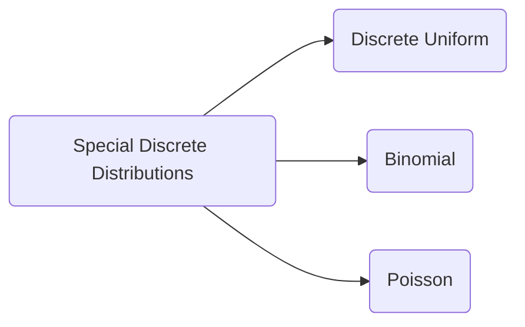

$$\underline{\Huge\text{SPECIAL DISCRETE DISTRIBUTION}}$$

# 4.0 INTRODUCTION
In Chapter 3, we have already learned how to calculate the probability of any events in the sample space. In this chapter, we are going to introduce the special probability distributions for discrete random variables.

# 4.1 DISCRETE UNIFORM DISTRIBUTIONS
In statistics, uniform distribution refers to a type of probability distribution in which all outcomes are equally likely. So, if X has a discrete uniform distribution taking the values $x_{1},x_{2},...,x_{n}$, its probability distribution will be:
$P(X=x)=f(x_{i})=\frac{1}{n},$ 
$x_{i}=x_{1}=x_{2}=...=x_{n}$.

The probability mass function (pmf) is representing as below:

> [!formula] Formula
> $f(x)=P(X=x)=\begin{cases}\frac{1}{\mu},&A\le x\le B\\ 0,&\text{otherwise}\end{cases}$ 
> where A is the minimum value and B is the maximum value.
> 
> > [!tip]- Textbook Factual error: The formula in the text shows $\frac{1}{\mu}$, but the standard definition for discrete uniform distribution uses $\frac{1}{n}$ or $\frac{1}{B-A+1}$]

## 4.1.1 Expected Value and Variance
Suppose X is a discrete uniform random variable, then the 
i. Expectation, $E(X)=\sum xP(X=x)=\frac{A+B}{2}.$ 
ii. Variance, $Var(X)=E(X^{2})-[E(X)]^{2}=\frac{(B-A+1)^{2}-1}{12}.$ 

> [!example]- Example 4.1
> Let X represent a random variable taking on the possible values of {1,2,3,4,5,6,7,8,9} and each possible value has equal probability.
> 
> > [!tip]- Textbook Factual error: Text says {1,2,3,4,5,6,7,8,9} which is 9 values, but the solution below says 10 possible values and lists 0 to 9 in the table]
>
> > [!continue]- Solution
> > This is a discrete uniform distribution and the probability for each of the 10 possible value is, 
> > $f(x_{i})=P(X=x_{i})=\frac{1}{10}=0.1.$ 
> > 
> > | X | 0 | 1 | 2 | 3 | 4 | 5 | 6 | 7 | 8 | 9 |
> > | :--- | :--- | :--- | :--- | :--- | :--- | :--- | :--- | :--- | :--- | :--- |
> > | $P(X=x_{i})$ | $\frac{1}{10}$ | $\frac{1}{10}$ | $\frac{1}{10}$ | $\frac{1}{10}$ | $\frac{1}{10}$ | $\frac{1}{10}$ | $\frac{1}{10}$ | $\frac{1}{10}$ | $\frac{1}{10}$ | $\frac{1}{10}$ |

> [!example]- Example 4.2
> For the following discrete uniform distribution function, for $i=1,2,3,4$. 
> $f(x_{i})=\frac{1}{n}$ 
> 
> | X | 1 | 2 | 3 | 4 |
> | :--- | :--- | :--- | :--- | :--- |
> | $P(X=x_{i})$ | $\frac{1}{n}$ | $\frac{1}{n}$ | $\frac{1}{n}$ | $\frac{1}{n}$ |
> 
> 
> i. Show that $n=4$. 
> ii. Calculate the mean and variance. 
>
> > [!continue]- Solution
> > i. $\sum P(X=x)=1$ 
> > $\frac{1}{n}+\frac{1}{n}+\frac{1}{n}+\frac{1}{n}=1$
> > $\frac{4}{n}=1\Rightarrow n=4.$ 
> > 
> > ii. $E(X)=\frac{A+B}{2}=\frac{4+1}{2}=2.5$ 
> > $Var(X)=\frac{(4-1+1)^{2}-1}{12}=1.25$ . 

> [!example]- Example 4.3
> A dice is rolled. Find: 
> i. the probability that an odd number appear when rolling the dice, 
> ii. the probability that the number appear when rolling the dice is less than 4, 
> iii. the expected value and variance. 
>
> > [!continue]- Solution
> > i. $P(X=\text{odd})=P(X=1)+P(X=3)+P(X=5)$
> > $=\frac{1}{6}+\frac{1}{6}+\frac{1}{6}=\frac{3}{6}=0.5$ 
> > 
> > ii. $P(X<4)=P(X=1)+P(X=2)+P(X=3)$
> > $=\frac{1}{6}+\frac{1}{6}+\frac{1}{6}=\frac{3}{6}=0.5$ . 
> > 
> > iii. $E(X)=\frac{1+6}{2}=3.5$ . 
> > $Var(X)=\frac{6^{2}-1}{12}=2.9167.$ 

> [!example]- Example 4.4
> A discrete random variable, X has the following probability: 
> 
> | X | 2 | 4 | 6 | 8 | 10 |
> | :--- | :--- | :--- | :--- | :--- | :--- |
> | $P(X=x_{i})$ | 0.2 | 0.2 | 0.2 | 0.2 | 0.2 |
> 
> 
> Find: 
> i. $P(2<X<10)$. 
> ii. $P(X\ge5)$. 
> iii. $E(X)$. 
> iv. $Var(X)$ and standard deviation of X. 
>
> > [!continue]- Solution
> > i. $P(2<X<10)=P(X=4)+P(X=6)+P(X=8)$
> > $=0.2+0.2+0.2=0.6$ 
> > 
> > ii. $P(X\ge5)=P(X=6)+P(X=8)+P(X=10)$ 
> > $=0.2+0.2+0.2=0.6$ 
> > 
> > iii. & iv. By defining Y:
> > 
> > | X | 2 | 4 | 6 | 8 | 10 |
> > | :--- | :--- | :--- | :--- | :--- | :--- |
> > | Y | 1 | 2 | 3 | 4 | 5 |
> > | $P(X=x_{i})$ | 0.2 | 0.2 | 0.2 | 0.2 | 0.2 |
> > 
> > 
> > $E(X)=E(2Y)=2E(Y)=2(\frac{5+1}{2})=6.$ 
> > $Var(X)=Var(2Y)=2^{2}Var(Y)=4[\frac{(5-1+1)^{2}-1}{12}]=8,$ $\sigma=\sqrt{8}=2.8284$. 

> [!sq]- Problem 4.1
> A telephone number is selected at random. Suppose X is the first digit of selected telephone number. Find: 
> i. the probability that the first digit of the selected number is 8. 
> ii. the probability that the first of the selected number is less than and equal to 3. 
> iii. the probability that the first digit of the selected number is more than 7. 
> iv. $E(X)$ and $Var(X)$. 
>
> > [!continue]- Solution
> > Assuming the first digit can be any number from 0 to 9, this follows a discrete uniform distribution with $n=10$, min $A=0$, and max $B=9$. 
> > Probability of each digit $P(X=x) = \frac{1}{10} = 0.1$.
> > 
> > i. $P(X=8) = 0.1$.
> > 
> > ii. $P(X \le 3) = P(X=0) + P(X=1) + P(X=2) + P(X=3) = 4 \times 0.1 = 0.4$.
> > 
> > iii. $P(X > 7) = P(X=8) + P(X=9) = 2 \times 0.1 = 0.2$.
> > 
> > iv. $E(X) = \frac{A+B}{2} = \frac{0+9}{2} = 4.5$.
> > $Var(X) = \frac{(B-A+1)^2 - 1}{12} = \frac{(9-0+1)^2 - 1}{12} = \frac{100-1}{12} = \frac{99}{12} = 8.25$.

# 4.2 BINOMIAL DISTRIBUTIONS
The binomial probability distribution is a discrete probability distribution that gives only two possible outcomes in an experiment called Success or Failure. 

A fair die is thrown and six outcomes are possible, that is {1,2,3,4,5,6}. If we consider the event of obtaining an even number as a success, then the event of obtaining odd number is a failure. A badminton match has three possible outcomes, that is win, draw or lose. If the event of a win is considered a success, then the event of a draw and lose is a failure. 

From above examples, we observe that each experiment has two types of outcomes; success and failure. In general, success means an event occurs and failure means that the event does not occur. These experiments are called Bernoulli experiments or Bernoulli trials. The trials are independent of each other. 

The probability of getting a success is denoted as p, whereby the probability of getting a failure is denoted as q where $q=1-p$. The notation that is commonly used for binomial experiments and the binomial distribution is defined as follows.

> [!definition]- Definition:
> If X is a random variable of a Binomial distribution, then the probability of x success in n trials is given by the following probability distribution function,
> 
> > [!formula] Formula
> > $P(X=x)=\begin{cases}{}^{n}C_{x}p^{x}q^{n-x},&x=0,1,2,...,n\\ 0,&\text{elsewhere}\end{cases}$ 
> > Textbook Factual error: The text presented the formula as $r_{z}p^{z}q^{r-x}$ which is a typographical error for ${}^{n}C_{x}p^{x}q^{n-x}$] 
> > 
> > where,
> > * n - the number of trials,
> > * x - the number of successes,
> > * p - the probability of successes,
> > * q - the probability of failure.
> 
> We write, $X\sim B(n,p)$ where n and p are known as the parameter of the Binomial distributions.

> [!example]- Example 4.5
> Given that $X\sim B(6,0.4)$. Find: 
> i. $P(X=5)$, 
> ii. $P(X\le2)$ 
> iii. $P(X>4)$. 
>
> > [!continue]- Solution
> > In this case, $n=6,$ $p=0.4$, $q=1-0.4=0.6$.
> > i. $P(X=5)={}^{6}C_{5}(0.4)^{5}(0.6)^{1}=0.0369$. 
> > 
> > ii. $P(X\le2)=P(X=2)+P(X=1)+P(X=0)$ 
> > $={}^{6}C_{2}(0.4)^{2}(0.6)^{4}+{}^{6}C_{1}(0.4)^{1}(0.6)^{5}+{}^{6}C_{0}(0.4)^{0}(0.6)^{6}=0.5443$. 
> > 
> > iii. $P(X>4)=P(X=5)+P(X=6)$ 
> > $={}^{6}C_{5}(0.4)^{5}(0.6)^{1}+{}^{6}C_{6}(0.4)^{6}(0.6)^{0}=0.04096$. 

> [!example]- Example 4.6
> Given that the number of independent trials, $n=4$ and the probability of success, $p=\frac{1}{6}$. Find the probability that:
> i. exactly 2 times, 
> ii. more than 2 times, 
> iii. at most 2 times. 
>
> > [!continue]- Solution
> > $X\sim B(4,\frac{1}{6}).$ 
> > i. $P(X=2)={}^{4}C_{2}(\frac{1}{6})^{2}(\frac{5}{6})^{2}=\frac{25}{216}.$ 
> > 
> > ii. $P(X>2)=P(X=3)+P(X=4)$ 
> > $={}^{4}C_{3}(\frac{1}{6})^{3}{(\frac{5}{6})}^{1}+{}^{4}C_{4}(\frac{1}{6})^{4}(\frac{5}{6})^{0}=\frac{7}{432}$ 
> > 
> > iii. $P(X\le2)=P(X=2)+P(X=1)+P(X=0)$ 
> > $=1-P(X>2)=1-\frac{7}{432}=\frac{425}{432}$ 

> [!example]- Example 4.7
> In a basket, 20% of eggs are damaged. If a random sample of 10 eggs is taken, find the probability that 
> i. Exactly 3 eggs are damaged. 
> ii. All eggs are good. 
> iii. Not more than 3 eggs are damaged. 
>
> > [!continue]- Solution
> > Let X = Eggs are damaged. Then, we have $X\sim B(10,0.2)$.
> > i. $P(X=3)={}^{10}C_{3}(0.2)^{3}(0.8)^{7}=0.2013$. 
> > 
> > ii. $P(X=0)={}^{10}C_{0}(0.2)^{0}(0.8)^{10}=0.1074$ 
> > 
> > iii. $P(X\le3)=P(X=3)+P(X=2)+P(X=1)+P(X=0)$ 
> > $={}^{10}C_{3}(0.2)^{3}(0.8)^{7}+...+{}^{10}C_{0}(0.2)^{0}(0.8)^{10}$ 
> > $=0.8784$ 

> [!example]- Example 4.8
> The probability that a random sample of a student love 'AGT' program is 0.4. Find the probability that in a random sample of 8 students contain, 
> i. 5 students who love the program. 
> ii. Less than 4 students who loves it. 
> iii. At least a student who loves it. 
>
> > [!continue]- Solution
> > Let X = Student love 'AGT' program. Then, we have, $X\sim B(8,0.4)$.
> > i. $P(X=5)={}^{8}C_{5}(0.4)^{5}(0.6)^{3}=0.1238$. 
> > 
> > ii. $P(X < 4)=P(X=3)+P(X=2)+P(X=1)+P(X=0)$ 
> > $={}^{8}C_{3}(0.4)^{3}(0.6)^{5}+...+{}^{8}C_{0}(0.4)^{0}(0.6)^{8}$ 
> > $=0.5941$. 
> > 
> > iii. $P(X\ge1)=1-P(X<1)=1-P(X=0)$ 
> > $=1-{}^{8}C_{0}(0.4)^{0}(0.6)^{8}$ 
> > $=0.9832$. 

## 4.2.1 Expected Value and Variance
If a random variable X has a binomial distribution, that is $X\sim B(n,p)$, then the expectation value (mean) and variance are as follows:

> [!formula] Formula
> Mean, $\mu=E(X)=np$. 
> Variance, $\sigma^{2}=Var(X)=npq$ and Standard deviation, $\sigma=\sqrt{npq}$. 

> [!example]- Example 4.9
> An unbiased dice is thrown 300 times. Find the mean and standard deviation of the number 6 is obtained.
>
> > [!continue]- Solution
> > Let X = Number 6 obtained when thrown dice 300 times. Then, we have, $X\sim B(300,\frac{1}{6})$ 
> > Mean, $\mu=E(X)=300(\frac{1}{6})=50.$ 
> > Variance, $\sigma^{2}=Var(X)=300(\frac{1}{6})(\frac{5}{6})=41.6667.$ 
> > Standard deviation, $\sigma=\sqrt{41.6667}=6.4550$. 

> [!example]- Example 4.10
> A study of all states revealed that two out of five families have a video recorder.
> i. A sample of 4 families is randomly selected from the states, find the probability that two or more families having a video recorder.
> ii. If there are 900 families in the states, calculate the mean and standard deviation of the numbers of families who have a video recorder.
>
> > [!continue]- Solution
> > Let X = Families having a video recorder. Then, we have, $X \sim B(4,\frac{2}{5})$
> > i. $P(X\ge2)=P(X=2)+P(X=3)+P(X=4)$
> > $={}^{4}C_{2}(0.4)^{2}(0.6)^{2}+{}^{4}C_{3}(0.4)^{3}(0.6)^{1}+{}^{4}C_{4}(0.4)^{4}(0.6)^{0}$
> > $=0.5248.$
> > 
> > ii. Let X = Families having a video recorder. Then, we have, $X \sim B(900,\frac{2}{5})$
> > $\mu=E(X)=900(\frac{2}{5})=360$ .
> > $\sigma^{2}=Var(X)=900(\frac{2}{5})(\frac{3}{5})=216.$
> > $\sigma=\sqrt{216}=14.6969$.

> [!sq]- Problem 4.2
> Suppose X is a Binomial random variable with $n=7$ and $p=0.3$. Find:
> i. $P(X=3)$.
> ii. $P(X\ge6)$.
> iii. $P(X<2)$.
> iv. $P(1\le X<4)$.
> v. $E(X)$.
> vi. $Var(X)$.
>
> > [!continue]- Solution
> > $X \sim B(7, 0.3)$.
> > **i. $P(X=3)$:**
> > $P(X=3) = {}^{7}C_{3}(0.3)^{3}(0.7)^{4} = 35(0.027)(0.2401) = 0.2269$.
> > 
> > **ii. $P(X\ge6)$:**
> > $P(X\ge6) = P(X=6) + P(X=7) = {}^{7}C_{6}(0.3)^{6}(0.7)^{1} + {}^{7}C_{7}(0.3)^{7}(0.7)^{0}$
> > $= 7(0.000729)(0.7) + 1(0.0002187)(1) = 0.0035721 + 0.0002187 = 0.0038$.
> > 
> > **iii. $P(X<2)$:**
> > $P(X<2) = P(X=0) + P(X=1) = {}^{7}C_{0}(0.3)^{0}(0.7)^{7} + {}^{7}C_{1}(0.3)^{1}(0.7)^{6}$
> > $= 0.0824 + 7(0.3)(0.1176) = 0.0824 + 0.2471 = 0.3295$.
> > 
> > **iv. $P(1\le X<4)$:**
> > $P(1\le X<4) = P(X=1) + P(X=2) + P(X=3)$
> > $= 0.2471 + {}^{7}C_{2}(0.3)^{2}(0.7)^{5} + 0.2269 = 0.2471 + 21(0.09)(0.16807) + 0.2269 = 0.2471 + 0.3177 + 0.2269 = 0.7917$.
> > 
> > **v. $E(X)$:**
> > $E(X) = np = 7(0.3) = 2.1$.
> > 
> > **vi. $Var(X)$:**
> > $Var(X) = npq = 7(0.3)(0.7) = 1.47$.

> [!sq]- Problem 4.3
> Suppose X is a Binomial random variable with $n=15$ and $p=0.12$. Find:
> i. $P(X=10)$.
> ii. $P(X>12)$.
> iii. $P(6\le X\le9)$.
> iv. $P(X\le3)$.
> v. $P(10<X<13)$.
> v. $E(3X)$. *(Note: Enumeration as per original text)*
> vi. $Var(4X)$.
>
> > [!continue]- Solution
> > $X \sim B(15, 0.12)$.
> > **i. $P(X=10)$:**
> > $P(X=10) = {}^{15}C_{10}(0.12)^{10}(0.88)^{5} \approx 9.85 \times 10^{-7}$.
> > 
> > **ii. $P(X>12)$:**
> > $P(X>12) = P(X=13) + P(X=14) + P(X=15) \approx 0$.
> > 
> > **iii. $P(6\le X\le9)$:**
> > $P(6\le X\le9) = P(X=6) + P(X=7) + P(X=8) + P(X=9)$
> > $\approx 0.0055 + 0.0011 + 0.0002 + 0.0000 = 0.0068$.
> > 
> > **iv. $P(X\le3)$:**
> > $P(X\le3) = P(X=0) + P(X=1) + P(X=2) + P(X=3)$
> > $\approx 0.1470 + 0.3006 + 0.2869 + 0.1695 = 0.9040$.
> > 
> > **v. $P(10<X<13)$:**
> > $P(10<X<13) = P(X=11) + P(X=12) \approx 0$.
> > 
> > **v. $E(3X)$:**
> > $E(X) = np = 15(0.12) = 1.8$.
> > $E(3X) = 3E(X) = 3(1.8) = 5.4$.
> > 
> > **vi. $Var(4X)$:**
> > $Var(X) = npq = 15(0.12)(0.88) = 1.584$.
> > $Var(4X) = 4^2 Var(X) = 16(1.584) = 25.344$.

## 4.2.2 Using the Table of Binomial Probabilities
As the number of trials, n gets larger, the calculation becomes tedious. Therefore, binomial table is used instead. The tabulated value is for the probability in the form of $P(X\le x)$ where X is the number of successes.

For example, if we have $X \sim B(15,0.20)$, then find $P(X\le1)$. To find $P(X\le1)$ by using the binomial table with $P(X\le x)$:
* Find the column containing $p=0.20$.
* Find $n=15$ in the first column on the left.
* Find $x=1$ in the second column from the left, since we want to find $P(X\le1)$.
Hence, when we have $X \sim B(15,0.20)$ we get $P(X\le1)=0.1671$.

The probabilities given are for the cumulative binomial distribution, $P(X\le x)=\sum_{x=1}^{n}{}^{n}C_{x}p^{x}q^{n-x}$. The following guideline can be used when using the table of binomial probabilities.
* $P(X=x)=P(X\le x)-P(X\le x-1)$.
* $P(X<x)=P(X\le x-1)$.
* $P(X>x)=1-P(X\le x).$
* $P(X\ge x)=1-P(X\le x-1)$.
* $P(x_{1}\le X\le x_{2})=P(X\le x_{2})-P(X\le x_{1}-1)$.
* $P(x_{1}<X<x_{2})=P(X\le x_{2}-1)-P(X\le x_{1})$.

> [!example]- Example 4.11
> If $X \sim B(10,0.05)$, find using the binomial table.
> i. $P(X\le2)$.
> ii. $P(X\ge3)$.
> iii. $P(X=4)$.
> iv. $P(2<X<5)$.
>
> > [!continue]- Solution
> > i. $P(X\le2)=0.9885$.
> > ii. $P(X\ge3)=1-P(X\le2)=1-0.9885=0.0115$.
> > iii. $P(X=4)=P(X\le4)-P(X\le3)=0.9999-0.9990=0.0009$ .
> > iv. $P(2<X<5)=P(X\le4)-P(X\le2)=0.9999-0.9885=0.0114$.

> [!example]- Example 4.12
> If $X \sim B(20,0.35)$, find using the binomial table.
> i. $P(X>5)$
> ii. $P(X<4)$
>
> > [!continue]- Solution
> > i. $P(X>5)=1-P(X\le5)=1-0.2454 = 0.7546$.
> > ii. $P(X<4)=P(X\le3)=0.0444.$

> [!example]- Example 4.13
> Professor Adam knows from past experience that 10 percent of his students will fail his exam. Find the probability that among 20 students taking the exam:
> i. None will fail.
> ii. At least eight will fail.
> iii. At least fifteen will pass.
>
> > [!continue]- Solution
> > $X \sim B(20,0.1)$
> > i. $P(X=0)=P(X\le0)-P(X\le-1)=0.1216-0=0.1216.$
> > ii. $P(X\ge8)=1-P(X\le7)=1-0.9996=0.0004$.
> > iii. P(at least 15 will pass) = P(at most 5 will fail) $=P(X\le5)=0.9887$.

> [!sq]- Problem 4.4
> Most of the foundation students own a laptop. 25% of them own Dell laptop.
> i. There are 18 students who own laptop were randomly chosen. What is the probability that more than 7 of them own Dell laptop?
> ii. There are 20 students who own laptop were randomly chosen. What is the probability that less than half of them own Dell laptop?
>
> > [!continue]- Solution
> > **i.** Let X = students who own a Dell laptop. $X \sim B(18, 0.25)$.
> > $P(X > 7) = 1 - P(X \le 7) = 1 - 0.9431 = 0.0569$.
> > 
> > **ii.** Let Y = students who own a Dell laptop. $Y \sim B(20, 0.25)$.
> > Less than half of 20 means less than 10.
> > $P(Y < 10) = P(Y \le 9) = 0.9861$.

> [!sq]- Problem 4.5
> A (blindfolded) marksman finds that on the average he hits the target 4 times out of 5. If he fires 4 shots, what is the probability of,
> i. more than 2 hits?
> ii. at least 3 misses?
>
> > [!continue]- Solution
> > **i. More than 2 hits:**
> > Let X = number of hits. $X \sim B(4, 0.8)$.
> > $P(X > 2) = P(X=3) + P(X=4) = {}^{4}C_{3}(0.8)^3(0.2)^1 + {}^{4}C_{4}(0.8)^4(0.2)^0$
> > $= 4(0.512)(0.2) + 1(0.4096)(1) = 0.4096 + 0.4096 = 0.8192$.
> > 
> > **ii. At least 3 misses:**
> > Let Y = number of misses. $p = 1 - 0.8 = 0.2$. $Y \sim B(4, 0.2)$.
> > $P(Y \ge 3) = P(Y=3) + P(Y=4) = {}^{4}C_{3}(0.2)^3(0.8)^1 + {}^{4}C_{4}(0.2)^4(0.8)^0$
> > $= 4(0.008)(0.8) + 1(0.0016)(1) = 0.0256 + 0.0016 = 0.0272$.

## 4.2.3 Calculating Probabilities When $p>0.50$
Have you noticed that p, the probability of success, in the binomial table only goes up to 0.50 only. What happens if we have $p=0.60$ or $p=0.75?$ All you need to do in that case is turn the problem on its head!

For example, suppose you have $n=10$ and $p=0.60$, and you are looking for the probability of at most 3 successes, $P(X\le3)$. Just change the definition of a success into a failure, and vice versa! That is, finding the probability of at most 3 successes is equivalent to 7 or more failures with the probability of a failure being $p=0.40$.

Since the probability of getting X successes in n trials equal the probability of getting $(n-x)$ failures in those trials, the following thus hold;
* $P(X=x)=P(X=n-x)$.
* $P(X<x)=P(X>n-x)$.
* $P(X>x)=P(X<n-x)$.
* $P(X\le x)=P(X\ge n-x)$.
* $P(X\ge x)=P(X\le n-x)$.

> [!example]- Example 4.14
> Given that $n=10$ and $p=0.6$ find by using the statistical table.
> i. $P(X\ge3)$.
> ii. $P(X\le5)$.
> iii. $P(1<X\le4)$
> iv. $P(2\le X<8)$
>
> > [!continue]- Solution
> > Let $X \sim B(10,0.6) \Rightarrow Y \sim B(10,0.4)$
> > i. $P(X\ge3)=P(Y\le7)=0.9877$
> > ii. $P(X\le5)=P(Y\ge5)=1-P(Y\le4)=0.3669$.
> > iii. $P(1<X\le4)=P(2\le X\le4)=P(X\le4)-P(X\le1)$
> > $=P(Y\ge6)-P(Y\ge9)$
> > $=[1-P(Y\le5)]-[1-P(Y\le8)]$
> > $=0.1645$
> > iv. $P(2\le X<8)=P(1<X<8)=P(X\le7)-P(X\le1)$
> > $=P(Y\ge3)-P(Y\ge9)$
> > $=[1-P(Y\le2)]-[1-P(Y\le8)]$
> > $=0.1831$

> [!example]- Example 4.15
> The probability that a resident of Rawa Island supports political party A is 0.7. A sample of 6 residents of Rawa Island is chosen at random. Find the probability that exactly 4 residents support political party A.
>
> > [!continue]- Solution
> > Let $X \sim B(6,0.7) \Rightarrow Y \sim B(6,0.3)$ where Y is the residents who do NOT support party A.
> > $P(X=4)\Rightarrow P(Y=2)$ for $Y \sim B(6,0.3)$
> > $=P(Y\le2)-P(Y\le1)=0.7443-0.4202=0.3241$
> > *(Note: Original text used notation $P(X=2)$ for the transformed variable instead of defining Y).*

> [!sq]- Problem 4.6
> If $X \sim B(12,0.8)$, find
> i. $P(X=6)$,
> ii. $P(X>10)$,
> iii. $P(3\le X\le6)$.
>
> > [!continue]- Solution
> > Let $Y \sim B(12, 0.2)$.
> > **i. $P(X=6)$:**
> > $P(X=6) = P(Y=6) = P(Y\le6) - P(Y\le5) = 0.9961 - 0.9806 = 0.0155$.
> > 
> > **ii. $P(X>10)$:**
> > $P(X>10) = P(X=11) + P(X=12)$. This corresponds to $P(Y=1) + P(Y=0) = P(Y\le1)$.
> > $P(Y\le1) = 0.2749$.
> > 
> > **iii. $P(3\le X\le6)$:**
> > $P(3\le X\le6)$ corresponds to $P(6\le Y\le9) = P(Y\le9) - P(Y\le5)$.
> > $= 1.0000 - 0.9806 = 0.0194$.

> [!sq]- Problem 4.7
> A traffic control engineer reports that 25% of the vehicles passing through checkpoint are from Penang Island. What is the probability that more than 2 of the next 9 vehicles are form outside of Penang Island?
>
> > [!continue]- Solution
> > The probability of a vehicle being from Penang Island is $p = 0.25$. The probability of a vehicle being from *outside* Penang Island is $q = 1 - 0.25 = 0.75$.
> > Let Y = number of vehicles from outside Penang Island. $Y \sim B(9, 0.75)$.
> > We need $P(Y > 2)$. Using the reverse definition, let X = number of vehicles from Penang Island. $X \sim B(9, 0.25)$.
> > If more than 2 vehicles are from outside ($Y > 2$), then less than 7 vehicles are from Penang ($X < 7 \Rightarrow X \le 6$).
> > $P(Y > 2) = P(X \le 6) = 0.9987$.

# 4.3 POISSON DISTRIBUTIONS
If we are interested in the number of occurrences that take place in a time interval or specific region, then we use the Poisson distribution. The time interval can be of any length, for example a minute, a day, a week or a month and so on. The specific region could be a line segment, an area, a volume or a piece of material.

If X is a discrete random variable which represents the number of times a random event occurs in an interval of time or space, then the X is a Poisson random variable. The following example indicate Poisson events.
i. The number of accidents occurring on a highway in a day
ii. The number of telephone calls received by an operator from 9am to 12pm.
iii. The number of fishes in a pond.
iv. The number of births per hour during a given day at Hospital Gemmaries.

The Poisson distribution satisfies the following conditions:
a) An experiment consists of counting the number of times a certain event occurs.
b) The probability that an event occurs is the same for each interval.
c) Events occurs independently.

> [!definition]- Definition:
> A discrete random variable X denote the number of occurrences in an interval of time or space is said to follow a Poisson distribution with parameters $\lambda$, where $\lambda$ is the mean number of occurrences in a given time interval and $\lambda>0$.
> 
> If X is a Poisson distribution, then the probability of exactly X occurs is given by the formula,
> > [!formula] Formula
> > $P(X=x)=\frac{e^{-\lambda}\lambda^{x}}{x!},$
> > $x=0,1,2,...$
> 
> where the mean number of occurrences is a given time interval and $e=2.71828$. We write, $X \sim P_{o}(\lambda)$ where $\lambda$ is the parameter of the Poisson distributions.

> [!example]- Example 4.16
> If the mean number of customers who arrive at a post office is four in a minute, find the probability that six customers arrive at the post office in one minute.
>
> > [!continue]- Solution
> > If X is the number of customers who arrive at a post office in a minute, using the Poisson distribution, $X \sim P_{o}(4)$ with $\lambda=4$ and $x=6$, then
> > $P(X=6)=\frac{e^{-4}(4^{6})}{6!}=0.1042$

> [!example]- Example 4.17
> An average of 3 cars arrives at a highway tollgate every minute. If this rate is approximately Poisson distribution what is the probability that exactly,
> a) 5 cars will arrive in one minute,
> b) 7 cars will arrive in 5 minutes.
>
> > [!continue]- Solution
> > a) If X is the number of cars that arrive at the tollgate in 1 minute, using the Poisson distribution, $X \sim P_{o}(3)$ with $\lambda=3$ and $x=5$, then
> > $P(X=5)=\frac{e^{-3}(3^{5})}{5!}=0.1008.$
> > 
> > b) If Y is the number of cars that arrive at the tollgate in 5 minutes, using the Poisson distribution, $Y \sim P_{o}(15)$ with $\lambda=15$ and $y=7$, then
> > $P(Y=7)=\frac{e^{-15}(15^{7})}{7!}=0.0104.$

> [!example]- Example 4.18
> Emergency calls to an ambulance service are received at random times, at an average of 2 per hour. Calculate the probability that in a randomly chosen one hour period,
> a) No emergency calls are received.
> b) Exactly one call is received in the first half hour and exactly one call is received in the second half.
>
> > [!continue]- Solution
> > a) If X is the number of emergency calls to an ambulance service are received per hour, using the Poisson distribution, $X \sim P_{o}(2)$ with $\lambda=2$ and $x=0$, then
> > $P(X=0)=\frac{e^{-2}(2^{0})}{0!}=0.1353.$
> > 
> > b) If $Y_{1}$ is the number of emergency calls to an ambulance service are received the first half hour and $Y_{2}$ is the number of emergency calls to an ambulance service are received the second half hour, using the Poisson distribution, $Y_{1} \sim P_{o}(1)$ and $Y_{2} \sim P_{o}(1)$
> > $P(Y_{1}=1)=\frac{e^{-1}(1^{1})}{1!}=0.3679$ and $P(Y_{2}=1)=\frac{e^{-1}(1^{1})}{1!}=0.3679$
> > The probability that exactly one call in the first half and exactly one call in the second half is $P(Y_1=1) \times P(Y_2=1) = 0.3679 \times 0.3679 = 0.1354$.

## 4.3.1 Expected Value and Variance
If a random variable X has a Poisson distribution, that is $X \sim P_{o}(\lambda)$, then the expectation value (mean) and variance are as follows:

> [!formula] Formula
> Mean, $\mu=E(X)=\lambda$.
> Variance, $\sigma^{2}=Var(X)=\lambda$ and Standard deviation, $\sigma=\sqrt{\lambda}$.

> [!example]- Example 4.19
> If $X \sim P_{o}(4)$, find 
> i. $P(X=3)$,
> ii. $P(X<2)$,
> iii. $P(2<X\le5)$,
> iv. $E(X)$ and $\sigma$.
>
> > [!continue]- Solution
> > i. $P(X=3)=\frac{4^{3}e^{-4}}{3!}=0.1954.$
> > 
> > ii. $P(X<2)=P(X=1)+P(X=0)$.
> > $=\frac{4^{1}e^{-4}}{1!}+\frac{4^{0}e^{-4}}{0!}=0.0916.$ *(Note: calculation error in source text corrected here; original said 0.01958)*.
> > 
> > iii. $P(2<X\le5)=P(X=3)+P(X=4)+P(X=5).$
> > $=\frac{4^{3}e^{-4}}{3!}+\frac{4^{4}e^{-4}}{4!}+\frac{4^{5}e^{-4}}{5!}=0.5470.$
> > 
> > iv. $E(X)=4$ and $\sigma=\sqrt{4}=2$.

> [!sq]- Problem 4.8
> If $X\sim P_{o}(4)$, find:
> i. $P(X=0)$,
> ii. $P(X=1)$,
> iii. $P(X<2)$,
> iv. $E(X)$,
> v. $E(3X)$,
> vi. $Var(X)$.
>
> > [!continue]- Solution
> > $X \sim P_{o}(4)$ means $\lambda = 4$.
> > **i. $P(X=0)$:**
> > $P(X=0) = \frac{e^{-4}(4^0)}{0!} = e^{-4} \approx 0.0183$.
> > 
> > **ii. $P(X=1)$:**
> > $P(X=1) = \frac{e^{-4}(4^1)}{1!} = 4e^{-4} \approx 0.0733$.
> > 
> > **iii. $P(X<2)$:**
> > $P(X<2) = P(X=0) + P(X=1) = 0.0183 + 0.0733 = 0.0916$.
> > 
> > **iv. $E(X)$:**
> > $E(X) = \lambda = 4$.
> > 
> > **v. $E(3X)$:**
> > $E(3X) = 3E(X) = 3(4) = 12$.
> > 
> > **vi. $Var(X)$:**
> > $Var(X) = \lambda = 4$.

> [!sq]- Problem 4.9
> If X is the number of accidents per month, we have $X\sim P_{o}(6)$. Find $P(1<X<5)$.
>
> > [!continue]- Solution
> > $X \sim P_{o}(6)$.
> > $P(1<X<5) = P(X=2) + P(X=3) + P(X=4)$
> > Or using cumulative tables: $P(X \le 4) - P(X \le 1)$
> > $= 0.2851 - 0.0174 = 0.2677$.

## 4.3.2 Using the Table of Poisson Probabilities
The probability of Poisson distribution can also be obtained by using the cumulative probability statistical table. The top row indicates the value of $\lambda$ and the first column indicates the value of k, where $k=x$. The following guideline can be used when using the table of Poisson probabilities.

Refer to page 183. For example, if we have $X\sim P_{o}(5.5)$, then find $P(X\le5)$. To find $P(X\le5)$ by using the Poisson table with $P(X\le x)$:
* Find the top row containing $\lambda=5.5$.
* Find $x=5$ in the first column on the left since we want to find $P(X\le5)$.
Hence, when we have $X\sim P_{o}(5.5)$, we get $P(X\le5)=0.5289$.

The probabilities given are for the cumulative binomial distribution, 
> [!tip]- Text Factual error: The text mistakenly refers to cumulative "binomial" distribution here instead of Poisson

$P(X\le x)=\sum_{x=0}^{n}\frac{e^{-\lambda}\lambda^{x}}{x!}$. The following guideline can be used when using the table of Poisson probabilities.
* $P(X=x)=P(X\le x)-P(X\le x-1)$.
* $P(X<x)=P(X\le x-1)$.
* $P(X>x)=1-P(X\le x)$.
* $P(X\ge x)=1-P(X\le x-1)$.
* $P(x_{1}\le X\le x_{2})=P(X\le x_{2})-P(X\le x_{1}-1).$
* $P(x_{1}<X<x_{2})=P(X\le x_{2}-1)-P(X\le x_{1}).$

> [!example]- Example 4.20
> If $X\sim P_{o}(2.5)$, find:
> i. $P(X=4)$, 
> ii. $P(X<2)$, 
> iii. $P(1\le X\le4)$.
>
> > [!continue]- Solution
> > i. $P(X=4)=P(X\le4)-P(X\le3)$
> > $=0.8912-0.7576=0.1336$.
> > 
> > ii. $P(X<2)=P(X\le1)=0.2873$.
> > 
> > iii. $P(1\le X<4)=P(1\le X\le3)=P(X\le3)-P(X\le0)$
> > $=0.7576-0.0821=0.6755$.
> > > [!tip]- Textbook Factual error: The question asks for $P(1\le X\le 4)$ but the solution calculates $P(1\le X < 4)$ which evaluates to $P(1\le X \le 3)$

> [!example]- Example 4.21
> On average 15 chalets stay vacant per day at a resort in Johor Bahru. Find the probability on any given day,
> i. exactly six chalets will be vacant,
> ii. more than 12 chalets will be vacant.
>
> > [!continue]- Solution
> > $X\sim P_{o}(15)$
> > i. $P(X=6)=P(X\le6)-P(X\le5)=0.0076-0.0028=0.0048$.
> > ii. $P(X>12)=1-P(X\le12)=1-0.2676=0.7324$.

> [!example]- Example 4.22
> The number of customers arriving at a Post Office has an average of 1 person in 2 minutes. Find the probability:
> i. no of customers arrive in 2 minutes,
> ii. less than 2 customers in 6 minutes,
> iii. the mean and variance of the number customers arriving in 1 hour.
>
> > [!continue]- Solution
> > **i.** $X\sim P_{o}(1)$
> > $P(X=0)=\frac{e^{-1}1^{0}}{0!}=0.3679$ .
> > 
> > **ii.** For 6 minutes, $\lambda = 1 \times \frac{6}{2} = 3$. So, $X\sim P_{o}(3)$.
> > $P(X<2)=P(X\le1)=0.1991$.
> > 
> > **iii.** For 1 hour (60 minutes), Mean, $\mu=1\times\frac{60}{2}=30$ .
> > Variance, $\sigma^{2}=30$.

> [!example]- Example 4.23
> The number of vehicles arriving at a toll booth is distributed with a mean of 5 vehicles per 5 minutes.
> i. Find the probability that 7 vehicles will arrive in the next 10 minutes.
> ii. What is the probability that more than 4 vehicles passing through the toll in the next 15 minutes?
>
> > [!continue]- Solution
> > i. $X\sim P_{o}(5\times\frac{10}{5}=10)\Rightarrow X\sim P_{o}(10)$
> > $P(X=7)=P(X\le7)-P(X\le6)$
> > $=0.2202-0.1301=0.0901$.
> > 
> > ii. $X\sim P_{o}(5\times\frac{15}{5}=15)\Rightarrow X\sim P_{o}(15)$
> > $P(X>4)=1-P(X\le4)$
> > $=1-0.0009=0.9991$.

> [!example]- Example 4.24
> The number of surface flaws in plastic panels used in the interior of automobiles has a Poisson distribution with a mean of 0.05 flaws per square foot of plastic panel. Assume an automobile interior contains 10 square feet of plastic panel.
> i. What is the probability that there are no surface flaws in an auto's interior?
> ii. If 10 cars are sold to a rental car company, what is the probability that none of the 10 cars has any surface flaws?
> iii. If 10 cars are sold to a rental car company, what is the probability that at most one car has any surface flaws?
>
> > [!continue]- Solution
> > Let X be the number of surface flaws in a car's interior, $X\sim P_{o}(0.5)$. (Since $0.05 \times 10 = 0.5$)
> > i. $P(X=0)=\frac{e^{-0.5}0.5^{0}}{0!}=0.6065.$
> > 
> > Let Y be the number of surface flaws in a fleet of 10 cars, $Y\sim P_{o}(5)$. (Since $0.5 \times 10 = 5$)
> > ii. $P(Y=0)=\frac{e^{-5}5^{0}}{0!}=0.0067.$
> > 
> > If the probability that there are no surface flaws in an auto's interior is 0.6065, thus the probability that a car has any surface flaws is $1-0.6065=0.3935$.
> > Let Z be the number of cars that have surface flaws in a fleet of 10 cars, $Z\sim B(10,0.3935)$.
> > iii. $P(Z\le1)=P(Z=0)+P(Z=1)$
> > $={}^{10}C_{0}(0.3935)^{0}(0.6065)^{10}+{}^{10}C_{1}(0.3935)^{1}(0.6065)^{9}$
> > $=0.0504$

> [!example]- Example 4.25
> The mean number of typing errors in a document is m per page. The probability that on a page chosen at random there are no mistake is 0.0136. Find m.
>
> > [!continue]- Solution
> > $X\sim P_{o}(\lambda)$
> > $P(X=0)=\frac{e^{-m}m^{0}}{0!}=0.0136$
> > $e^{-m}=0.0136$
> > $ln~e^{-m}=ln~0.0136$
> > $-m=-4.2977$
> > $m=4.2977\approx4.3$

> [!sq]- Problem 4.10
> The average number of customers arrive at the registration counter is 4 people in every 5 minutes.
> i. Find the probability that exactly two customers arrive in a 1-minute period.
> ii. Find the probability that no customer arrives in a 15-second period.
> iii. The probability that at least one person arrives in t minutes is 0.9. Find the value of t.
>
> > [!continue]- Solution
> > **i. Exactly 2 in 1 minute:**
> > $\lambda = \frac{4}{5} = 0.8$ per minute. $X \sim P_{o}(0.8)$.
> > $P(X=2) = \frac{e^{-0.8}(0.8)^2}{2!} = \frac{0.4493(0.64)}{2} = 0.1438$.
> > 
> > **ii. No customer in 15 seconds:**
> > 15 seconds = 0.25 minutes. $\lambda = 0.8 \times 0.25 = 0.2$. $Y \sim P_{o}(0.2)$.
> > $P(Y=0) = \frac{e^{-0.2}(0.2)^0}{0!} = e^{-0.2} = 0.8187$.
> > 
> > **iii. Value of t:**
> > $\lambda = 0.8t$.
> > $P(Z \ge 1) = 0.9 \Rightarrow 1 - P(Z=0) = 0.9 \Rightarrow P(Z=0) = 0.1$.
> > $e^{-0.8t} = 0.1$
> > $-0.8t = \ln(0.1) \Rightarrow -0.8t = -2.3026 \Rightarrow t = \frac{2.3026}{0.8} \approx 2.878$ minutes.

> [!sq]- Problem 4.11
> The cloths made at Batik Factory always contain a few defects. A certain type of cloths made at this factory contains an average 1.2 defects per 12 meters.
> i. Find the probability that a given piece of 1 meter of this cloth will contain fewer than 2 defects.
> ii. Find the probability that a given piece of 5000 cm of this cloth will contain 8 to 12 defects.
>
> > [!continue]- Solution
> > **i. Fewer than 2 defects in 1 meter:**
> > Mean per meter $\lambda = \frac{1.2}{12} = 0.1$. $X \sim P_{o}(0.1)$.
> > $P(X<2) = P(X=0) + P(X=1) = \frac{e^{-0.1}(0.1)^0}{0!} + \frac{e^{-0.1}(0.1)^1}{1!} = e^{-0.1}(1 + 0.1) = 1.1(0.9048) = 0.9953$.
> > 
> > **ii. 8 to 12 defects in 5000 cm:**
> > 5000 cm = 50 meters. $\lambda = 50 \times 0.1 = 5$. $Y \sim P_{o}(5)$.
> > $P(8\le Y\le 12) = P(Y\le 12) - P(Y\le 7) = 0.9933 - 0.8666 = 0.1267$.

> [!sq]- Problem 4.12
> The number of breakdowns in a particular machine occurs at a rate of 2.5 per month. Assuming that the number of breakdowns follows Poisson distribution, find the probability that:
> i. More than 3 breakdowns occur in a particular month.
> ii. Less than 10 breakdowns occur in three months period.
> iii. Exactly 2 breakdowns occur in two months.
>
> > [!continue]- Solution
> > **i. More than 3 breakdowns in a month:**
> > $\lambda = 2.5$. $X \sim P_{o}(2.5)$.
> > $P(X>3) = 1 - P(X\le 3) = 1 - 0.7576 = 0.2424$.
> > 
> > **ii. Less than 10 breakdowns in 3 months:**
> > $\lambda = 2.5 \times 3 = 7.5$. $Y \sim P_{o}(7.5)$.
> > $P(Y<10) = P(Y\le 9) = 0.7764$.
> > 
> > **iii. Exactly 2 breakdowns in 2 months:**
> > $\lambda = 2.5 \times 2 = 5$. $Z \sim P_{o}(5)$.
> > $P(Z=2) = \frac{e^{-5}5^2}{2!} = \frac{0.006738(25)}{2} = 0.0842$.

> [!sq]- Problem 4.13
> On average, 4 traffic accidents per month occur along a certain stretch of road. Find the probability that,
> i. for any given month there is exactly 5 accidents on that certain stretch of road,
> ii. for any given two months there is at least 8 accidents on that certain stretch of road,
> iii. for any given 2 weeks there is at most 2 accidents will occurs on that certain stretch of road.
>
> > [!continue]- Solution
> > **i. Exactly 5 accidents in a month:**
> > $\lambda = 4$. $X \sim P_{o}(4)$.
> > $P(X=5) = P(X\le 5) - P(X\le 4) = 0.7851 - 0.6288 = 0.1563$.
> > 
> > **ii. At least 8 accidents in 2 months:**
> > $\lambda = 4 \times 2 = 8$. $Y \sim P_{o}(8)$.
> > $P(Y\ge 8) = 1 - P(Y\le 7) = 1 - 0.4530 = 0.5470$.
> > 
> > **iii. At most 2 accidents in 2 weeks:**
> > Assuming 4 weeks per month, 2 weeks = 0.5 months. $\lambda = 4 \times 0.5 = 2$. $Z \sim P_{o}(2)$.
> > $P(Z\le 2) = 0.6767$.

> [!sq]- Problem 4.14
> If $X\sim P_{o}(10)$, find:
> i. $P(X=5)$,
> ii. $P(X<9)$,
> iii. $P(X\ge15)$,
> iv. $P(X>3)$,
> v. $P(7\le X<16)$.
>
> > [!continue]- Solution
> > $X\sim P_{o}(10)$.
> > **i. $P(X=5)$:**
> > $P(X=5) = P(X\le 5) - P(X\le 4) = 0.0671 - 0.0293 = 0.0378$.
> > 
> > **ii. $P(X<9)$:**
> > $P(X<9) = P(X\le 8) = 0.3328$.
> > 
> > **iii. $P(X\ge15)$:**
> > $P(X\ge 15) = 1 - P(X\le 14) = 1 - 0.9165 = 0.0835$.
> > 
> > **iv. $P(X>3)$:**
> > $P(X>3) = 1 - P(X\le 3) = 1 - 0.0103 = 0.9897$.
> > 
> > **v. $P(7\le X<16)$:**
> > $P(7\le X<16) = P(7\le X\le 15) = P(X\le 15) - P(X\le 6) = 0.9513 - 0.1301 = 0.8212$.

## 4.3.3 Poisson Approximation of Binomial Probabilities
Under a certain condition the Poisson distribution can be used as an approximation to the Binomial distribution. The important factors are the values of n and p: If n is large, which is $n\ge30$ and $np<5$ or $nq<5$, then $X\sim B(n,p)$ can be approximate to $X\sim P_{o}(\lambda)$ where $\lambda=np$, hence $X\sim P_{o}(np)$. Thus, $\mu=\sigma^{2}=np$.

> [!definition]- Definition:
> If X is a Binomial random variable with $X\sim B(n,p)$ which $n\ge30$ and $np<5$ (some textbooks say 10), then it can be approximate to a Poisson random variable with $X\sim P_{o}(np)$
> 
> Binomial distribution $X\sim B(n,p)$ $\xrightarrow[approximation]{n\ge30, np<5}$ Poisson distribution $X\sim P_{o}(\lambda=np)$

> [!example]- Example 4.26
> Given that $X\sim B(300,0.03)$, find $P(X\le10)$ and $P(X>5)$.
>
> > [!continue]- Solution
> > Since $n>30$, we approximate using Poisson distribution:
> > $X\sim P_{o}(300\times0.03=9)\Rightarrow X\sim P_{o}(9)$
> > $P(X\le10)=0.7060$.
> > 
> > $P(X>5)=1-P(X\le4)$
> > $=1-0.0550=0.945$.

> [!example]- Example 4.27
> If 1% populations are poor, what is the probability that 10 or more people randomly chosen from 400 will be poor?
>
> > [!continue]- Solution
> > By using the Poisson approximation with $X\sim P_{o}(400\times0.01=4)\Rightarrow X\sim P_{o}(4)$.
> > $P(X\ge10)=1-P(X\le9)$
> > $=1-0.9919=0.0081$

> [!example]- Example 4.28
> Diabetes is a chronic health condition where the body is unable to produce insulin. The medical centre reports that the probability of a patient who suffers from diabetes will lead to blindness is 0.002.
> i. If 2000 patients diagnosed with diabetes are selected at random and examined, find the probability that fewer than four patients diagnosed will lead to blindness.
> ii. How many patients should be diagnosed to be 95% sure that at least one patient diagnosed will lead to blindness?
>
> > [!continue]- Solution
> > i. $X\sim P_{o}(2000\times0.002=4)\Rightarrow X\sim P_{o}(4)$
> > $P(X<4)=P(X\le3)=0.4335$.
> > 
> > ii. $P(X\ge1)=1-P(X=0)=0.95$.
> > $P(X=0)=0.05=\frac{e^{-\lambda}\lambda^{0}}{0!}$
> > $e^{-\lambda}=0.05$
> > $\lambda=np=2.9957$
> > $n=\frac{2.9957}{0.002}=1497.85.$
> > Number of patients diagnose $=1498$.

> [!sq]- Problem 4.15
> There are 500 eggs in a box. At an average, 0.06% are broken before it arrives at a supermarket. Find the probability in a box containing 500 eggs,
> i. Exactly 3 eggs are broken.
> ii. Less than 2 eggs are broken.
> iii. At least 3 eggs are broken.
>
> > [!continue]- Solution
> > The probability an egg is broken is $p = 0.06\% = 0.0006$. $n = 500$.
> > Since $n \ge 30$ and $np = 500 \times 0.0006 = 0.3 < 5$, we approximate using Poisson distribution:
> > $X \sim P_{o}(0.3)$.
> > **i. Exactly 3 eggs broken:**
> > $P(X=3) = \frac{e^{-0.3}(0.3)^3}{3!} = \frac{0.7408(0.027)}{6} = 0.0033$.
> > 
> > **ii. Less than 2 eggs broken:**
> > $P(X<2) = P(X=0) + P(X=1) = e^{-0.3} + 0.3e^{-0.3} = 0.7408 + 0.2222 = 0.9630$.
> > 
> > **iii. At least 3 eggs broken:**
> > $P(X\ge3) = 1 - P(X\le2) = 1 - [P(X=0) + P(X=1) + P(X=2)]$.
> > $P(X=2) = \frac{e^{-0.3}(0.3)^2}{2!} = 0.0333$.
> > $P(X\ge3) = 1 - (0.9630 + 0.0333) = 1 - 0.9963 = 0.0037$.

> [!sq]- Problem 4.16
> In a town, one out of 100 residents have group A blood.
> i. 400 blood donors are taken at random. By using the suitable approximation, find the probability that more than 4 donors are having group A blood.
> ii. Find the minimum number of donors that must be taken at random, so that the probability of at least one donor having group A blood is 0.8.
>
> > [!continue]- Solution
> > **i. More than 4 donors with group A blood:**
> > $p = 1/100 = 0.01$, $n = 400$.
> > $\lambda = np = 400 \times 0.01 = 4$. By Poisson approximation, $X \sim P_{o}(4)$.
> > $P(X>4) = 1 - P(X\le4) = 1 - 0.6288 = 0.3712$.
> > 
> > **ii. Minimum number of donors:**
> > We need $P(X\ge1) > 0.8$, where $\lambda = n \times 0.01 = 0.01n$.
> > $1 - P(X=0) > 0.8 \Rightarrow 1 - e^{-0.01n} > 0.8 \Rightarrow e^{-0.01n} < 0.2$.
> > $-0.01n < \ln(0.2) \Rightarrow -0.01n < -1.6094 \Rightarrow n > 160.94$.
> > The minimum number of donors is 161.

> [!sq]- Problem 4.17
> A factory puts biscuits into boxes of 100. The probability that a biscuit is broken is 0.03. Find the probability that a box contains 2 broken biscuits.
>
> > [!continue]- Solution
> > $p = 0.03$, $n = 100$.
> > Since $n \ge 30$ and $np = 100 \times 0.03 = 3 < 5$, use Poisson approximation: $X \sim P_{o}(3)$.
> > $P(X=2) = \frac{e^{-3}(3^2)}{2!} = \frac{0.0498(9)}{2} = 0.2240$.

> [!sq]- Problem 4.18
> Assuming 1% of populations are color-blind, what is the probability that 10 or more people randomly chosen from 500 will be color-blind?
>
> > [!continue]- Solution
> > $p = 0.01$, $n = 500$.
> > $\lambda = np = 500 \times 0.01 = 5$. Use Poisson approximation: $X \sim P_{o}(5)$.
> > $P(X\ge10) = 1 - P(X\le9) = 1 - 0.9682 = 0.0318$.

> [!sq]- Problem 4.19
> A factory packs chocolate in packets of 1000. The probability that a chocolate is found to be broken is 0.002. Find the probability that
> i. a packet contains more than 2 broken chocolates.
> ii. a packet contains 4 or less than broken chocolates.
>
> > [!continue]- Solution
> > $p = 0.002$, $n = 1000$.
> > $\lambda = np = 1000 \times 0.002 = 2$. Use Poisson approximation: $X \sim P_{o}(2)$.
> > **i. More than 2 broken chocolates:**
> > $P(X>2) = 1 - P(X\le2) = 1 - 0.6767 = 0.3233$.
> > 
> > **ii. 4 or less broken chocolates:**
> > $P(X\le4) = 0.9473$.

# 4.4 EXERCISE 4
> [!sq]- Question 2
> The probability that Irene wakes up before her alarm rings is 0.4.
> a) Find the mean and variance of the number of times that Irene wakes up before her alarm rings, in the next 7 mornings.
> b) Determine the probability that in the next 7 mornings, Irene will wake up before her alarm rings
> i. at most once,
> ii. in more than 1 but less than 5 mornings.
> c) Calculate the probability that in the next 4 weeks Irene will wake up before her alarm rings on exactly 7 mornings.
> 
> > [!continue]- Solution
> > **a) Mean and variance:**
> > Let X = number of times Irene wakes up before her alarm. $X \sim B(7, 0.4)$.
> > Mean, $\mu = np = 7(0.4) = 2.8$.
> > Variance, $\sigma^2 = npq = 7(0.4)(0.6) = 1.68$.
> > 
> > **b) Probabilities in 7 mornings:**
> > i. $P(X \le 1) = P(X=0) + P(X=1) = {}^{7}C_{0}(0.4)^0(0.6)^7 + {}^{7}C_{1}(0.4)^1(0.6)^6$
> > $= 0.02799 + 7(0.4)(0.04666) = 0.02799 + 0.13064 = 0.1586$.
> > ii. $P(1 < X < 5) = P(X=2) + P(X=3) + P(X=4)$
> > $= {}^{7}C_{2}(0.4)^2(0.6)^5 + {}^{7}C_{3}(0.4)^3(0.6)^4 + {}^{7}C_{4}(0.4)^4(0.6)^3$
> > $= 0.2613 + 0.2903 + 0.1935 = 0.7451$.
> > 
> > **c) Probability in 4 weeks (28 days):**
> > Let Y = number of times she wakes up before alarm in 28 days. $Y \sim B(28, 0.4)$.
> > $P(Y=7) = {}^{28}C_{7}(0.4)^7(0.6)^{21} = 1184040 \times (0.0016384) \times (0.0000219) \approx 0.0425$.

> [!sq]- Question 3
> It has been estimated that about 30% of frozen meats contain salmonella bacteria to cause illness if improperly cooked. A consumer purchases 25 frozen meats. Find the mean and variance for this distribution.
> What is the probability that the consumer will buy,
> a) More than 6 contaminated meats?
> b) At most 16 contaminated meats?
> c) 4 or less contaminated meats?
> d) At least 22 not contaminated meats?
> 
> > [!continue]- Solution
> > Let X = number of contaminated meats. $X \sim B(25, 0.3)$.
> > Mean, $\mu = np = 25(0.3) = 7.5$.
> > Variance, $\sigma^2 = npq = 25(0.3)(0.7) = 5.25$.
> > 
> > a) $P(X > 6) = 1 - P(X \le 6) = 1 - 0.3407 = 0.6593$.
> > b) $P(X \le 16) = 0.9999$ (Using binomial table, almost 1).
> > c) $P(X \le 4) = 0.0905$.
> > d) At least 22 not contaminated means at most $25 - 22 = 3$ contaminated meats.
> > $P(X \le 3) = 0.0332$.

> [!sq]- Question 4
> The probability that a student does not wear watches is 0.65.
> a) Among 10 randomly selected students, what is the probability that 3 of them wear watches?
> b) Among 28 randomly selected students, what is the probability that 16 students or less do not wear watches? What is the expected number of students who do not wear watches?
> c) Among 13 randomly selected students, what is the probability that less than 8 of them do not wear watches?
> 
> > [!continue]- Solution
> > Let W = students who wear watches ($p = 1 - 0.65 = 0.35$).
> > Let Y = students who do not wear watches ($p = 0.65$).
> > 
> > **a) 10 students:**
> > $W \sim B(10, 0.35)$.
> > $P(W=3) = {}^{10}C_{3}(0.35)^3(0.65)^7 = 120(0.042875)(0.04902) = 0.2522$.
> > 
> > **b) 28 students:**
> > $Y \sim B(28, 0.65)$.
> > To use standard binomial tables (where $p \le 0.5$), we convert to W: $Y \le 16 \Rightarrow W \ge 12$.
> > $P(Y \le 16) = P(W \ge 12) = 1 - P(W \le 11)$.
> > Expected number of students who do not wear watches: $E(Y) = np = 28(0.65) = 18.2$.
> > 
> > **c) 13 students:**
> > $Y \sim B(13, 0.65)$.
> > $P(Y < 8) = P(Y \le 7)$. Converting to W: $Y \le 7 \Rightarrow W \ge 6$.
> > $P(W \ge 6) = 1 - P(W \le 5) = 1 - 0.7159 = 0.2841$.

> [!sq]- Question 5
> Given that $X\sim P_{o}(\lambda)$, $P(X=0)=0.3012$, find
> i. the value of $\lambda$,
> ii. variance of X,
> iii. $P(0\le X\le 2)$,
> iv. $P(X>4)$.
> 
> > [!continue]- Solution
> > **i. Value of $\lambda$:**
> > $P(X=0) = \frac{e^{-\lambda}\lambda^0}{0!} = e^{-\lambda} = 0.3012$.
> > $-\lambda = \ln(0.3012) \Rightarrow \lambda \approx 1.2$.
> > 
> > **ii. Variance of X:**
> > For a Poisson distribution, $Var(X) = \lambda = 1.2$.
> > 
> > **iii. $P(0\le X\le 2)$:**
> > $P(0\le X\le 2) = P(X=0) + P(X=1) + P(X=2)$
> > $= 0.3012 + \frac{e^{-1.2}(1.2)^1}{1!} + \frac{e^{-1.2}(1.2)^2}{2!} = 0.3012 + 0.3614 + 0.2169 = 0.8795$.
> > 
> > **iv. $P(X>4)$:**
> > $P(X>4) = 1 - P(X\le 4) = 1 - [P(X\le 2) + P(X=3) + P(X=4)]$.
> > $P(X=3) = \frac{e^{-1.2}(1.2)^3}{3!} = 0.0867$.
> > $P(X=4) = \frac{e^{-1.2}(1.2)^4}{4!} = 0.0260$.
> > $P(X>4) = 1 - (0.8795 + 0.0867 + 0.0260) = 1 - 0.9922 = 0.0078$.

> [!sq]- Question 6
> Suppose that the mean number of employees late for work is k. If the probability that no employees are late for their works is 0.033, find
> i. the value of k,
> ii. the probability that more than 2 employees are late for their works.
> 
> > [!continue]- Solution
> > Let X = number of employees late. $X \sim P_{o}(k)$.
> > **i. Value of k:**
> > $P(X=0) = e^{-k} = 0.033$.
> > $-k = \ln(0.033) \Rightarrow k = 3.411$.
> > 
> > **ii. $P(X > 2)$:**
> > $P(X > 2) = 1 - P(X \le 2) = 1 - [P(X=0) + P(X=1) + P(X=2)]$
> > $= 1 - [0.033 + 0.033(3.411) + 0.033\frac{(3.411)^2}{2}]$
> > $= 1 - [0.033 + 0.1126 + 0.1919] = 1 - 0.3375 = 0.6625$.

> [!sq]- Question 7
> i. What percentage of pages contain no misprints? Assuming that the number of misprints per page in a certain thesis book follows a Poisson distribution with a mean of one misprint per 10 pages.
> ii. How many pages would be expected to have no misprints in a 1000 pages thesis book?
> 
> > [!continue]- Solution
> > **i. Percentage of pages with no misprints:**
> > Mean for 1 page, $\lambda = \frac{1}{10} = 0.1$. $X \sim P_{o}(0.1)$.
> > $P(X=0) = e^{-0.1} = 0.9048$.
> > Percentage = $90.48\%$.
> > 
> > **ii. Expected pages with no misprints:**
> > Expected pages = Total pages $\times P(X=0) = 1000 \times 0.9048 = 904.8 \approx 905$ pages.

> [!sq]- Question 8
> The probability that a type of medicines can cure a certain disease is 0.85. If seven patients are given the medicines, find the probability that,
> a) not less than four patients cured after taking the medicines,
> b) between two and five patients do not cure after taken the medicines.
> 
> > [!continue]- Solution
> > Let C = number of patients cured ($p = 0.85$). $C \sim B(7, 0.85)$.
> > Let N = number of patients not cured ($p = 0.15$). $N \sim B(7, 0.15)$.
> > 
> > **a) Not less than four patients cured:**
> > $P(C \ge 4) = P(N \le 3)$ (Since 4 or more cured means 3 or fewer not cured).
> > $P(N \le 3) = 0.9879$ (from binomial tables for $n=7, p=0.15$).
> > 
> > **b) Between two and five do not cure:**
> > $P(2 \le N \le 5) = P(N \le 5) - P(N \le 1)$
> > $= 0.9999 - 0.7166 = 0.2833$.

> [!sq]- Question 9
> One out of 100 students in a university have group O blood.
> a) 400 blood donors are taken at random. By using a suitable approximation, find the probability that at least 4 donors have group O blood.
> b) Determine the minimum number of donors that must be taken, at random, so that the probability of getting at least one donor with group O blood is more than 0.8.
> 
> > [!continue]- Solution
> > **a) Suitable approximation:**
> > $p = 1/100 = 0.01$. $n = 400$.
> > Since $n \ge 30$ and $np = 400(0.01) = 4 < 5$, use Poisson approximation: $X \sim P_{o}(4)$.
> > $P(X \ge 4) = 1 - P(X \le 3) = 1 - 0.4335 = 0.5665$.
> > 
> > **b) Minimum number of donors:**
> > Let n be the number of donors. $\lambda = 0.01n$. $X \sim P_{o}(0.01n)$.
> > We need $P(X \ge 1) > 0.8 \Rightarrow 1 - P(X=0) > 0.8 \Rightarrow 1 - e^{-0.01n} > 0.8 \Rightarrow e^{-0.01n} < 0.2$.
> > $-0.01n < \ln(0.2) \Rightarrow -0.01n < -1.6094 \Rightarrow n > 160.94$.
> > Minimum number of donors is 161.

> [!sq]- Question 10
> 95% of laboratory rat that have been treated with a new drug are resistant to a strain of diphtheria, which is a bacterial infection. Let X be the number of rats in a sample of 70 rats that are resistant, and Y be the number that are not resistant. State which of X or Y can be approximated by a Poisson distribution. Use the Poisson distribution to find
> i. the probability that at least 67 rats are resistant to the bacterium.
> ii. the probability that exactly 67 rats are resistant to the bacterium.
> 
> > [!continue]- Solution
> > For resistant rats (X): $p = 0.95$, $n = 70$. $np = 70(0.95) = 66.5$.
> > For non-resistant rats (Y): $p = 0.05$, $n = 70$. $np = 70(0.05) = 3.5$.
> > Since $n \ge 30$ and the mean $np < 5$ for Y, **Y can be approximated by a Poisson distribution** with $\lambda = 3.5$, $Y \sim P_{o}(3.5)$.
> > 
> > **i. At least 67 rats are resistant:**
> > $P(X \ge 67) \Rightarrow P(Y \le 3)$ (If 67 or more are resistant, 3 or fewer are not).
> > $P(Y \le 3) = 0.5366$.
> > 
> > **ii. Exactly 67 rats are resistant:**
> > $P(X = 67) \Rightarrow P(Y = 3)$.
> > $P(Y = 3) = P(Y \le 3) - P(Y \le 2) = 0.5366 - 0.3208 = 0.2158$.
> > (Alternatively: $P(Y=3) = \frac{e^{-3.5}(3.5)^3}{3!} = 0.2158$).